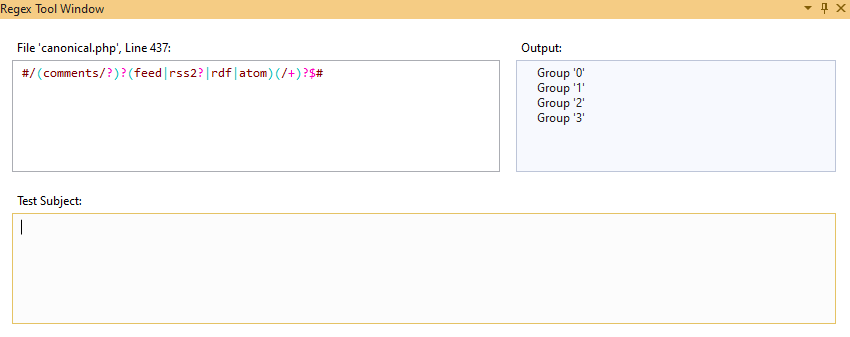

# PHP RegEx Editor

Perl Compatible Regular Expressions (PCRE) are integral part of most PHP applications. Therefore it's important to make developing with them easy and transparent.  **PHP Tools for Visual Studio 2019** introduces several neat features making the editing and testing such expressions a fluent experience. The features are the following:

<!-- more -->

- colorization of the expression
- highlighting of matching parentheses
- validation and error reporting
- separate *Regex Tool Window* which highlights expression, updates the regex expression in corresponding PHP code, shows regex groups, allows to test the regex with a test subject and see all the matches, matched groups, and matched captures.

## Colorization

Right in the editor, the regular expression syntax is seamlessly highlighted. The color scheme is a part of Visual Studio 2019, and you can change the colors in Visual Studio's menu `Tools` / `Options` / `Fonts and Colors`.

All the major elements are distinguished, text, escaped elements, ranges, quantifiers, comments, and groupings.

The color scheme is adapted for both the light, blue, and dark themes.

Note, the colorization works for string literals that do not contain any variables, and are a part of `preg_***` function calls. The colorization also works for HEREDOC and NOWDOC syntaxes, if they are introduced with either `REGEX`, `PCRE`, or `PREG` labels. All the following syntaxes work:

## Brace matching

It's important to keep track of all the braces and groups within the regular expression. The brace matching is a natural way of highlighting the group spans in Visual Studio:

Whenever a keyboard caret touches the parenthesis outside, it gets highlighted. This works for comments as well although they have their own (usually green) color.

## Regex Designer

For detailed analysis of the regular expression and eventual testing, there is **Regex Tool Window**. The tool window is opened using a code action **`Regex Designer`**. Navigate the keyboard caret at some regular expression, open code actions (usually `Ctrl`+`.`), and choose `Regex Designer`.

The command opens the *Regex Tool Window* that gets *linked* with the source code. It allows to edit the regular expression without dealing with PHP string escaping, and transparently updates the source code with the edited text.

The tool window also continuously analyzes the regular expression, shows the expression groups in *Output* pane on the right, and underlines eventual errors. The error is annotated with red dotted underline, and the error detail is shown in a mouse tool-tip.

All the edits are seamlessly applied to the original source code which deals with additional quotes and character escaping.

### Regex Test Subject

It is always a good idea to check the expression on some test data. The `Regex Tool Window` allows to paste a **Test Subject**.

Once there is a test subject, the **Output** pane shows either nothing (if there is no match) or the detailed tree with information about all matches, matched groups, and captured portions of the text. In case there are named groups, the group name is also shown in the *Output* pane.

## Conclusion

As I know, all of PHP developers deal with Perl Compatible Regular Expressions, and a way of writing it correctly. The Regex Colorization and Regex Tool Window makes this process easier. It helps with testing your code and preventing unwanted and long testing.
