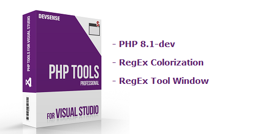
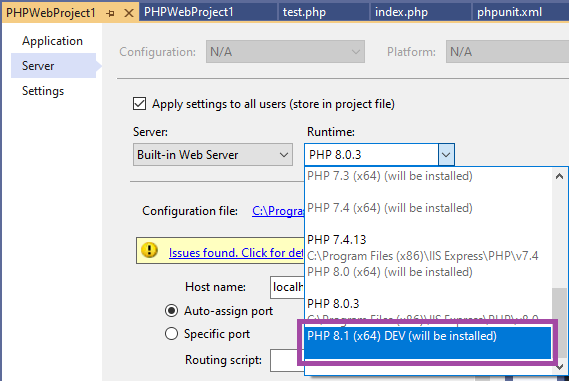
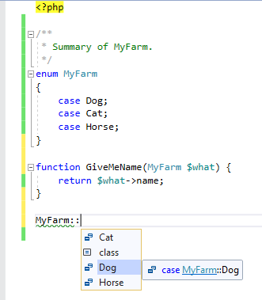
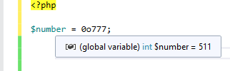
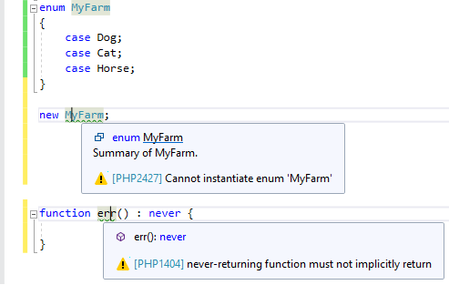
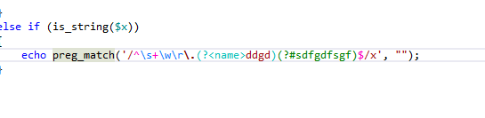

# PHP Tools for Visual Studio (May 2021)

Read the news about new features in PHP 8.1 and PHP Tools for Visual Studio - RegEx, PHP 8.1 enumerations, PHP 8.1 installation, etc.

<!-- more -->

## PHP 8.1 (dev)

It is now possible to try the development version of PHP, the PHP 8.1. Go to the project properties, and choose PHP 8.1, as depicted on the screenshot below.

Upon running the project for the first time, **PHP 8.1-dev** will be automatically installed or updated. You'll have the opportunity to debug and try your project on the latest build of PHP 8.1 on Windows. If you're keen to try the latest new features such as: enumerations, the new octal number notation, the new `never` return type, go ahead.

## PHP 8.1 Editor Support

The new PHP's features are also supported by the editor. Upon choosing PHP 8.1 in the project properties, the editor will provide IntelliSense, syntax support and error checking for the new features as well.

For the new `enum` with `case`s, you're getting tooltips, code completion, corresponding icons in navigation bar, search, all over the IntelliSense, and `enum` snippet.

The new octal number notation is useful as well. Note, that when switching back to PHP 8.0 or lower, the editor will underline and report all the new constructs as not yet supported. This means, the user will get notified whenever they'll use an unsupported feature on an older PHP.

The new features are also analyzed for potential issues. 

## RegEx Support (VS 2019)

The editor now provides **colorization** of Perl Compatible Regular Expressions (PCRE), **error underlining**, and a neat **RegEx Tool Window**, which shows matched groups, allows to test the expression on a test subject, and underlines errors in the RegEx itself.

Checkout the separate blog post for more information at https://blog.devsense.com/2021/php-regex-editor or the documentation page at https://docs.devsense.com/en/vs/editor/regex .

## Fixes and improvements

For minor fixes and improvements, please see our [changelog](https://www.devsense.com/download). 