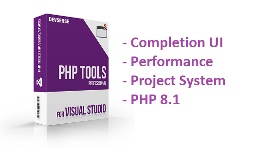

# PHP Tools for Visual Studio (July 2021)

We are happy to announce **PHP Tools for Visual Studio v1.55**. This release contains significant improvements, new UI and new features.

<!-- more -->

## Performance and New Project System

We have improved the performance of the project system across all the supported Visual Studios (even the 2010 one).

For Visual Studio 2019 (and in the future, 2022 either) the projects are based on the new Common Project System (CPS) API. This provides even better performance, great extensibility, and what's most important - the project file itself is ultimately small.

Another noteworthy benefit is that project files won’t get modified when adding or removing files. This is a great benefit when you’re working with source control (Tfs, Git, etc.)

**The performance**

Opening the project which involves both restoring the previously opened editors and indexing the whole folder takes seconds now. See the screen recording below.

Here we're opening a newly created Laravel project (~7900 files in the project, 6926 PHP files being indexed). Then the Visual Studio opens editor with `index.php` with all its features, and we are **ready to work within 5 seconds**.

Projects might have 10k, 30k, or more files, without any noticeable problems. Internal optimizations specifically recognize the `vendor` folder and skip some unnecessary processing in there. For the future support for Visual Studio 2022 which runs as a 64-bit process, there won't be any limitations to the project size at all.

The new CPS project file is a standard Visual Studio and standard MSBuild project file. It's fully extensible and might work on CI platforms on a command line, without the need of installing Visual Studio itself to run your build and other MSBuild targets (will be described in our documentation).

## New Project Wizards

For the current update we have prepared a **New Project Wizard** redesign and updates. It safely prepares the project to just work; 

Within the wizard steps, the developer selects one of the prepared **project templates**. In the sample above we go for Laravel. Then we choose a **PHP version**. The version selector provides known PHP installations, existing local PHP installations, and custom PHP executables specified in `Tools | Options`, under `PHP Tools > Executables` dialog.

Upon creating the specified project, the wizard performs the following steps:

- Checks the project template requirements.
- It automatically installs and verifies selected PHP version, and if necessary, it enables required PHP extensions and debugging extension.
- Integrated composer package gets verified and updated.
- The project itself gets created and Visual Studio project properties are automatically set (e.g. the project server root is set to `./public`).

We're currently preparing more New Project templates, to quickly create various projects for most common cases.

**New PHP Script**

A neat shortcut is the new `New PHP Script` command available in a folder context menu. We'll be adding more in the future, including New PHP Class, etc.

**From Existing Code**

Creating a project within an existing folder has also been updated. It is available right as a project template (`File | New | Project`) or under the `File | New | Project From Existing Code` menu.

The wizard quickly creates and opens the PHP Web Project in an existing location. In the future, there will be some exciting new features as well!

## Improved Code Completion UI

The whole completion experience has been refreshed and provides more possibilities than before. The UI now signalizes auto-importing will happen, which is another new feature.

The code completion window marks items which are not in the current naming context, but will be added upon completion. It shows a little exclamation mark and a grayed-out fully qualified name of the symbol. For **Auto-Importing** options and features, please see the documentation at [docs.devsense.com/en/vs/editor/auto-import](https://docs.devsense.com/en/vs/editor/auto-import). In short, it automatically imports the name into the current namespace context, or it fully qualifies the name if necessary.

Filtering through the code completion now works by typing just a few letters from the desired symbol, and highlights the letters in the completion accordingly.

## Error Diagnostics

Code analysis warnings got updated as well. For the users trying out the development version of the **upcoming PHP 8.1**, we have added code diagnostics for the restrictions introduced in PHP 8.1. In this way, migrating to the new PHP will be a bit easier.

---

By the way, anyone can try the new PHP 8.1 simply by selecting it in the project properties. It will get automatically installed and configured upon running the project. It is also possible to select this development version of PHP in the **New PHP Web Project** wizard.

## Fixes

In addition to the new features and improvements, we are fixing some issues as well:

- fixed package and project load times
- fixes occasional freezes on VS UI at startup
- fixes icons in menus in VS 2019+
- fixes for the RegEx editor, double quoting the pattern, and UI theme colors
- fixes occasional incorrectly underlined errors
- fixes debugger edge cases, and improves the debugging session stability
- improves support with some undocumented PHPStorm META file features
