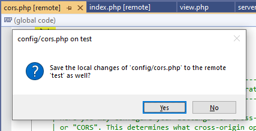
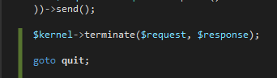

# PHP Tools for Visual Studio (August 2021)

There were a lot of improvements and new features under the hood of PHP Tools for Visual Studio. Tons of stability fixes, enhanced UI, and new Remote Explorer tool window, which replaces the publish mechanism.

<!-- more -->

---

## Remote Explorer

The new [Remote Explorer](https://docs.devsense.com/vs/project/remote-explorer) window provides a great way of synchronizing files between your project and the remote host. This feature replaces the one-way publish process and introduces a lot of enhancements. First of all, it allows to manage various remote profiles, and to switch between them.

Most importantly, the window is interactively **listing current modifications**. There you can browse the modified files, exclude them from being uploaded to the remote host, compare local changes to the version on the remote host, quickly revert the local changes with the content on the remote host, or navigate directly to the Windows Explorer.

The bottom section of the window - the **Remote Browser** - provides direct access to the remote host files; it's listing the remote files while allowing to download them to your computer, to pull them to your project into the respective project folder, or quickly open the remote file in the Visual Studio editor. The opened files can be automatically uploaded to the remote upon saving them.

For more details, please see [the Remote Explorer documentation](https://docs.devsense.com/vs/project/remote-explorer).

## Editor Colors

We've been working on the UI and Fonts and Colors in the PHP Editor in general. This update brings themed variable and class name colors which are better visible on dark themes. Also, we're adding a setting for PHP labels, which are slightly bold by default now.

## Fixes

Visual Studio is changing, and so we are. PHP Tools are fully 64-bit already, and most of the internals are changing as well to match with the new Visual Studio APIs. Recent changes introduce more asynchronicity and less UI freezes. We're continuously working on this and improving the responsiveness wherever possible.

Other fixes include: working **PHP Error Log** Output Window ([see docs at debugging/output](https://docs.devsense.com/en/vs/debugging/output)), fixed **IIS** and **IIS Express** servers, fixed falsely reported missing composer packages, improved code completion hinting, fixed code editing in between `<?=` and `?>` tags, and fixed **colors and icons in Tool Tips**.

