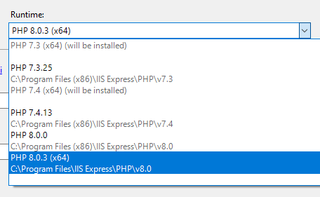
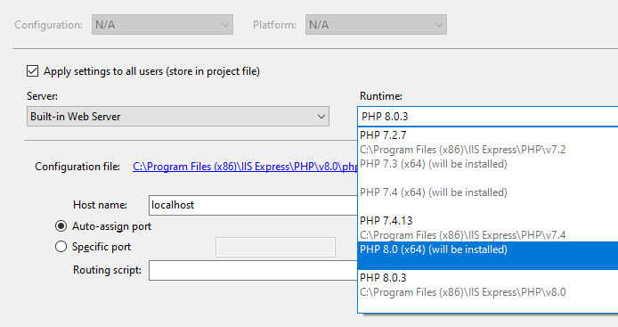
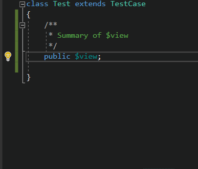
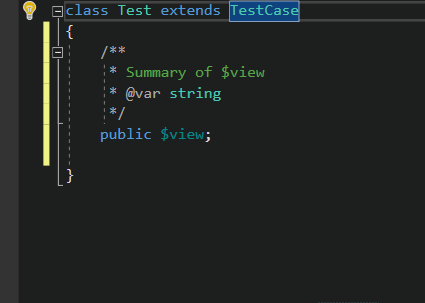

# PHP Tools for Visual Studio (April 2021)

Let's take a look on the April's news and updates for PHP Tools in Microsoft Visual Studio.

<!-- more -->

## x64

PHP Tools manage and install PHP for you, if necessary. Now it is possible to choose the 64bit version of the PHP in *Project Properties* (selected by default) See [Project Properties](https://docs.devsense.com/en/vs/installation/install-php) for more details.

The selected PHP will get automatically downloaded and installed upon running the project. The automatic installation handles the necessary debugging extension `Xdebug`, configures it, or installs an update if necessary.

## Code Actions

The PHP editor got a few more code actions available in the form of a light bulb or a smart tag in older versions of Visual Studio. Use the context menu or a shortcut `ctrl+,` to open and apply an available action.

- **Sort Uses** reorganizes `use` statements according to `PSR-12` specifications. Statements are ordered alphabetically according to the used identifier. Uses of `function` and `const` declarations are grouped, and separated with a blank line. Note, that trailing comments and preceding comments are moved together with the corresponding `use` statement.

- **Remove and Sort Uses** is the same as Sort Uses. Additionally it removes any unused declarations. 

- **Property setter, or getter, or both** generates a function to get and/or set the property value, known as getter and setter. The function gets annotated with the property documentary comment as well. By default, the setter returns the reference to the containing class, so they can be chain-called as well.

- **Generate construct** generates a default `__construct()` method, with empty body.

- **Generate construct from defined properties** is used to generate `__construct()` method that initializes all the class properties. Every property in the order as defined creates a constructor parameter which initializes the corresponding property.

## Debug

There are a lot new improvements in the PHP debugging experience. Now it **handles fatal errors in the code better**, showing the corresponding stack trace and navigating to the affected line of code in the editor. During the debug session, user will also get more information in the Visual Studio's `Output` pane. This should help with diagnosing and fixing issues with the debugging itself.

For remote debugging functionality ([see *Custom Server* setting](https://docs.devsense.com/en/vs/debugging/remote-debug)), *Project Properties* now provides more validations and help. The **Path Mapping** validates user's setting and provides completion when typing local paths.

DBGp Proxy setting was also improved. It validates and checks the entered connection setting, with an option to verify the connection setting live.

## Diagnostics

There are a few more diagnostics reported live in your code. With the spread of the PHP version 8, there are more projects that stopped working. One of the causes is the use **curly braces as array indexers**. PHP editor now reports the use of curly braces as an array indexer, in case the language level is set to 8.0 or higher (in the future).

A lot of new functions got added to PHP 8, and a lot of functions have been deprecated. PHP editor now **reports use of deprecated or not available methods** as warnings.

## Test Explorer

The Test Explorer has been updated as well. Now it scans the entire solution and lists all the PHPUnit configurations (except for test configuration in `vendor` folder). All the available tests get sorted and organized by available groups.

The feature allows to run and debug the tests, it remembers the previous tests results and displays them visually, including the test log, test output, and test duration. 

Since the April's update, this feature also works with the new `Open Folder` feature in Visual Studio 2019, so users don't have to create a project for their PHP application.
