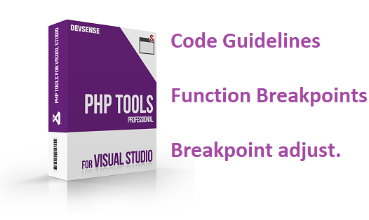
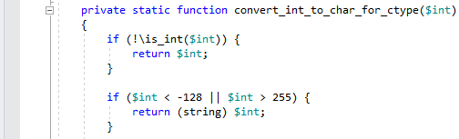
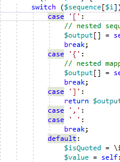
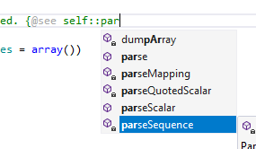
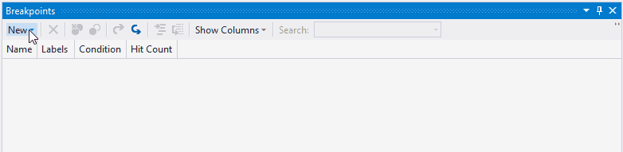
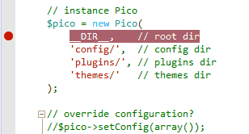

# PHP Tools for Visual Studio (October 2021)

Let's take a look on the new updates in PHP Tools and Visual Studio. The PHP editor provides more navigation features, debugger works smarter with breakpoints, and the overall stability and performance has been improved.

<!-- more -->

---

## Editor

The editor provides several new features and enhancements; the first one is the re-enabled **structure guideline**, which was introduced in Visual Studio 2017. It is now a part of the Visual Studio 2019 and 2022 as well, providing structure guidelines for all the PHP code blocks. This feature can be newly disabled in `Tools` / `Options`, under the `Text Editor` / `PHP` / `Advanced`.

Highlighting of symbols under the cursor has been improved to take the `@global` PHPDoc keyword, `case` and `default` within `switch` block into the account:

Newly, the editor understands the `@see` PHPDoc tag, so it highlights the symbol specified in there, shows the clickable link in tooltips, and it provides code completion:

The other improvements are under the hood:

- The inferred control flow type analysis has been improved.
- Type analysis of global variables takes `@global` keyword above a function into the account.
- Type inference of `array_pad()`, `array_fill()`, and `array_flip()` is more precise.
- Fixed false positive warning for `[]` operator.
- Stability fixes for project containing large chained expressions.
- Stability fixes for blade editor.

## Breakpoints

Newly it is possible to add **breakpoints based on function name**. PHP Tools debugger supports the whole range of special prefixes and suffixes, and it intuitively adds breakpoints to all the matching functions and methods. It is sufficient to enter just the method name, without the type name prefix:

The syntax for the function breakpoint is `<directory_string>!<type_name>::<function_name>()`, where `type_name` and `function_name` can be fully qualified or the namespace part can be omitted. For example, the following syntaxes are possible:

- `function_or_method_name`
- `function_or_method_name()`
- `fully\qualified\function_name`
- `::method_name`
- `type_name::method_name`
- `fully\qualified\type_name::method_name`
- `directory_string!function_or_method_name`
- `directory_string!type_name::method_name`

Names that are not fully qualified will be searched for within available namespaces, so you can only type the name without the long namespace. A useful feature is the `directory_string!` prefix, which allows to restrict breakpoints only to functions defined in files that have the specified `directory_string` as a part of its path.

Another great improvement is the **automatic adjustment of the breakpoint position**. Sometimes the breakpoint must be put on a specific line, so it gets hit by the underlying debugger extension. Newly, the PHP Tools debugger adjusts the breakpoints to the correct line, so it gets hit correctly. This solves the issues with multi-lined statements, empty functions, breakpoints placed on the opening curly brace `{`, etc.

## Fixes

Additionally, there are a few fixes in **Remote Explorer**; it now correctly creates a new directory on the remote machine, improves performance when switching profiles, and more. We'll be continuing improving the this new tool window in the upcoming releases as well.

