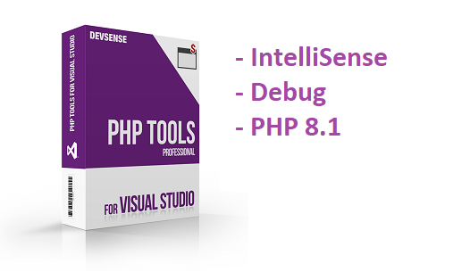
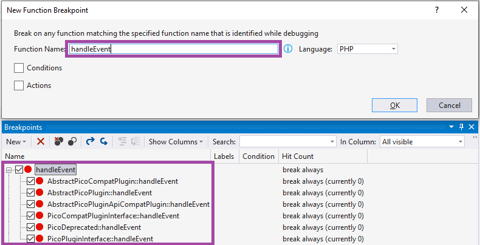
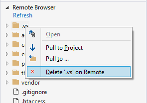

# PHP Tools for Visual Studio (September 2021)

The latest update to PHP Tools for Visual Studio improves and fixes overall functionality, and updates the PHP 8.1 support. Read more for the details!

<!-- more -->

---

## IntelliSense

The editor got updated IntelliSense features. There are two most noticeable improvements:

- **integrated localized PHP manual** contains more information which you can revel in the editor tool-tips. Newly there are more type annotation, and more localized texts (in case you're using Visual Studio in Japanese, Chinese, German, French, Spanish, or Portuguese. Moreover, the manual database got smaller which means the PHP Tools installer itself is smaller. 
- **tool tips** are better formatted with more colors and newly containing summary of the functions return value.

## Debugging

Debugging PHP projects is an essential feature of PHP Tools, and we're working on improving the experience continuously. First; there is more detailed logging now, available in [Visual Studio's Output Window](https://docs.devsense.com/en/vs/debugging/output). The window shows three separate logs: **PHP error log** (tracks all errors and warnings coming from PHP), **web server log** (tracks requests and failures), and **debug session log** (internal debugger information).

Next, the September update introduces smart **function breakpoints**. Enter a function name, fully qualified name, with or without class name; the debugger resolves all the possible functions and let's you to tick or untick the right ones.

## PHP 8.1

The upcoming version of PHP - PHP 8.1 - is almost there, and we're providing all of its new features to try already. The IntelliSense understands the new syntax, provides completion for the new `enum`, new classes and functions, new special `noreturn` reserved type name, final class constants, and more ([php rfc#php_81](https://wiki.php.net/rfc#php_81)). 

The latest update introduces `readonly` properties.

In case you didn't know, you can already try the latest build of PHP 8.1 right from Visual Studio; go to project properties and choose PHP 8.1 as your language - **PHP Tools will download the latest snapshot for you**, ready to run and debug your project with it.

## Remote Explorer

Remote Explorer is the new window allowing to work with the files on a remote server. It is linked with your PHP project, and allows to quickly upload your local changes, manage excluded content which won't be uploaded, browse and open the remote files, and compare your local changes with the content on the remote server. For the details, please see https://docs.devsense.com/vs/project/remote-explorer.

Newly, it allows to **delete files or folders** on the remote server as well.

## Fixes

There is a lot of fixes or rare issues when VS can freeze or crash. Please read our changelog at https://www.devsense.com/download to see more details.

Additionally, the following issues have been fixed:

- launching PHP project when `php.ini` is in a restricted folder.
- updated SSL libraries to support the latest cryptographic algorithms.
- fixes installation of PHP 5.4.
- fixes HTML code formatting in case of  multi-lined tags.
- fixes function deprecation information in code analysis.
- stability improvements of the Twig editor.
- fixes Remote Explorer Compare/Open features.
- fixes remote debugging.
