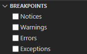

# PHP Tools for Code, Version 1.4

Announcing release version 1.4 of PHP Tools for Visual Studio Code. Read more about the new features made for developers, addressing most frequent questions, requests, and ideas.

<!-- more -->

## PHP Tools for VS Code 1.4

*PHP Tools for VS Code* is an extension for Visual Studio Code providing **complete PHP development environment**. There are built-in the following high-level features:

- fully featured code editor with advanced code analysis engine
- integrated fine-tuned debugging support
- test explorer for PHPUnit which runs and debugs
- code problem analysis, and code fixes

All the features are working together. See the marketplace page for more details at [Visual Studio Marketplace / PHP Tools](https://marketplace.visualstudio.com/items?itemName=DEVSENSE.phptools-vscode).

## What's new?

Get ready for the new **PHP 8.1** with the built-in editor support, neat Test Explorer, and new code actions for quick code fixes. In addition to that, there the following new features:

### PHP Version Picker

The editor, problems analysis, debugger, and the test explorer; they all need to work with a specified version of PHP. PHP Tools now provide a configuration to choose a specific PHP version or a specific executable to use across all these features. The selected version is noted at the bottom right corner of your VS Code, and can be clicked on now.

Available PHP's are listed, together with user configured executables. Each PHP can be named, and referenced by your workspace setting.

See [docs - PHP Version](https://docs.devsense.com/en/vscode/editor/php-version-select) for more details.

### New Problems Configuration

We have added a new options on how to deal with problems across the entire workspace. PHP Tools may analyze the entire workspace for possible issues, however it may not make sense for packages in your `vendor` folder.

The new setting **`php.problems.scope`** is by default set to only analyze user's code, excluding the vendor folder. This not only speeds up the analysis, but also allows you to focus on your code only.

Additionally, we have unified the configuration with the full Visual Studio where you can specify the problems severity in **`.editorconfig`** file in more details. It allows to override problems severity or visibility specifically using wild-cards and problems ID.

See [docs - Problems](https://docs.devsense.com/en/vscode/problems) for more details.

### Exception Handling

Previously, there were low-level options on how to deal with errors, warnings, and exception during debugging. From the user's perspective, it was not always what they expected.

It was not possible to only break on unhandled fatal errors - you had to break on any exception or nothing. Now the behavior changes; it is possible to choose whether to break on handled errors, however the debugger will always break on a fatal error or exception. In the result, users don't have to go through all the single throws in their code, just to find the last one ... the debugger will break only on the one causing the fatal issue.

The new release makes it easier to find bugs in your code, improves stability, and responsiveness of the debugging session.

## Thanks!

We're happy we could announce the new milestone in our extension, improved thanks to your feedback.
