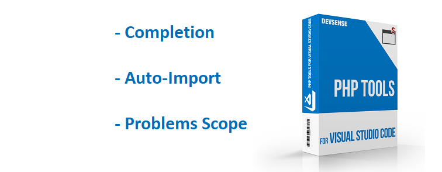
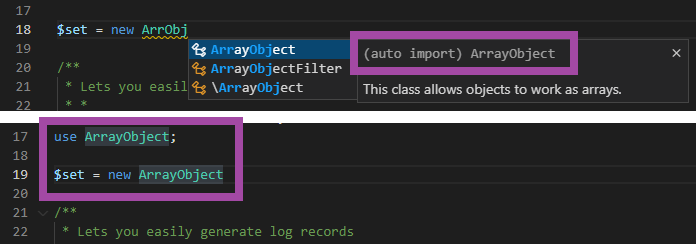

# PHP Tools for VS Code (July 2021)

## Code Completion

<!-- more -->

The completion list has received numerous updates and new features. It sorts the items more reasonably, especially variables in case the user doesn't type the leading `$` character. More importantly, it shows all the available classes, interfaces, functions, and constants across the workspaces, allowing to auto-import them upon completion.

The completed item will auto-import, which means it automatically adds the corresponding `use` statement. Such an item will be marked with `(auto import)` label. In case, the item will be inserted as a fully qualified name (FQN) instead, the label will be `(auto fqn)`.
 
## Auto-Import

Importing the name automatically is a useful feature that allows using anything from the workspace, where it is conveniently listed in the code completion list. The feature is fully configurable in VS Code Settings, as described on [the documentation page](https://docs.devsense.com/en/vscode/editor/auto-import).

An item that will be auto-imported is labeled correspondingly, as seen on the picture above.

The setting `php.format.autoimport` provides several options:

- **auto-import** option: auto imports alias when completing types/function/constants out of namespace scope
- **fqn**: inserts fully qualified name upon completion
- **none**: insert name as it is
- **hide**: does not show inaccessible symbols in code completion
 
## Problems Scope

New setting specifying where PHP Tools should look for code problems is called `php.problems.scope`. It is now possible to just list problems in user' files, excluding the `vendor` folder, or ignore the problems at all. For more details, please see [the documentation page](https://docs.devsense.com/en/vscode/problems#phpproblemsscope).
