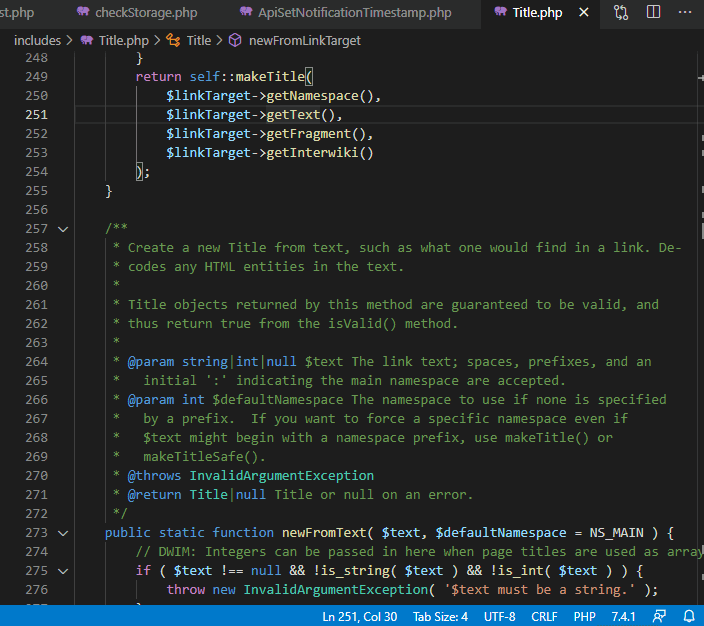
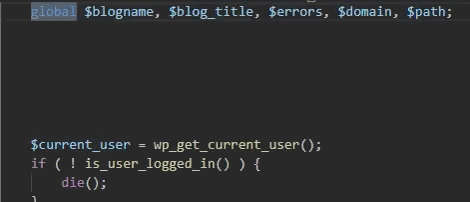

# PHP Tools in VS Code (March 2021)

Read the latest updates for PHP Tools in Visual Studio Code. We have been working on improving the performance, fixing debugging support, and providing more editor features as well.

<!-- more -->

The latest installation package as well as the change-log can be always downloaded at [devsense.com/download](https://www.devsense.com/en/download#vscode) or from the [Visual Studio marketplace](https://marketplace.visualstudio.com/items?itemName=DEVSENSE.phptools-vscode).

## Rename Refactoring with Preview

Renaming class members, such as methods and properties, was an anticipated feature - but not enabled until now. With the new Refactoring Preview Window, we could safely provide renaming for those constructs even the editor knows the changes may break your code.

In case any of the changes are not safe, which means the type information on the instance variable could not be fully resolved, the preview window popups automatically. In addition, renaming global variables and functions is now smarter, looking into dynamic constructs.

Renaming with preview can be also opened with the menu `Rename Symbol` command, and confirming with the `Shift+Enter` key.
 
## Editor features

With the latest releases, we have also updated the integrated PHP manual in all major languages, describing well more of the new PHP 8 constructs.

The other improvements include:

- **.phpstorm.metadata** is properly parsed, and the included type information interpreted correctly by the editor and code analysis engine.
- Upon typing `/**` above global and local variables, a neat PHPDoc is generated, with placeholders for type hints and descriptions.

- The editor now correctly **highlights occurrences** of global variables under the cursor, as well as any other symbol such as function, methods, property, constant, etc.
- **Problems window** reports much fewer falsely detected problems. Note, to ignore certain folders from the problems reporting, see our documentation at docs.devsense.com/en/vscode/problems.
- **Go To Implementation** has been improved to handle anonymous classes and traits.

## Stability Fixes & Optimizations
 
- **DBGp Proxy** now supports more protocols, including the binaries you can download from the xdebug.org website. More about setting DBGp Proxy in your workspace see [docs.devsense.com/vscode/debug/launch-json](https://docs.devsense.com/en/vscode/debug/launch-json#dbgp-proxy-settings).
- **The pretty-printing** feature has been improved to handle well various specific cases, such as grouping in "use" construct, or anonymous functions.
- We are continuously working on **performance improvements**. Recent updates fix a lot of issues with the language server not being closed on macOS, or extensive consumption of CPU in the background. Thanks for all the great feedback we're getting!
