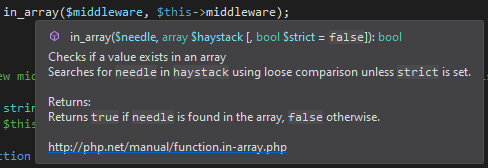
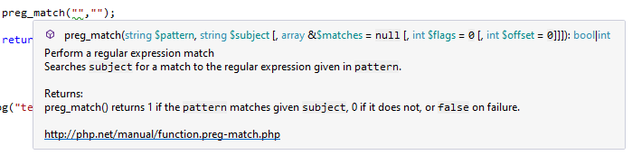
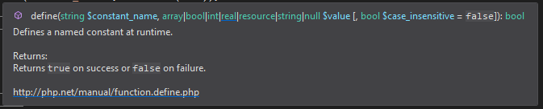
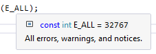
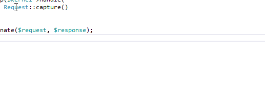
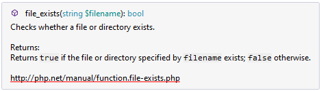

# PHP tooltips in Visual Studio explained

Tool-tips are a common feature of modern code editors and IDEs. They display available information about a symbol under the mouse cursor, and during the code completion. Check out, what you can do with tool-tips in a PHP language in Visual Studio.

<!-- more -->

## Colors

PHP ToolTips respect the current Visual Studio theme and the current user' color settings to colorize and format the content of a tooltip. Functions signatures, and symbol declaration is formatted to distinguish keywords, types, variables, and values.

> ToolTip bubble color itself can be also customized in Visual Studio' `Tools`/`Options`, `Fonts and Colors`, settings for `Editor Tooltip` category.

The tooltip respects the Visual Studio dark theme natively:

## Values

Sometimes it is useful to reveal a run-time value of a variable or constant. PHP Tools resolves static values and it also knows values of most of the PHP language constants. The tooltip reveals it's value during development to get a little peek inside the run time.

## Summaries

Tool-Tip shows information for all the

- user's declarations
- vendor's declarations
- and PHP language itself.

The content for the tooltip is displayed for all the functions, function parameters, local variables, global variables, classes, interfaces, traits, keywords, snippets, and constants - including description, function's return value description and eventually a link to the online documentation.

## Links

Underlined elements on the tooltip are actually links; unless you move the mouse away from the bubble, the tooltip stays in place so you can click on the elements and navigate to the other symbols.

Notice, all the PHP language symbols have also a link to the PHP manual. In this way, additional information including samples and users comments can be opened quickly.

## Summary

Tool-Tips are a neat productivity tool showing all the available documentation for a symbol. It definitely shortens the time needed to understand the function, class, or a function you're about to use. Especially in PHP, the function **return value summary** is an important piece of documentation.