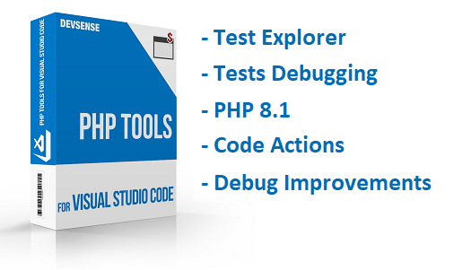
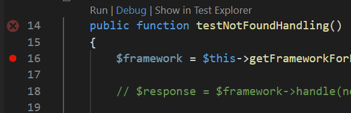
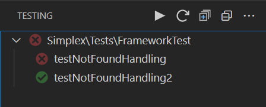
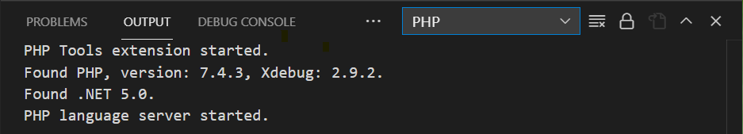
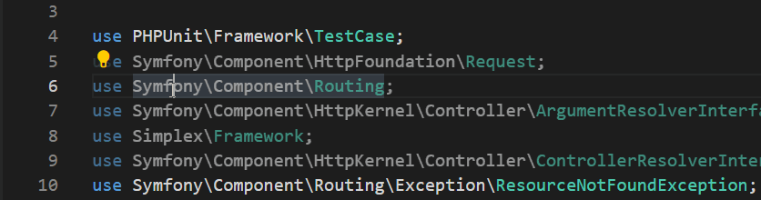
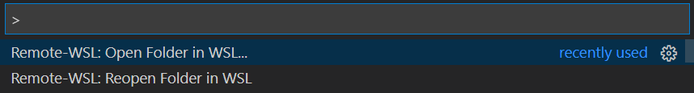

# PHP Tools for VS Code (May 2021)

The recent updates to PHP Tools for VS Code introduces new features and improvements. Read more about the new test explorer, debugging improvements, code actions, and more.

<!-- more -->

---

## Test Explorer

Testing is an essential part of the software development. Newly, PHP Tools are extending the complete **Test Explorer** functionality and implementing full range new features.

### Debugging PHPUnit Tests

Single tests got a new code lens with quick actions for **Run**, **Debug**, and **Show** in Test Explorer. This allows to quickly start and debug the single test right from the code. Users can also use the Test Explorer view and debug all the tests, just selected tests, or single test suites.

### Test Discovery

The Test Explorer is now fast, and automatically updated whenever a test file is changed, using smart scan for test cases without the need of running PHP or PHPUnit at all. All the details about tests discovery and test run is logged into the Output window, under the log named `PHP (PHPUnit)`.

### Retirement of Test Results

Whenever a test file is changed, Test Explorer discovers the contained test cases and mark them as retired. This helps to keep track of tests that should be run again.

### Optimized Tests Run

Upon running a custom selection of tests or test suites or all the tests at once, PHP Test Explorer minimizes number of php processes needed to be spawned. In most cases, all the selected tests run within one process which improves the time needed to initiate the testing.

Additionally, the PHP Test Explorer marks the tests progress continuously now. In the result, next to each test case, it shows whether it is pending, waiting, failed, was skipped or succeeded.

Newly, **test cases with data sets** are also supported.

## Debug

In the recent updates, there have been many improvements to the debugging support. Currently there is a stable support for multi-session debugging, utilizing all the available Xdebug versions and protocols. The Xdebug protocol and related issues have been fixed and optimized as well.

Check the output panel for details about your setup, and whether Xdebug is properly configured:

The PHP debugging works out of the box, allowing to simply start the application with `F5` key, or with optional launch settings for built-in, remote debug, or with DBGp Proxy.

## Code Actions

There are new code actions and code fixes for **Sort uses** and **Generate constructor**.

Sorting uses respects the **PSR-12** notation.

Constructors can be generated either empty, or with pre-initialized parameters for already declared properties.

## WSL & Remote FS

We have been working on adding support for WSL (Windows Subsystem for Linux) and Remote-FS support. WSL, specifically WSL 2, is recommended since the user gets full code completion and code analysis. Remote file systems are also supported, although editor does not "see" the entire workspace content and cannot provide all the completions.

Note, for the WSL support the extension will be installed into the virtual environment and needs to be activated there as well.

## PHP 8.1

The PHP editor in VS Code is getting a preview support for the new PHP 8.1, according to the latest PHP RFCs. Currently, there is support for:

- The new octal number notation, e.g. `0o777`.
- `never` return type, which is also fully analyzed, and functions not respecting the new type get reported and underlined.
- `enum` support, its syntax, type checks, debugging, and code completion.

---
