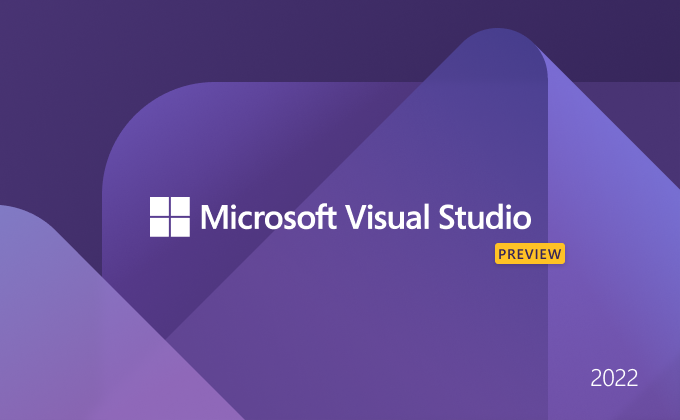
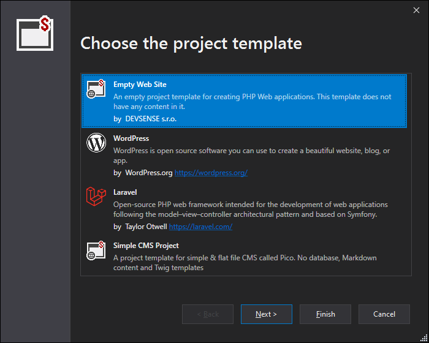
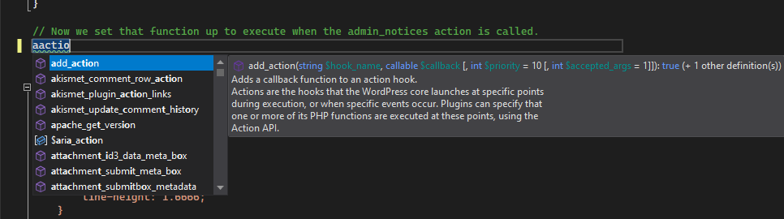

# Visual Studio 2022 (preview)

We're happy to announce that PHP Tools for Visual Studio already supports the new Visual Studio 2022 (since the Preview 2). This brings amazing new features, User-Interface enhancements, and of course the native support for 64-Bit.

<!-- more -->

**The installation is available at our [download page at devsense.com/download](https://www.devsense.com/download).**

## What Does It Mean for PHP Tools

The great news is that all the features you are used to are maintained, and mostly even enhanced. The new Visual Studio introduces several new UI elements and styles, which we are continuously following. Our goal is to make the PHP language a natural part of your IDE, providing features, shortcuts, colors, and other components users are used to from standard Visual Studio languages.

We have already brought a new project wizards alive, a new code completion, new editor tool tips and navigation features.

Next, PHP Tools will get more of the new Visual Studio 2022 appearance, such as the new Project Properties tab, which we're working on.

Finally, it's worth noting that the 64-bit support is not just about memory, and possible extreme project sizes. It also brings an improved performance. Stay tuned for more information!

