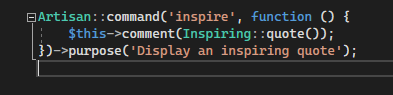
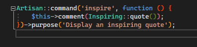
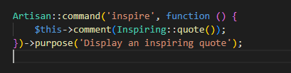
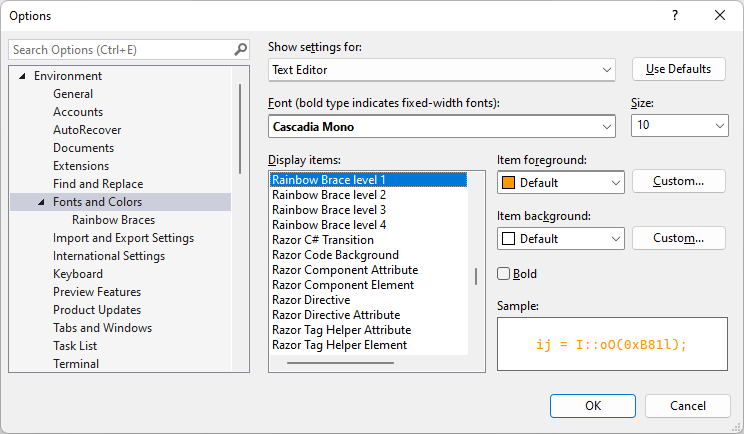
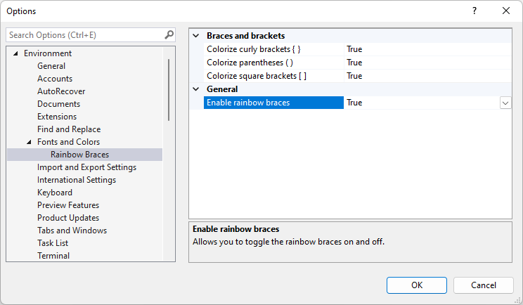

# Bracket pair colorization for PHP in Visual Studio

When you work with code that is deeply nested, it might get hard to know in what context the code is. You should follow good practices and not to create such a code, but sometimes the code is not yours or you are refactoring an old one. In such cases bracket, pair colorization comes in handy. Each bracket pair gets a different color, so you will have an easier job to orient yourself.

<!-- more -->

Here is an example without bracket pair colorization:

Here is an example with bracket pair colorization:

I suppose this is a matter of personal preference, but I do like the second example better.

## Visual Studio Code

The first implementation of bracket pair coloring was introduced by a user named CoenraadS as an extension for VS Code in 2016. Ultimately this led VS Code team to create native support for bracket pair colorizing, which was released in August 2021. The main reason for this step was performance. VS Code API didn't allow the creation of such a feature as an extension with high performance in mind. You can read more about it on the official blog https://code.visualstudio.com/blogs/2021/09/29/bracket-pair-colorization. And what's even better is that this feature is supported in VS Code for the Web as well.

For comparison, I include the same snippet as above with the default dark VSCode theme (Dark+):

## Visual Studio

It didn't take long for users of Visual Studio to desire this feature as well. The feature request appeared on [Developer Community](https://developercommunity.visualstudio.com/t/Bracket-pair-colorization/1631048) - Please vote up :-)

The standard process to introduce a new feature for Visual Studio takes some time. But since VS team is lucky to have [Mads Kristensen](https://twitter.com/mkristensen) - he created an extension that supports bracket pair colorization - called [Rainbow Braces](https://marketplace.visualstudio.com/items?itemName=MadsKristensen.RainbowBraces). The project is hosted on [Github](https://github.com/madskristensen/RainbowBraces) and it supports Visual Studio 2022.

We wanted to make sure that **PHP Tools for Visual Studio** supports it and we've quickly released an update that enables bracket pair colorization for PHP code as well. If you'd like to turn it on, make sure to use version `1.67.16259` or higher.

<a class="btn btn-primary" href="https://marketplace.visualstudio.com/items?itemName=DEVSENSE.PHPToolsforVisualStudio2022">Download!</a>

 

Then install **Rainbow Braces** extension version `1.0.34` or higher from [VS Marketplace](https://marketplace.visualstudio.com/items?itemName=MadsKristensen.RainbowBraces) or directly withing Visual Studio, go to `Extensions | Manage Extensions` and type `rainbow braces` and click `Download`.

### Customization

If you wonder whether it's possible to customize the default colors, just go to `Tools | Options` and choose `Fonts and Colors`.

Or you can even turn on/off certain bracket pairs, in the `Rainbow Braces` sub-item of `Fonts and Colors`.

## Thank you

Thank you for your attention. Do you like this feature? Make sure to vote or comment on the [original feature request](https://developercommunity.visualstudio.com/t/Bracket-pair-colorization/1631048?space=8&ftype=idea&q=brackets) Or is there something else in PHP code that deserves a color? Please let us know in the comments below.!
