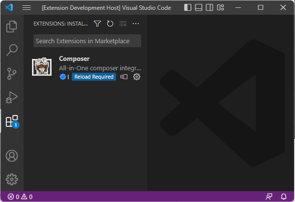

# Create PHP Project using Composer in VS Code

You know **composer** is a framework for maintaining PHP packages - installing them as a dependency to your project, ensuring their requirements, auto-loading classes, and much more. But you can also create a new PHP project directly from a composer package, easily. **In Visual Studio Code it's even simpler.**

<!-- more -->

---

> **Already know composer?** With PHP Tools you don't have to install `composer`, just pick command `composer: create project ...` and that's it.

## Before You Start

We need a few things; obviously [Visual Studio Code](https://code.visualstudio.com/download) and the following.

### Required Things

- **PHP** - please make sure, you have `php` installed. With [PHP Tools](https://marketplace.visualstudio.com/items?itemName=DEVSENSE.phptools-vscode) you can configure what version of PHP will be used, and check whether it is installed correctly ([docs.devsense.com](https://docs.devsense.com/vscode/php-version)).

- [**Composer Extension**](https://marketplace.visualstudio.com/items?itemName=DEVSENSE.composer-php-vscode) - make sure, you have this extension installed: [Composer for VS Code](https://marketplace.visualstudio.com/items?itemName=DEVSENSE.composer-php-vscode). It extends Visual Studio Code with commands for maintaining your composer packages, IntelliSense for `composer.json`, and it also automatically downloads `composer` itself.

### Empty Workspace

Start with an empty workspace. Open VS Code and either open an empty folder, or close an existing folder so you have an empty workspace like this:

## Create the Project from Composer

Open **Command Palette** and choose `Composer: create-project ...` command. Confirm.

If you have an empty workspace, you'll get asked, where to create the project. Then the command asks for the package name to create your project from. Just type a few letters, it searches it for you including the corresponding information. I personally like watching for downloads and stars count ...

There are many package you can create the project from. The most populars are probably `laravel/laravel`, or `drupal-composer/drupal-project`.

Confirm the selection, and watch the progress in Visual Studio Code's Output:

## Prepare launch.json

The project is created, now you can setup Visual Studio Code to run and debug it. Open **Run and Debug** tab, and create `launch.json` file, as shown on the picture:

Newly created `.vscode/launch.json` file is ready, but make a few adjustments for your actual project first. In case of **Laravel**, we need to change the web root folder from `"."` to `"./public"`:

## See Also

- [Introducing Composer for Visual Studio Code](https://blog.devsense.com/2022/composer-for-vscode)
- [composer create-project on command line](https://getcomposer.org/doc/03-cli.md#create-project)

