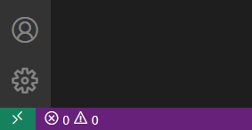

# How to develop PHP inside a Docker Container using VS Code

VS Code allows you to work remotely with the full-featured development environment. Even though you work remotely, you don't need to sacrifice all the great features available when you work locally - full Intellisense, navigation, refactoring, debugging and testing. 

<!-- more -->

There are 3 options for how to develop remotely with VS Code, each enabled by a separate extension:
- [WSL](https://aka.ms/vscode-remote/download/wsl)
- [Remote machine or virtual machine through SSH](https://aka.ms/vscode-remote/download/ssh)
- [Container](https://aka.ms/vscode-remote/download/containers)

In this tutorial, we're going to focus on development inside a docker container. This approach will allow you to have a separate development environment isolated from your local one. When you will need to switch to a different project, with different dependencies, tools or system, you can just switch to a different container.


## Requirements

- [Docker Desktop](https://www.docker.com/products/docker-desktop/)
- [Remote Containers VSCode extension](https://aka.ms/vscode-remote/download/containers)
   
   You know that you have the extension when you see the green icon in the bottom left corner of VS Code.
 
   

## STEP 0 - Get Started Quickly

The sample code is available [Github](https://github.com/DEVSENSE/vscode-remote-sample-php). Assuming you already have Docker Desktop, you can start quickly by clicking on this button.

<div style="text-align:center">
<a class="btn btn-primary" href="vscode://ms-vscode-remote.remote-containers/cloneInVolume?url=https://github.com/DEVSENSE/vscode-remote-sample-php">Quick Start NOW!</a>
</div>
<br/>

This link instructs VS Code to install [Remote - Containers](https://marketplace.visualstudio.com/items?itemName=ms-vscode-remote.remote-containers) extension if you don't have it already and clone the sample project from Github into a [container volume](https://docs.docker.com/storage/volumes/). 

## STEP 1 - Open a Container in VS Code

If you already opened our sample project, you don't need to follow this step. I just wanted to mention that you have multiple options to open a container in VS Code. When you click on the green button in the bottom left corner of VS Code, you should see the following options:


- Open Folder in Container - opens an existing folder and shows you a wizard which will create an appropriate container for your application
- Clone Repository in Container Volume - you will choose which repository and what container should be used for it if it's not already defined by the project
- Attach to Running Container - you can attach to the already running container
- Add Development Container Configuration Files - adds to the currently opened workspace
- Try a Development Container Sample - Microsoft has prepared bunch of samples for different languages and configurations
- Getting Started with Remote-Containers - links [here](https://code.visualstudio.com/docs/remote/containers#_getting-started)

## STEP 2 - Initialization

After you've opened a container in VS Code, you usually wait a moment when it's the first time opening a particular container. VS Code needs to do a bunch of work - clone a repository, build a container, install VS Code server, install required extensions etc.


You can click on the link to open to find out details about what's doing.

When everything is prepared you can see what container are you running in the bottom left corner of VS Code.


You can also find what containers are running, additional information and a list of container volumes in the VS Code Remote Explorer window.


## STEP 3 - Check devcontainer.json

All the magic boils down to a `devcontainer.json` file, located in the `.devcontainer` folder. The file tells VS Code what container to open(or create) as well as other customizations. 

`devcontainer.json` for the sample application looks like this:
```json
{
	"name": "PHP",
	"build": {
		"dockerfile": "Dockerfile",
		"args": { 
			// Update VARIANT to pick a PHP version: 8, 8.1, 8.0, 7, 7.4
			// Append -bullseye or -buster to pin to an OS version.
			// Use -bullseye variants on local on arm64/Apple Silicon.
			"PHP_VERSION": "8.1"
		}
	},

	// Configure tool-specific properties.
	"customizations": {
		// Configure properties specific to VS Code.
		"vscode": {
			// Set *default* container specific settings.json values on container create.
			"settings": { 
				"php.executablePath": "/usr/local/bin/php"
			},
			
			// Add the IDs of extensions you want installed when the container is created.
			"extensions": [
				"DEVSENSE.phptools-vscode"
			]
		}
	},

	// Use 'forwardPorts' to make a list of ports inside the container available locally.
	"forwardPorts": [8000],

	// Use 'postCreateCommand' to run commands after the container is created.
	"postCreateCommand": "composer install",

	// Comment out to connect as root instead. More info: https://aka.ms/vscode-remote/containers/non-root.
	"remoteUser": "vscode"
}
```

As you can see `build` section references a single `Dockerfile` because this is a single container application. It's probably not necessary to explain in much detail the content of the sample `Dockerfile`. Suffice to say we're using a prepared container image from [VS Code Remote / GitHub Codespaces Development Container Images](https://hub.docker.com/_/microsoft-vscode-devcontainers). But feel free to use any image you'd like. You can check our tutorial on PHP on docker at https://blog.devsense.com/2019/introduction-to-php-on-docker-with-visual-studio-code

For more complex scenarios, where a multi-container setup is required, there would be a reference to `docker-compose.yml`. Such a scenario might be PHP in one container, Nginx server in another - we have a tutorial for exactly that [here](https://blog.devsense.com/2019/php-nginx-docker)

`customization` section allows you to define what settings and extensions should be installed in the container. For the sample application, we will be using [PHP Tools](https://marketplace.visualstudio.com/items?itemName=DEVSENSE.phptools-vscode) to provide us with full PHP support for VS Code.

If you decide to edit this file or other files referenced by it, you would need to rebuild a container. Click on a bottom-left green icon and then select `Rebuild container`.


`devcontainer.json` allows for many different scenarios, you can find the complete reference [here](https://code.visualstudio.com/docs/remote/devcontainerjson-reference).

## STEP 4 - Terminal

The terminal might be one of a few places where you can notice that you are not working locally.

Press <kbd>Ctrl + `</kbd> to open the terminal and run the following command:

```bash
cat /etc/os-release
```


## STEP 5 - Explore the editor

Open `public/index.php`, and you can see it looks identical like you would experience when opened locally.


The syntax is properly highlighted, there is a [code lens](https://docs.devsense.com/pt/vscode/editor/code-lens) present above the function definition - you can click on it to see the location of the reference. Or if you hover over any symbol you get a tooltip.

Click on `php_uname` and press <kbd>F12</kbd> you would get a generated manual for the function.


Click on `say` function, press <kbd>F2</kbd> and rename the function.


This was just an arbitrary selection of editor features provided by [PHP Tools](https://marketplace.visualstudio.com/items?itemName=DEVSENSE.phptools-vscode) with the intent to show that even though you are working remotely you get a full-featured experience.

## STEP 6 - Run and debug

In `index.php` put a cursor on the line with `echo` statement and press <kbd>F9</kbd> to place a breakpoint, then press <kbd>F5</kbd> to start debugging.


As you can see the debugging works straight from the box - the docker image has preconfigured Xdebug and the repository contains `launch.json` file.

You can also see the [debugging adornments](https://blog.devsense.com/2022/php-vs-code-debugging-adornments) with the variable value displayed in the editor.

If you press <kbd>F5</kbd> again, the browser will appear with the resulting page.


The browser is opened on your local system, but it's possible because `8000` port is forwarded to the host. To inspect what other ports are forwarded to the host, press <kbd>F1</kbd> and write `>Ports: Focus on Ports View`


## STEP 7 - Tests

Click on the tests icon in the left menu bar. You should see the tests defined in the `tests` folder.


Click on the &#9658; play button to run all tests. You should see the results immediately in the Test Explorer window.


Click on `testSad` test to check why it didn't pass.


Place a breakpoint by pressing <kbd>F9</kbd> to `testSad` function and right-click on the red icon next to the function header and select `Debug Test`.


It probably isn't necessary to debug this one to find out why it didn't pass. When you fix it and click on `Run` the icon next to the function header will turn green.

The tests are run by PHPunit which was installed by the composer when the container was initiated by VSCode. You can find the command in `postCreateCommand` section in the `devcontainer.json` file.


## Conclusion

VS Code with [Remote - Containers](https://marketplace.visualstudio.com/items?itemName=ms-vscode-remote.remote-containers) extension is a very powerful tool for developers. When combined with [PHP Tools](https://marketplace.visualstudio.com/items?itemName=DEVSENSE.phptools-vscode) you will get a full-featured PHP development environment while working remotely in a container.


