# Find and Replace with regular expressions in VS or VS Code is a superpower

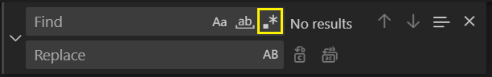

When you want to edit a bulk of the text in markdown, text files, JSON or other file types, **Find and Replace** feature of VS or VS Code can help a lot.

<!-- more -->

Even in some files which do have language support, you might still miss an advanced tool that would do the operation you are looking for. Needless to say, if there is a tool for the operation you should use that - e.g. when you would like to rename a function or variable in PHP, use [Rename refactoring](https://docs.devsense.com/en/vscode/editor/refactoring). But for the other cases, we have **Find and Replace**.

## Find and Replace dialog

To display the tool window press:

- `Ctrl+F` or `⌘F` Find
- `Ctrl+H` or `⌥⌘F` Replace

In VS you can also specify the scope for **Find and Replace**.

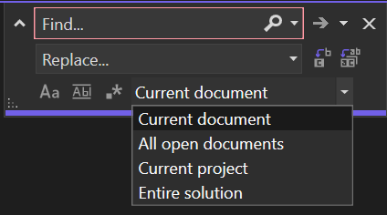

## Enable regular expressions in Find and Replace dialog

By default, regular expressions are not enabled and you need to turn them on.

Either click on the icon shown in the picture or press `Alt+E` in Visual Studio.

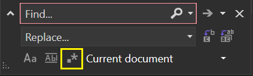

The shortcut in VS Code is `Alt+R` or click on the same icon as in VS. 

 > Some users have reported that `Alt+R` did't work since it's bound to toggle the NVIDIA display of stats.

## Find and Replace in Files

If you want to search through the files, not just the current document you will want to press these:

- `Ctrl+Shift+F` or `⇧⌘F` Search in files
- `Ctrl+Shift+H` or `⇧⌘H` Replace in files

The dialog in Visual Studio looks like this:

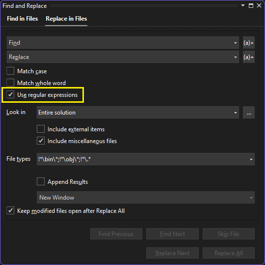

And the one in VS Code:

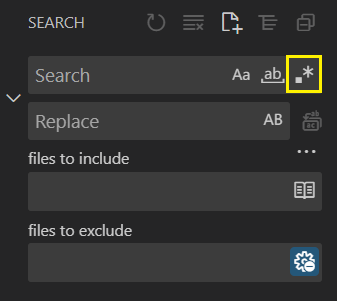

## Some samples usages

I don't want to explain regular expressions in detail, I think there are plenty of other resources on this topic. I would rather show a few examples, so you will get a feel for how it can be useful to you.

What most of the samples below have in common are capturing groups in the search pattern. The groups are delimited by parentheses `()` and then referenced by the `$number` in the replace pattern. If you use `$0` it will mean the whole match. And if you wonder how to use `$` in the patterns, it's just `$$`.

### Transform a date

Find pattern
```regexp
(\d+)-(\d+)-(\d+)
```

Replace pattern
```regexp
$3.$2.$1
```

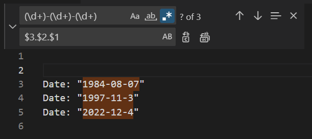

What I did here is to find all occurrences of dates in the format `YYYY-MM-DD` and replaced it with `DD.MM.YYYY` since that's the way we are used to presenting dates in Czechia.

The problematics of date formats and cultures is a very complex subject. But in this case, I'm just transforming a bunch of dates into a known format.**Find and replace** did the trick.

### Transform html title to markdown title

Let's say you want to transform a text surrounded by some tags e.g. header html tags `<h1>text</h1>` into a different text - `# text` a markdown header.

Find pattern
```regexp
<h1>(.+?)</h1>
```

Replace
```regexp
# $1
```

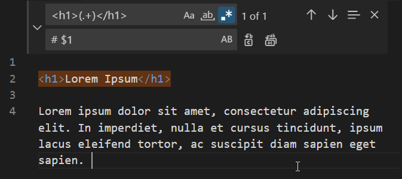

### Match beginning of a line

The following sample will find all occurrences of the word `Note:` only if it's at the beginning of the line and transforms it to `> **Note:**`.

Find pattern
```regexp
^Note
```

Replace
```regexp
> **Note:**
```

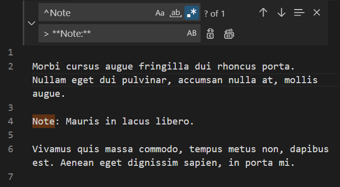

There are no capturing groups in the sample, just an anchor metacharacter `^` indicating the beginning of the line. In a same way you can use `$` for the end of the line.

### Removing duplicities

For this task, you will need backreferences in the search pattern. This means you want to reference a group captured in the preceding part of the search pattern in the later part of the pattern. 

They will allow you to find consecutive duplicate words like this:

Find pattern
```regexp
\b(\w+)\s+\1\b
```

Replace
```regexp
$1
```

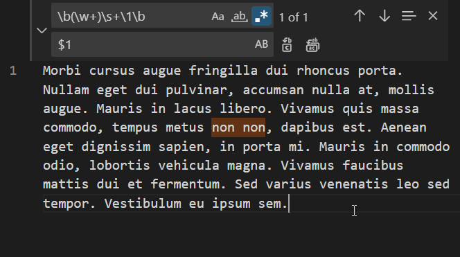

In this case, you are not just referencing the first captured group in replace pattern, but also in the search pattern itself by `\1`. That's how you can define you are looking for duplicities.

The other important metacharacter in this pattern is `\b` which matches the beginning or end of a word. So we will not match in cases of a word ends with the same letters as another word begins. e.g. capturing groups would match `g g`.

### Removing duplicate lines

To find and remove consecutive duplicate lines you could use this pattern:

```regexp
^(.*)(\n\1)+$
```

and as a replace pattern:
```regexp
$1
```

But it only removes duplicities if they are next to each other. And although it's possible to write a pattern that would match any duplicities, the pattern would start to get quite complex and inefficient. That's where the benefit of the simplicity of **Find and Replace** might start to vanish and it might be worth using another tool.

Fortunately, VS Code since version `1.62` has a built-in command for this.

Select the text in the current document, open Command Palette `F1` and write `Delete Duplicate Lines`. Hit `ENTER`.

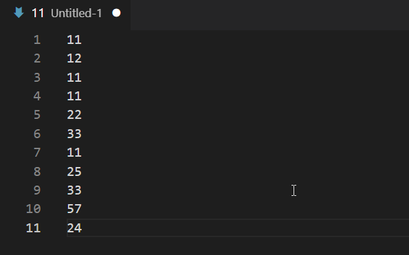

I'm not aware of such a command in Visual Studio though.

## Named capture groups

I would like to mention that you can also refer to groups by names, not just numbers. I find that useful if it's some regexp I want to use various times and by naming a group I would self-document it. If I write one-time search pattern I don't bother and just use the numbers.

But for example, in case of duplicity searching regexp, I would rewrite it like this instead:

```regexp
(?<repeated>\w+)\s\k<repeated>
```

Then in the replace pattern, you will still need to use numbers.

Actually, in Visual Studio you can use `${repeated}`. And in VS Code, there was a feature request for it, but due to low interest, it didn't get to the product.

## Finding and replacing multiline patterns

When one line isn't enough, you can always write multiline search or replace patterns. You will just need to press `Ctrl+ENTER` to add a new line or copy-paste it from another source.

## Transform text to lowercase/uppercase

One more useful feature to mention is the possibility to transform text from lowercase/uppercase or even transform just a first letter to lower or uppercase.

If you search for all words:
```regexp
(\w+)
```

Then you can use these transformations in the replace patterns:
 - `\L$1` All words in the matched group will change to lowercase.
 - `\l$1` First letter in the matched group will be lowercase, the rest will be unchanged.
 - `\U$1` All words in the matched group will change to uppercase.
 - `\u$1` First letter in the matched group will be uppercase, the rest will be unchanged.

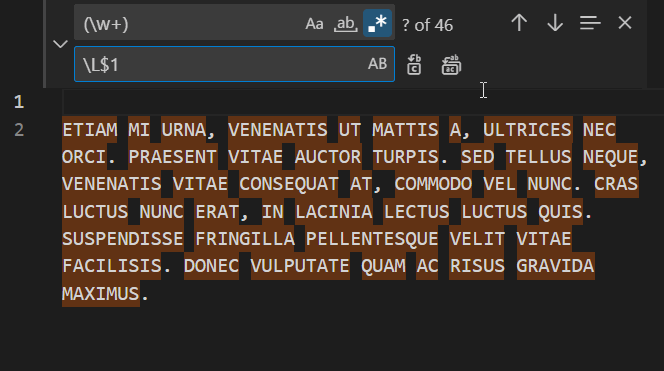

## Conclusion
	
VS and VS Code **Find and Replace** using regular expressions is a very powerful tool to have in your pocket. Although it's not a silver bullet and a better tool might be available depending on what you are trying to achieve, it's worth keeping it in mind the next time you'll need to do a lot of similar text editing.
