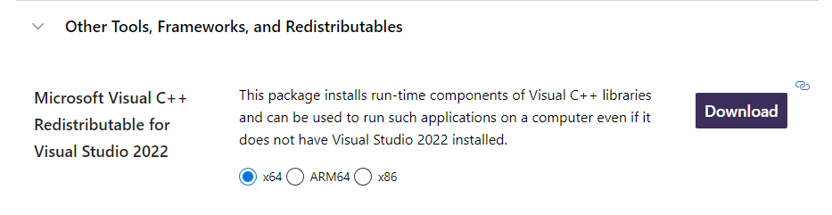
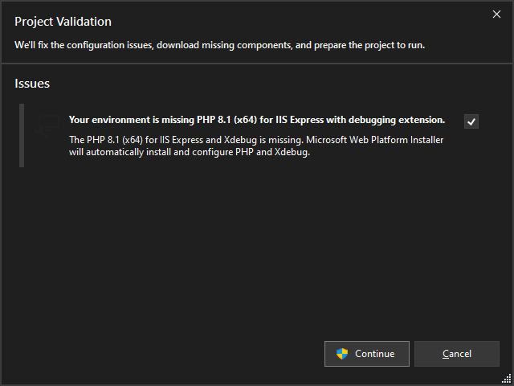
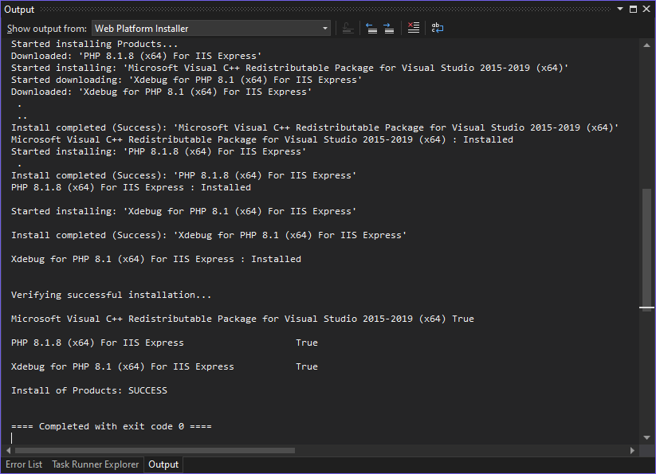

# Fix PHP Warning: vcruntime140.dll 14.0 is not compatible with this PHP build

I got an email from a user asking for help. He couldn't debug PHP application he was working on. After a little digging, we found out that he couldn't even run PHP. When executed it stopped immediately with a warning:

<!-- more -->

`
PHP Warning:  'C:\WINDOWS\SYSTEM32\VCRUNTIME140.dll' 14.15 is not compatible with this PHP build linked with 14.29 in Unknown on line 0
`

As you know PHP is written in C, with some components in C++. When you build PHP for Windows you will need a component called Microsoft C and C++ (MSVC) runtime libraries and `VCRUNTIME140.dll` is the main library. These libraries will have to be installed before PHP or any app that requires them can run. You can install MSVC in the package called Microsoft Visual C++ Redistributable package.

Now, since PHP doesn't bundle MSVC, it will want to use what you will have on your system. And if you have an older version than the version which PHP was built with, you will get the warning shown above.

## How to fix it

1. Go to [https://visualstudio.microsoft.com/downloads/](https://visualstudio.microsoft.com/downloads/)

2. Scroll to the bottom, there is a `Other Tools, Frameworks, and Redistributables` section.

3. Select your OS distribution bitness (Don't worry about Visual Studio version) and click **Download**

4. After installation, the warning should go away.

## How not to worry about it again

If you are using **PHP Tools for Visual Studio**, the issue will not happen. There is an automatic installation/configuration feature that checks the requirements of the particular PHP version you want to update or install.

For example, if your project requires PHP 8.1 with Xdebug and you run the project, you would get the following dialog.

When you click continue, PHP Tools will install PHP 8.1 x64, the latest Xdebug and the required Microsoft Visual C++ Redistributable package - if not present already. 

This way you will not have to deal with this the next time.
