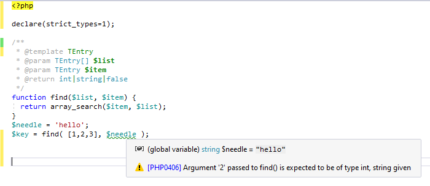
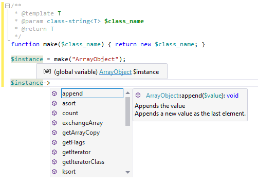

# Generics in PHP using PHP DocComments

Most of the type-safe languages, like *TypeScript*, *C++*, *C#*, *Java*, ... or *Hack*, .. allow you to specify not just types but also so-called **generic type arguments** - a way of substituting a type name with an actual type when you use it. PHP lets you to specify types for extra type-safety (and improved code completion), but generic types need to be specified inside Doc Comments. That's because the PHP language syntax itself does not know them yet.

<!-- more -->

Let's see how they look like, and what's the benefit of generic types.

## Basic Usage

There is a well-known PHPDoc tag **`@template`** which tells the editor about a new type name - the generic type. Consider the following sample, and notice that we introduce type named **`T`**.

```php
/**
 * @template T
 */
class MyCollection {

    /** @var T[] */
    var $items;
	
    /** @return T */
    function getItem($i) { return $this->items[$i]; }
}
```

`@template T` defines a new type name `T`, which can be used in Doc Comments in the scope of entire `class`.

**`T`** can be \*anything\* (an object, int, bool, string, array, ...) at this point but at the same time `$items` and `getItem()` are restricted to the same **`T`**. More precisely, `$items` is restricted to be an `array` of `T`, and `getItem()` is annotated to return the same type `T`.

In the same way, you make restrictions within a single function scope, like the following one:

```php
/**
 * @template T
 * @param T[] $list
 * @return T
 */
function array_first($list) {
    return array_shift($list);
}

//
$x = array_first( [1,2,3] ); // "T" is substituted with "int", "$x' is "int"
```

## Code Diagnostic

The PHP editor recognizes generic types and checks everything matches; consider the following sample:

```php
/**
 * @template TEntry
 * @param TEntry[] $list
 * @param TEntry $item
 * @return int|string|false
 */ 
function find($list, $item) {
  return array_search($item, $list);
}
```

`$list` and `$item` are both restricted to the same type `TEntry`, they are bound to each other. This makes your code much safer, since it adds additional level of type information to it.

When you make use of such annotated function, the editor substitutes the type argument `TEntry` with what it knows. Then we get error right in the PHP editor, if we try to use the function `find()` in a way which does not make sense:

```php
$needle = 'hello';
find( [1,2,3], $needle ); // ERROR: type mismatch: expected 'int', but 'string' given.
```

This is very useful for maintaining your code integrity without the need of continuously running tests for every line of the project:



## Limit the Generic Type

> `@template TException of Exception`

Sometimes you need to restrict the generic type argument itself. Imagine function that accepts anything assignable to type `Exception`. And returns it.

```php
/**
 * @template TException of \Exception
 * @param TException $e
 * @return TException
 */
function handle($e) { return $e; }

// call
$e= handle(new InvalidArgumentException); // $e is "InvalidArgumentException", not just "Exception"
```

The sample above keeps the type information we pass as an argument. In the result, PHP Editor, and eventual type checks will make use of better type information for the resulting value in `$e`. Moreover, **we only allow objects of type `Exception` to be used as an argument**.

## Generic Type Specification

Generic type names can be used in other type names, and that allows for more complex combinations. Specifying generic type arguments is made through **`<`** and **`>`** brackets.

### Generic Class Type Arguments

As a sample, to specify our `MyCollection` class with specifying the type argument `T`, we use it like this:

```php
/**
 * @param MyCollection<int> $collection
 */
function foo( $collection ) {
	// $collection is of type "MyCollection", where "T" is "int"
}
```

### Special Type Names

Additionally, there are some special keywords allowing us to be even more specific.

#### **`class-string<T>`**
	
Use the type name `class-string<T>` to annotate a type, which is a string that refers to a type name. Let's demonstrate on an example:

```php
/**
 * @template T
 * @param class-string<T> $class_name
 * @return T
 */
function make($class_name) { return new $class_name; }
```

The parameter `$class_name` uses a generic type specification, it will be a `string` referring to a type name (so we can make an instance of it with `new`). But also, the editor will inherit as much information as it can, so in result:

- the editor may check argument to `make()` is a valid class name.
- it may resolve the return type of `make()` and provide better code completion and additional type checks.



#### **`array<TKey,TValue>`**

In the same way, the editor understands `array<>` notation. Use `array<TKey, TValue>` or just `array<TValue>` to annotate arrays and their elements.

#### Others

Other special annotations are `iterable<T>`, `(callable(): TResult)`, `Collection<T>`, `Generator<TKey, TValue, TSend, TReturn>`

## Inherit, and More

Finally, there are new Doc Comment keywords `@extends` and `@implements`. We use them in the `class`'s Doc Comment to specify generic type base class and base interfaces.

```php
/** @extends MyCollection<int> */
class IntCollection extends MyCollection {
}
```

Or combine it all together:

```php
/**
 * @template T
 * @extends MyCollection<T>
 * @implememts Traversable<T>
 */
class ReadOnlyCollection extends MyCollection implements Traversable {
}
```

## Conclusion

It's a long time requested feature. When writing a type-safe object-oriented PHP code, you'll definitely need some generics. [PHP Tools for Visual Studio](https://www.devsense.com/features#vs) and [PHP Tools for Visual Studio Code](https://www.devsense.com/features#vscode) provide you with the smart PHP Editor which has full support for generics - code completion, code diagnostics, and refactoring help you with writing type-safe and bullet-proof code. Code faster, and avoid unnecessary errors.

## See Also

- [PHP Generics in Visual Studio and Visual Studio Code](https://blog.devsense.com/2022/update-php-generics)
- [PHP Doc Comments in Visual Studio](https://docs.devsense.com/en/vs/editor/phpdoc)
- [Writing PHPDoc in VS Code](https://docs.devsense.com/en/vscode/editor/phpdoc)


