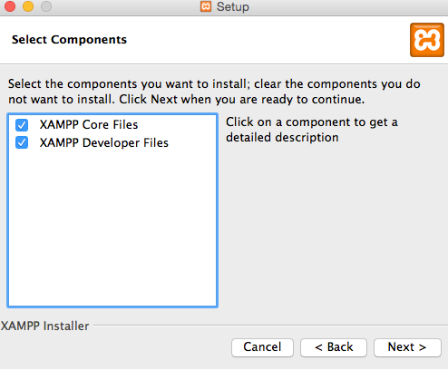

# How to install and configure Xdebug for XAMPP on Mac

[XAMPP](https://www.apachefriends.org/) is a very popular cross-platform Apache distribution containing MariaDB (fork of MySQL), PHP, and Perl. But unfortunately, XAMPP doesn't come bundled with the Xdebug, which is an extension that enables PHP debugging. This tutorial shows one way how to get it on Mac - we will be compiling Xdebug from sources.

<!-- more -->

In case you've installed PHP with Homebrew, you can check this tutorial instead https://docs.devsense.com/en/vscode/debug/xdebug-mac.

## 1. Install Homebrew

First, you will need homebrew (https://brew.sh/) which is a package manager for Mac. Paste the following command in a macOS Terminal:

```
/bin/bash -c "$(curl -fsSL https://raw.githubusercontent.com/Homebrew/install/HEAD/install.sh)"
```

## 2. Install other required tools

Once you have Homebrew installed, run the following command:

```
brew install autoconf automake libtool
```

These tools are part of **GNU Build system** and are necessary to be able to compile Xdebug.

- `autoconf` is a tool for producing configure scripts from `m4` language.
- `automake` then uses the output of `autoconf` and creates a portable makefile.
- `libtool` helps to manage creation of static and dynamic libraries on various Unix based systems.

## 3. Reinstall XAMPP?

When you were installing XAMPP, did you check both `XAMP Core Files` and `XAMPP Developer Files`? If not, you will need to reinstall XAMPP.



## 4. Clone Xdebug

You will need sources of Xdebug, you can just clone the xdebug repository

```
git clone https://github.com/xdebug/xdebug.git
```

or download the sources from the official Xdebug page https://xdebug.org/download and unpack them.

## 5. Compile Xdebug

Make sure you are in the directory with the Xdebug sources and run this command:

```
phpize
```

Choose which command to run depending on your Mac architecture:

- **Intel**
  ```
  pecl install xdebug
  ```

- **Apple M1**

  Here you have two options. PHP on M1 can either be compiled for the x86_64 or arm64 architecture. And the Pecl tool can't guess which one is it, so you will need to run a specific command depending on the the architecture. You can find out which one is it by running this command.

  ```
  file `which php`
  ```
  
  Then if it's arm64 run this command:
  ```
  arch -arm64 sudo pecl install xdebug
  ```
  
  or if PHP was compiled for x86_64 architecture, run this command:

  ```
  arch -x86_64 sudo pecl install xdebug
  ```

This will install Xdebug extension to XAMPP PHP extension folder:

```
/Applications/XAMPP/xamppfiles/lib/php/extensions/no-debug-non-zts-20210902/xdebug.so
```

## 6. Configure Xdebug

Open `php.ini` of your XAMPP distribution at `/Applications/XAMPP/xamppfiles/etc/php.ini` and add the following lines to the bottom of the file:

```ini
[xdebug]
zend_extension=/Applications/XAMPP/xamppfiles/lib/php/extensions/no-debug-non-zts-20210902/xdebug.so
xdebug.mode=debug
xdebug.start_with_request=yes
```

## 7. Verify

Run the following command
```
php -v
```

You should see the output like this one:

```
PHP 8.0.17 (cli) (built: Mar 18 2022 09:45:09) (NTS)
Copyright (c) The PHP Group
Zend Engine v4.0.17, Copyright (c) Zend Technologies
   with Xdebug v3.1.3, Copyright (c) 2002-2022, by Derick Rethans
   with Zend OPcache v8.0.17, Copyright (c), by Zend Technologies
```

## That's it

Now, you have Xdebug working with your XAMPP installation on Mac. The only thing that's left is to have an extension in Visual Studio Code able to connect with the Xdebug like [PHP Tools](https://marketplace.visualstudio.com/items?itemName=DEVSENSE.phptools-vscode), create [`launch.json`](https://docs.devsense.com/en/vscode/debug/launch-json) and you can debug your PHP application in Visual Studio Code.