# Start with Laravel in VS Code on Docker

Imagine you are part of the team and you want each member to develop in one standardized environment. They can have different operating systems and use different development tools or IDEs, but you want to have one unified environment with all the required dependencies. 

<!-- more -->

Or if being part of the team isn't your thing, you might want a standardized environment for yourself as well. You want to keep the project separate from your local environment. Or when you are done with the project and you leave it for a while, then return to it, you want to be able to start where you finished. Even if it was some time ago and you have a new computer. You want to be able to set everything up, as you had it before, and start to work quickly.

We will use a tool called [Laravel Sail](https://laravel.com/docs/9.x/sail) - a command-line tool that should simplify the whole process and shield us from the complexities of such a setup.

## Requirements

For this tutorial you will need:
 - [Docker Desktop](https://www.docker.com/products/docker-desktop/)
 - [VS Code](https://code.visualstudio.com/download)
 - [Remote Development](https://marketplace.visualstudio.com/items?itemName=ms-vscode-remote.vscode-remote-extensionpack) pack extension (In reality you would just need WSL and Dev Containers extension, but let's install the whole package)
 - [WSL 2](https://learn.microsoft.com/en-us/windows/wsl/install)

Now, I'm going to use Windows in this tutorial, but you should be able to follow with any other OS. There might be just slight differences. Particularly when dealing with some issues that are not going to apply to you.

## Getting the Laravel

- First, in Windows press <kbd>Win + R</kbd> and type `wsl`, hit <kbd>ENTER</kbd>
- Create a directory where are you going to work on the project. 

 When I first wrote this tutorial I used  `/mnt/c/Miloslav/Projects/Recent/laravel_test/example-app` but one careful reader (thanks Ken Verhaegen) has point out to me that this is not ideal for performance reasons. It's better to create the directory outside of `/mnt/c`, e.g. `~` works fine and you can always access it from Windows through network share. In my case `\\wsl.localhost\Ubuntu-22.04\home\miloslav`

- Now, when you are in the target directory, run this command

```bash
curl -s "https://laravel.build/example-app?with=mysql,redis&devcontainer" | bash 
```

Since I want to use other components, not just Laravel itself, I'm specifying those in `with` query parameter. In particular, it's going to be MySql and Redis. The other query argument `devcontainer` instructs sail to create a default `devcontainer.json` file for us. Do not worry for now, if you don't know what is that - I will explain later.

> **Note**: In my case, when I first run this command, I got this error output:
> `Docker is not running`
>
> What I had to go to Docker desktop settings (You can right click on Docker Desktop icon in systray and select **Settings**). Under **Resources**, open **WSL integration** and check in which WSL distros you want to access Docker from.
>
> 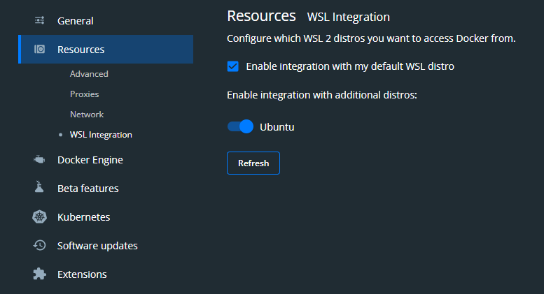
>
> That should do the trick and you will be able to run the command.

-  Let the thing do the work:

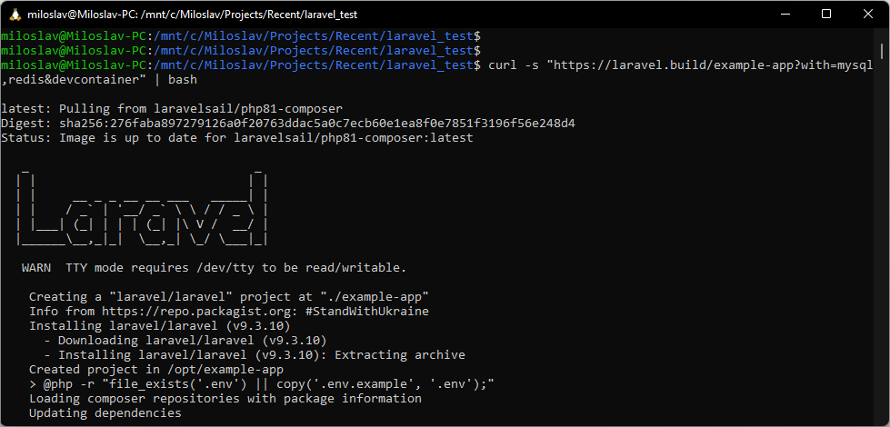

- Once finished, go to the new directory `cd example-app`.

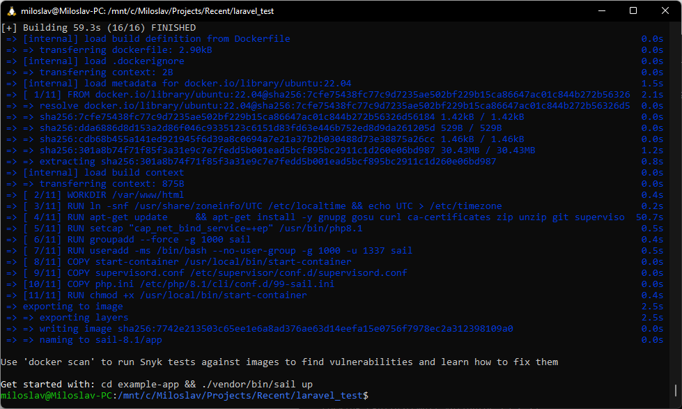

- Run this command to start a new instance of VS Code opened from the current location:

```bash
code .
```

> **Note:** I hit the wall again when I first run the command and received this message:
> 
> 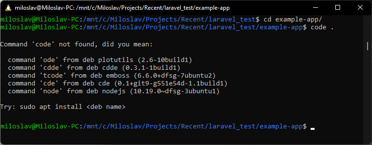
>
> For some reason `code` command couldn't be found. When I check the path by running:
> ```bash
> echo $PATH
> ```
> I couldn't find the VS Code there. Simple solution would be to make sure there is path to the VS Code directory - in my case it would be `/mnt/c/Users/milko/AppData/Local/Programs/Microsoft VS Code/bin`.
> 
> But instead of manually adding VS Code to the PATH in WSL, I just installed a new Linux distribution through Microsoft Store (I wanted to do it anyway) - `Ubuntu-22.04` and `PATH` should be updated there.
>
> Then I checked which container is wsl using (In windows Command Line):
> `wsl --list -v`
>
> ```bash	
>	  NAME                   STATE           VERSION
>	* Ubuntu                 Running         2
>	  Ubuntu-22.04           Stopped         2
>	  docker-desktop         Stopped         2
>	  docker-desktop-data    Stopped         2
> ```
>
> I had to switch the container to the new Ubuntu `wsl -s Ubuntu-22.04`,
>
> Then I restarted `wsl` and `code .` worked now.

## Visual Studio Code in WSL

The Visual Studio Code will start in WSL. You will know that when you check the bottom left corner of VS Code window. You should see this green tag:

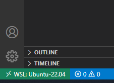

VS Code will also immediately want to reopen this folder in Dev Container since it detected `devcontainer.json` file. It will notify you with this message:

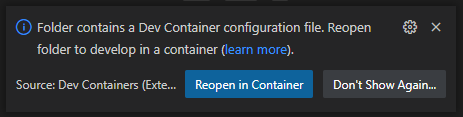

Don't do that just yet and let's examine the `devcontainer.json` file first. You will find it in `.devcontainer` folder.

## Customizing `devcontainer.json` file

The file instructs VS Code which container (or multiple containers) to open and what other customizations should perform. In this case, `dockerComposeFile` points to the `docker-compose.yml` generated by the Laravel Sail which specifies particular containers for our services (we wanted Mysql and Redis) and how they are connected. Since Laravel Sail is here to simplify this whole process, we will not worry about the content of `docker-compose.yml` and just trust that the sail did a good job.

Let's make slight changes to `devcontainer.json`. We will want to have full PHP support in the container. So we are going to add [PHP Tools](https://marketplace.visualstudio.com/items?itemName=DEVSENSE.phptools-vscode) extension `DEVSENSE.phptools-vscode` to the `extensions` section and also specify code style settings `php.format.codeStyle` for the formatter (one component of the PHP Tools). Laravel uses PSR-2, so that's what we are going to use. You can just copy the whole file from here:

```json
// https://aka.ms/devcontainer.json
{
	"name": "Existing Docker Compose (Extend)",
	"dockerComposeFile": [
		"../docker-compose.yml"
	],
	"service": "laravel.test",
	"workspaceFolder": "/var/www/html",
	"settings": {
		"php.format.codeStyle": "PSR-2"
	},
	"extensions": [
		"DEVSENSE.phptools-vscode"
		// "mikestead.dotenv",
		// "amiralizadeh9480.laravel-extra-intellisense",
		// "ryannaddy.laravel-artisan",
		// "onecentlin.laravel5-snippets",
		// "onecentlin.laravel-blade"
	],
	"remoteUser": "sail",
	"postCreateCommand": "chown -R 1000:1000 /var/www/html"
	// "forwardPorts": [],
	// "runServices": [],
	// "shutdownAction": "none",
}
```

If interested, you can examine the whole specification of `devcontainer.json` [here](https://aka.ms/devcontainer.json)

## Enable Xdebug in the Laravel container

Since we want to be able to debug php code in the container, we will need to turn that on.

Open `.env` file and append the following lines which will turn on Xdebug step debugging mode and instruct it to try to connect back to the VS Code on each request:

```
SAIL_XDEBUG_MODE=debug
SAIL_XDEBUG_CONFIG="start_with_request=true"
```

> **Note:** By default Laravel will be server from port `80`. If you have already another web server installed localy which is bound to this port, the container will not start. You would need to either stop the local web server, or add `APP_PORT=8080` to `.env` file. That would change the port from where the Laravel will be served.

Now we are ready to start the containers and launch another VSCode instance directly in the Laravel container. 

## Launch VS Code in the Container

Start the terminal (<kbd>Ctrl + ~</kbd>), if it's not opened already. And run the following:

```bash
./vendor/bin/sail up -d
```

Laravel Sail will create the containers and start them. Normally, this wouldn't be a required step. VS Code itself can compose, build and run containers specified in `devcontainer.json`, but at the time of writing it didn't pick up the changes I've made to `.env` file. There is a related [issue](https://github.com/microsoft/vscode-remote-release/issues/6586) on Github and I will update the article once resolved - maybe I just need to put something to the `devcontainer.json`? - If you know, please write me in the comments below.

The other thing we want to do is to get [barryvdh/laravel-ide-helper](https://github.com/barryvdh/laravel-ide-helper) package and instruct it to generate files that will hep the IntelliSense engine to provide accurate auto-completions for Laravel.

First, open up `composer.json` and update `post-update-cmd` by adding these commands:

```json
    "scripts": {
        "post-update-cmd": [
            "@php artisan ide-helper:generate",
            "@php artisan ide-helper:models",
            "@php artisan ide-helper:meta"
        ],
    },
```

They will regenerate ide helper files on each time you update your dependencies. Then run the following command to get the package:

```bash
./vendor/bin/sail composer require --dev barryvdh/laravel-ide-helper
```

Once finished, press <kbd>F1</kbd> and select `Reopen in Container`.

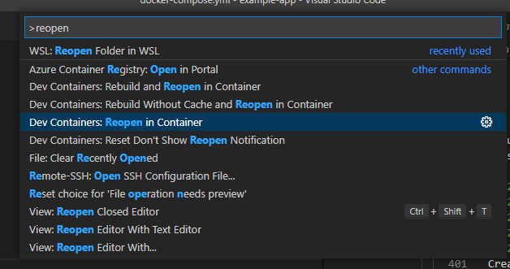

The folder will reopen in the new VS Code window. Now, the new VS Code instance is running in the container with Laravel. At this point, I'm starting to feel like I'm opening Matryoshka dolls - launching VS Code in one container from VS Code in another container.

## Debug the Laravel in the Container

First, let's check if we have Laravel up and running and accessible from the local machine. On Windows, open your favorite browser and type `localhost`. If you have changed the port with `APP_PORT`, use that port in the URL (e.g. `localhost:8080`).

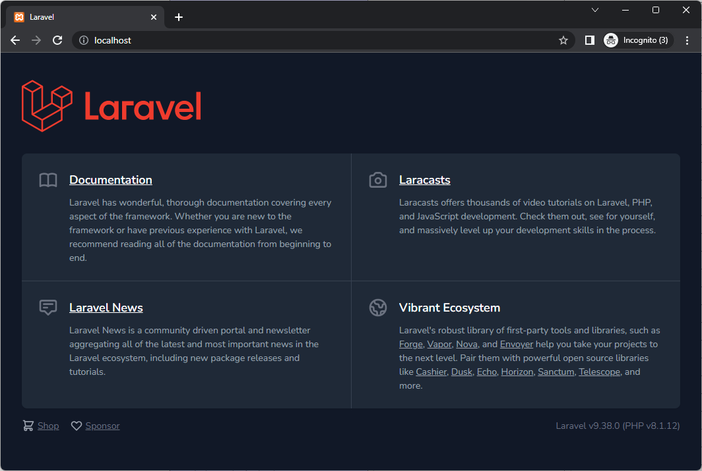


Now, to debug open `public/index.php`, place a breakpoint there and hit <kbd>F5</kbd>. Since we do not already have any [`launch.json`](https://docs.devsense.com/en/vscode/debug/launch-json) file specifying what the launch should do, we will get these default options. Click `Listen for Xdebug`.

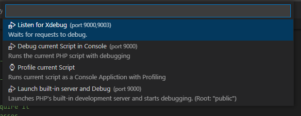

Then go back to the browser and refresh it. The debugger should break on the line with the breakpoint.

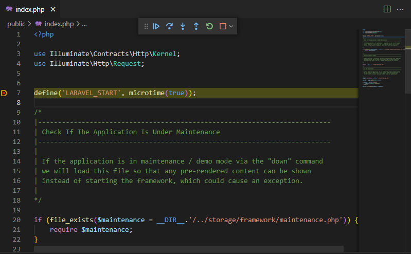


## Working with Mysql and Redis

Since we've instructed Sail to install and configure Mysql and Redis too, they are now available in their separate containers, but available to the Laravel container. To test that, open `resources/views/welcome.blade.php` file, delete the default welcome content in the body and replace it with the following:

```html
<body class="antialiased">
    <h1>Laravel in the Container</h1>
    <p>Visits {{$visits}}</p>
    <p>MySql version {{$mysql_version}}</p>
</body>
```

Then open `routes/web.php` and replace it completely with the following:

```php
<?php

use Illuminate\Support\Facades\Redis;
use Illuminate\Support\Facades\Route;

/*
|--------------------------------------------------------------------------
| Web Routes
|--------------------------------------------------------------------------
|
| Here is where you can register web routes for your application. These
| routes are loaded by the RouteServiceProvider within a group which
| contains the "web" middleware group. Now create something great!
|
*/

Route::get('/', function () {
    return view('welcome', [
        'visits' => Redis::incr('visits'),
        "mysql_version" => DB::select("select version()")[0]->{'version()'}
    ]);
});

```

This way we will check if we have both Redis and Mysql ready to go. Just refresh the browser with `localhost` address.

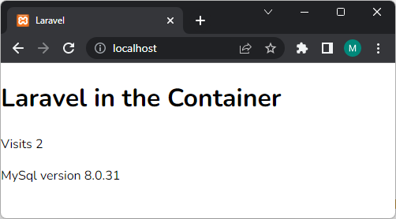

## Testing

One more thing you can find useful is the unit testing support. In VS Code, click on the tests icon in the left menu bar. You should see the example tests defined in the `tests` folder. You can run them in bulk by clicking on the play button:

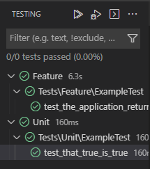

Or run and debug them individually by right-clicking on the test and selecting `Debug Test`.

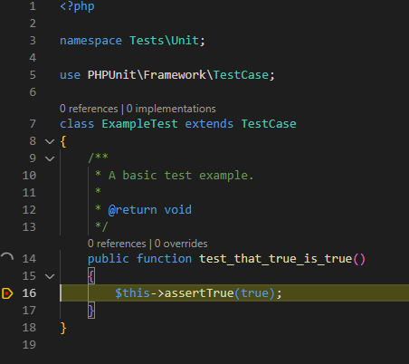

## Conclusion

That's it! You have successfully created and configured a standardized development environment for Laravel in Visual Studio Code on Docker. You can debug and test Laravel. And you have Redis and Mysql up and running. I hope your Laravel development needs are covered. But if you find anything else worth mentioning, I will gladly take a look. Please let me know in the comment below. Thank you.
