# Create a multi-container PHP app with Docker Compose

In this tutorial you'll learn how to create more than one container and communicate between them. This requires Docker compose which is a great way for local developing and testing your projects.

<!-- more -->

This tutorial is based on the previous tutorial about [debugging multiple projects](https://blog.devsense.com/2015/10/debugging-multiple-projects), but you don't need to check that first in order to follow this one.

You can find the sample project on [github](https://github.com/DEVSENSE/php4vs/tree/master/samples/MultiplePHPProjectsOnDocker)

## Prerequisities:
- [Docker Desktop](https://hub.docker.com/editions/community/docker-ce-desktop-windows)
- Visual Studio with [PHP Tools](https://www.devsense.com/en/download) installed

## Create a solution with two PHP projects

In Visual Studio, create a solution with two PHP projects (`*.phpproj`). You can do it by first creating one project.

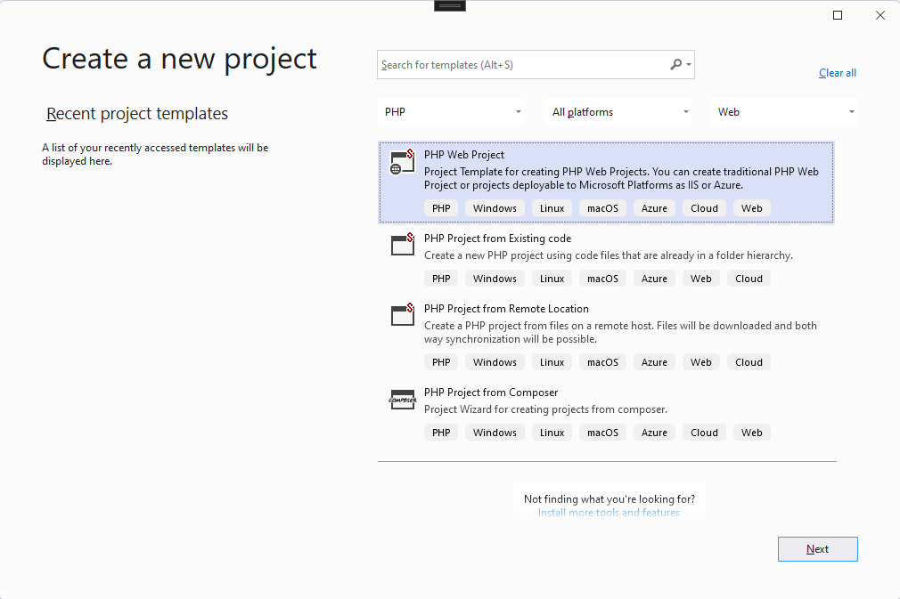

The first project will present the data to the user. Let's call it **PHPWebProject**. Then to the same solution we will add a second project called **PHPWebService** which be actually doing the work.

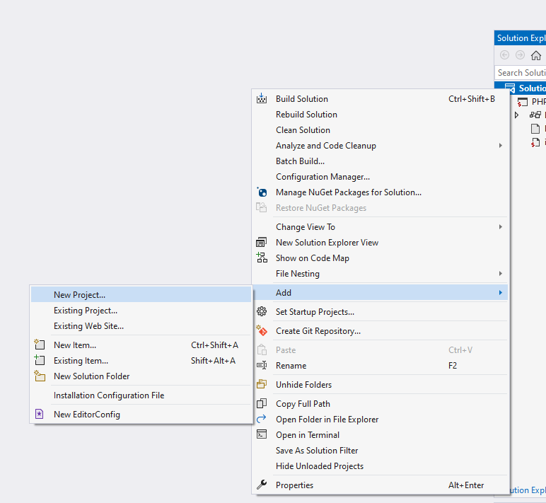

Now when you have to projects, go to **File** menu and click **Save All**. You will be asked to save the solution file, go one folder level up, so you do not save it the the project and name it 'MultiplePHPProjectsOnDocker'.

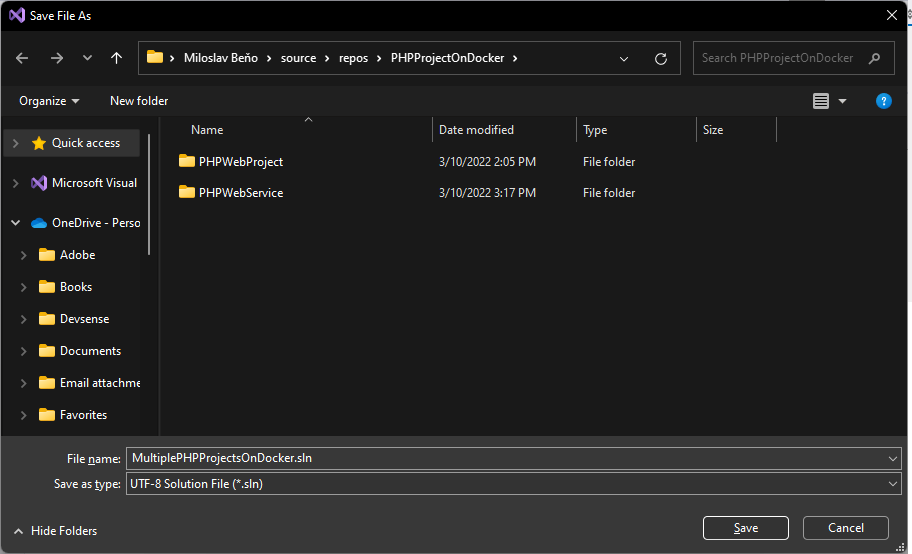

Create a `Dockerfile` in the both projects.

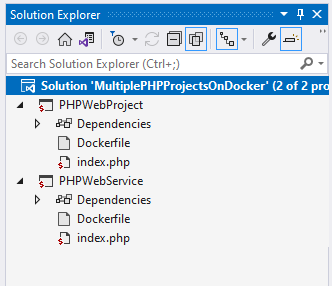

In the **PHPWebProject** and copy the following content:

```
FROM php:8.0-cli

ENV APP_DIR /var/www/html

RUN mkdir -p $APP_DIR
WORKDIR $APP_DIR
EXPOSE 80
VOLUME $APP_DIR

# Xdebug
RUN pecl install xdebug && docker-php-ext-enable xdebug;

# append to end of php.ini the xdebug section
RUN echo "xdebug.client_host=host.docker.internal" >> "$PHP_INI_DIR/conf.d/xdebug.ini" \
    && echo "xdebug.mode=debug" >> "$PHP_INI_DIR/conf.d/xdebug.ini" \
    && echo "xdebug.client_port=9003" >> "$PHP_INI_DIR/conf.d/xdebug.ini" 


CMD ["php", "-S", "0.0.0.0:80", "-t", "."]
```

There is plenty of tutorial on the internet explaining exactly what any of that means, but in short this will create a container with php 8.0 and installs and configures Xdebug. 

The last line executes [php build-in web server](https://www.php.net/manual/en/features.commandline.webserver.php) which will be listening on port `80`. In the real world scenario you would rather use `nginx` ( https://blog.devsense.com/2019/php-nginx-docker ) or `Apache` server for that. But just for a simplicity we will go the easy route in the tutorial.

Then open the project properties of the **PHPWebProject**. Right click on the **PHPWebProject** node in the **Solution Explorer** and open **Server tab**.

Change **Server** to `Custom` and fill in project URL `http://localhost:8080/`

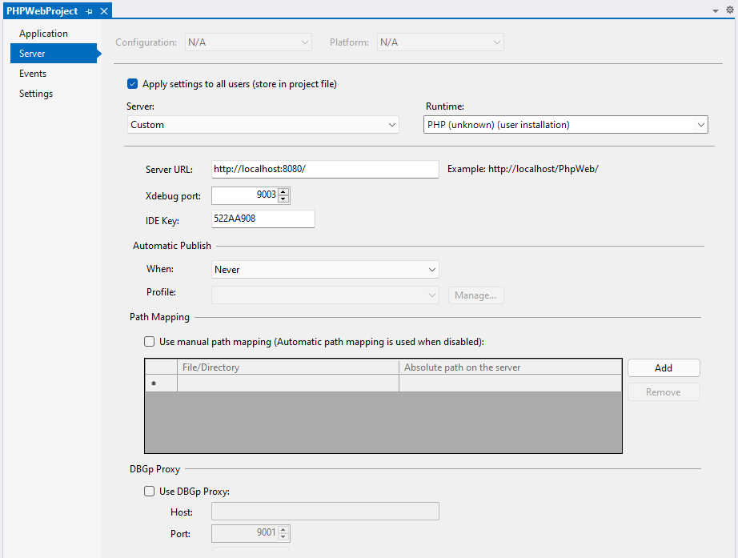

In the **PHPWebService** project create this `Dockerfile`:
```
FROM php:8.0-cli

ENV APP_DIR /var/www/html

RUN mkdir -p $APP_DIR
WORKDIR $APP_DIR
EXPOSE 80
VOLUME $APP_DIR

# Xdebug
RUN pecl install xdebug && docker-php-ext-enable xdebug;

# append to end of php.ini the xdebug section
RUN echo "xdebug.client_host=host.docker.internal" >> "$PHP_INI_DIR/conf.d/xdebug.ini" \
    && echo "xdebug.mode=debug" >> "$PHP_INI_DIR/conf.d/xdebug.ini" \
    && echo "xdebug.client_port=9003" >> "$PHP_INI_DIR/conf.d/xdebug.ini" \
    && echo "xdebug.start_with_request=yes" >> "$PHP_INI_DIR/conf.d/xdebug.ini" \
    && echo "xdebug.idekey=10F3DA6B" >> "$PHP_INI_DIR/conf.d/xdebug.ini";


CMD ["php", "-S", "0.0.0.0:80", "-t", "."]
```

It's almost identical to the previous one, but we've added `xdebug.start_with_request=yes` option which instructs Xdebug to try to initiate the debug session on each request and `xdebug.idekey=10F3DA6B` identifies which project should handle the Xdebug requests coming from this container.

Open the **PHPWebService** project properties and on the **Server** tab fill the project URL, e.g. `http://phpwebservice`. In this case it doesn't really matter since we will not be calling this service directly from our development computer. What matters here is `IDE_KEY` option. Make sure `10F3DA6B` is set there.

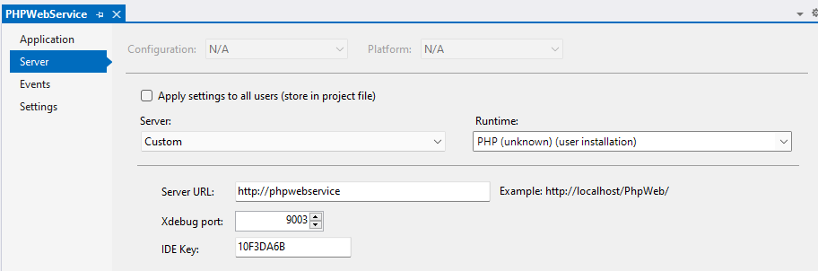

## Define services in a Compose file

Managing multiple containers requires container orchestration and requires an orchestrator such as Docker Compose, Kubernetes, or Service Fabric. So once we have `Dockerfile` in the both projects, we will create a solution file `docker-compose.yml` to use Docker compose.

Right click on the solution node in the **Solution Explorer** and select **Add**, **New Item...** (make sure to click on the solution node, not the project node).

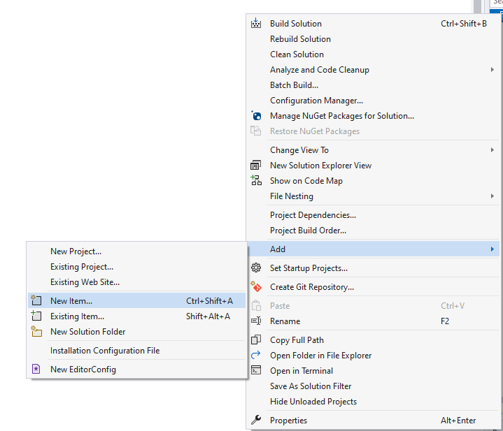

Fill in `docker-compose.yml` and hit <kbd>ENTER</kbd>

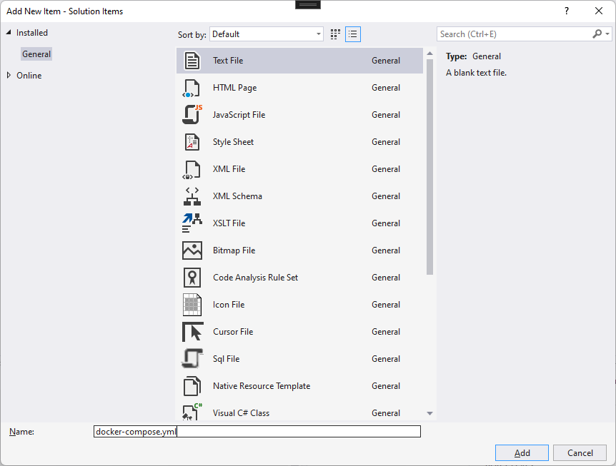

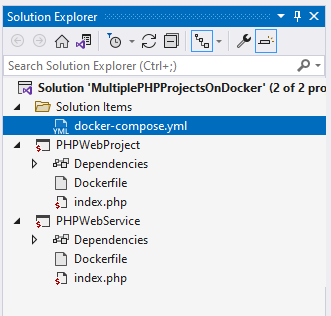

Once the file is created in the Solution, copy the following content:

```
version: "3.9"

services:
  phpweb:
    build:
      context: ./PHPWebProject
      dockerfile: Dockerfile
    networks:
      - internal
    volumes:
      - ./PHPWebProject/:/var/www/html
    ports:
      - 8080:80
  phpservice:
    build:
      context: ./PHPWebService
      dockerfile: Dockerfile
    networks:
      - internal
    volumes:
      - ./PHPWebService/:/var/www/html

volumes:
  phpweb:
  phpservice:

networks:
  internal:
    driver: bridge
```

We include both projects as services, first **PHPWebProject** as `phpweb` and **PHPWebService** as `phpservice`. For `phpweb` we will need to map port `80` to local port `8080` so we can access it from host machine. We also defined a network so `phpweb` can access `phpservice`.

## Call web service 

Since we want to access **PHPWebService** from **PHPWebProject** copy the following code to the `index.php` of **PHPWebProject**

 ```php
<?php

$ch = curl_init("http://phpservice/");
curl_setopt($ch, CURLOPT_HEADER, 0);
curl_setopt($ch,  CURLOPT_RETURNTRANSFER, 1);
$response = curl_exec($ch);
curl_close($ch);

echo $response;

?>
 ```

As you can see we are able to access **PHPWebService** with `phpservice` name defined in the `docker-compose.yml`. This will work since docker compose sets up the host names in its own network, so that `phpservice` is visible to other services as a hostname.

To know we actually got the response from the **PHPWebService**,  copy the following code to `index.php`:

```php
<?php

echo "Hello World from WebService on Docker";

```

## Build the app with Compose

Open a terminal by pressing <kbd>Ctrl + \` </kbd> or go to `View | Terminal` and run `docker compose up`.

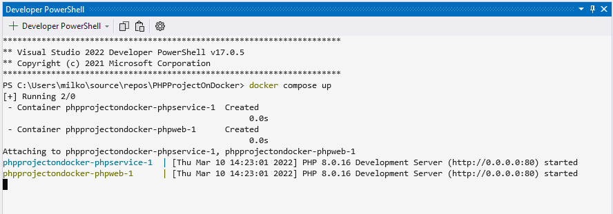

We can see the containers have been built and they are both running and serving requests with php built-in web server.

You can see more details about the containers at **Containers** tool window. Open `View | Other Windows | Containers`

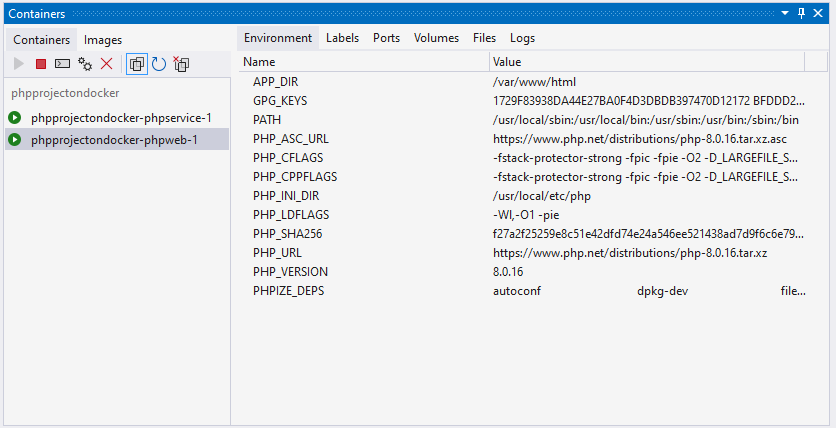

## Configure multiple project launch

We want both projects to start when <kbd>F5</kbd> is pressed. In the solution Properties (right click on Solution node in the **Solution Explorer** and choose **Properties**), select **Startup Project** tab, choose **Multiple startup projects** and select **Action** for both projects to **Start**.


We do not want to launch browser for the **PHPWebService** project. Open **PHPWebService** properties (right on **PHPWebService** node in the **Solution Explorer**, choose **Properties**). As **Start Action** select **Don't open a page. Wait for a request from and external application.**


## Debug the app

Let's add breakpoints to both projects and press <kbd>F5</kbd>.

First the debugger will break in the **PHPWebProject**.

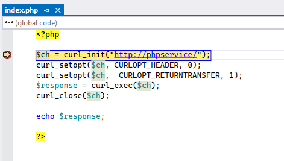

Then press <kbd>F5</kbd> again and it will break in **PHPWebService**. 

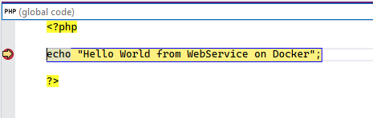

Pressing <kbd>F5</kbd> one more time will finish the requests and you can see the output in the browser.

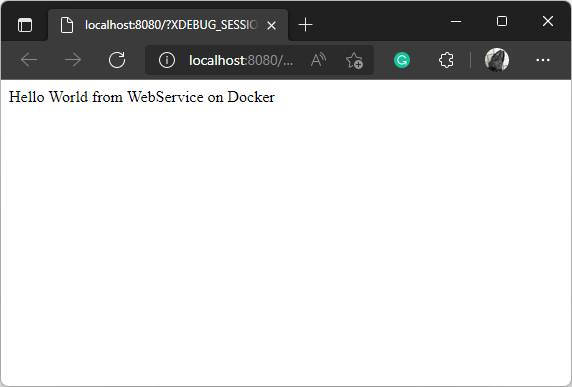

The important thing to note is we can further develop this solution without needing to build the containers again since the files in the projects are shared with the containers. Make changes and they will immediately take effect.

## That's it

Congratulations! You are running multi-container PHP app with Docker Compose.

