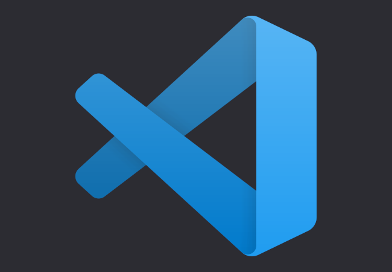
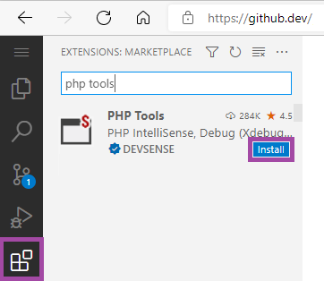
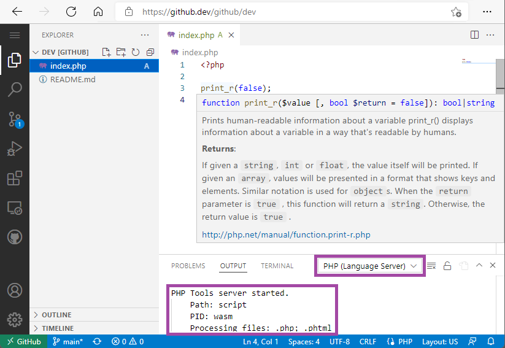
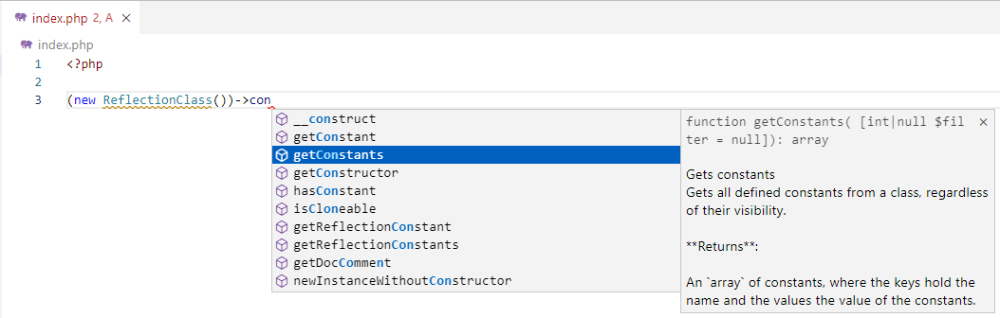
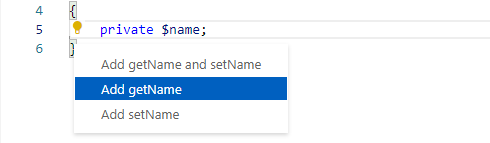
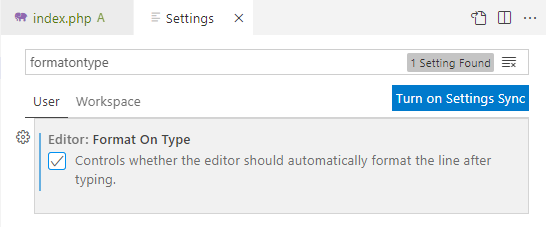
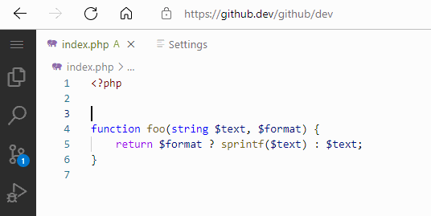
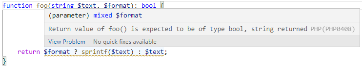

# PHP IntelliSense on the Web

Have you heard about the [Visual Studio Code for the Web](https://code.visualstudio.com/docs/editor/vscode-web)? It's the code editor running in your browser, allowing to work with your local files, files on your GitHub repositories, or files on Azure. Anywhere.

<!-- more -->

In case of the PHP language, the VS Code for the Web is perfect for quick edits on small projects, due to its [limitations](https://code.visualstudio.com/docs/editor/vscode-web#_limitations),

---

**PHP Tools for Visual Studio Code** is now available on the **VS Code for the Web**. All the editor features can be used in this browser-based development environment. 

## Installation

There are currently a few _VSCode on the Web_ applications, including https://vscode.dev or https://github.dev.

Navigate to the one of those, and your on-line workspace will open.You can either open a folder, a remote codespace, or single files. To enable PHP support in your `.php` files, switch to **_Extensions_**, and look for `"php tools"`. Click **`Install`**.

Open a PHP file to start working. To confirm you have successfully activated the extension, see the VSCode's Output Window, `PHP (Language Server)` tab. Or hover a mouse over something - you should see a net tooltip as we are used to from VS Code or Visual Studio:

## Features

There is a lot of features included; the entire code editor, IntelliSense, code formatting, errors analysis, type analysis, PHPDoc generator, multilingual PHP manual, navigating to _phar_ files, navigating to symbols in PHP manual, outlining, code actions, signature help, auto-importing `use`, semantic highlighting, inline editing, rename refactoring, ... and more.

### IntelliSense

The code completion including tool tips and all the available symbol information is included. 

### Code Actions

The editor provides also code actions - generating constructors, implementing interface methods, getters and setters, sorting `use`s, and others. See the [documentation](https://docs.devsense.com/en/vscode/editor/code-actions) for more examples.

### PHPDoc Generator

PHPDoc is generated seamlessly. Just type `/**` above a declaration. Although, it might be necessary to enable it in `File` / `Preferences` / `Settings` - where `editor.formatOnType` must be set to `true`.

Upon enabling the `formatOnType` setting, doc comments are nicely generated. This includes the available information from the syntax and the type analysis, eventually also with thrown exception information.

### Problems Analysis

The code editor also analyses the entire workspace for errors. The code is checked in the same way as in Visual Studio or Visual Studio Code. Based on syntax, semantics, and the type analysis, you get code underlined, errors listed in `Problems` window, including tooltips providing additional details.

## Limitations

The limitations are described at the VS Code's documentation page: https://code.visualstudio.com/docs/editor/vscode-web#_limitations.

Since the editor won't process all the files in your workspace, the IntelliSense might not be complete. In the result, code lenses with useful commands are not enabled since they would not provide complete results, code problems do not mention unknown classes and functions, tooltips might not provide the complete information, and Laravel facades might not provide complete IntelliSense either.

Additionally, the extension is unable to debug PHP code even though, it would be technically possible.

Test Explorer and PHPUnit integration is not included either.

It's important to remember, that the first time the extension is used, it might take a few seconds while the browser is downloading the extension file. It may be about 10 MB or more of data.
