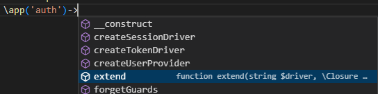
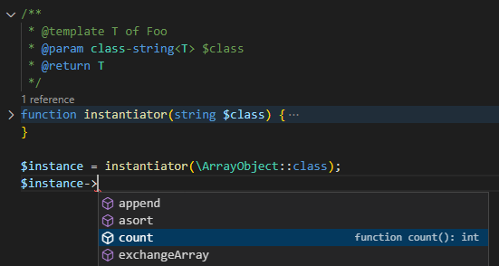

# PHP Tools for Visual Studio Code News (July 2022)

[PHP Tools for VS Code](https://marketplace.visualstudio.com/items?itemName=DEVSENSE.phptools-vscode) extension keeps growing, and we're happy we can show off a lot of useful new improvements. Recently, we have added support for the new Laravel framework and annotations that Laravel uses, support for generics through DocComment `@template` tag, redesigned the PHPUnit integration, and more.

<!-- more -->

---

## PHPUnit Test View

There is so-called **Test View** panel in Visual Studio Code, which has been updated recently. With PHP Tools, the panel lists your PHPUnit tests, allowing to run, **debug**, organize, track history of test runs, and more.

The new PHPUnit integration has a few neat features. Most noticeably every assertion failure is decorated with the failure message and eventually the actual/expected value diff.

No configuration is needed, `phpunit` is found within the `vendor` folder implicitly, `phpunit.xml` or `phpunit.xml.dist` is found and processed. Although in case you have your own `phpunit` phar/binary file, you can pass it to the VS Code setting named `phpunit.phpunit`. More at [the Testing documentation page](https://docs.devsense.com/vscode/test-explorer).

> Note: if you're updating from previous version of PHP Tools, you should manually uninstall the following deprecated VSCode extensions:
> - `ms-vscode.test-adapter-converter` (can be uninstalled)
> - `hbenl.vscode-test-explorer` (can be uninstalled)

## Laravel

It's a wide spread PHP framework, and it's full of very specific annotations. Laravel 9 is nicely documented piece of code, which serves as an example of what our PHP editor should be able to handle.

PHP IntelliSense ([*PHP Tools*](https://marketplace.visualstudio.com/items?itemName=DEVSENSE.phptools-vscode)) in VSC is now able to work with Laravel Facades, Real-Time Facades, Eloquent local scopes, and most of the `@template` Doc Comments annotations. It resolves service containers, understands eventual *phpstorm meta file*, and resolves the facade accessors.

Read our [Microsoft Visual Studio announcement with the Laravel support](https://blog.devsense.com/2022/php-tools-visual-studio-june-2022). We have been working hard to bring the same experience to VS Code as well!

## Generics

Generic type annotations are used across majority of PHP code, libraries, and frameworks, especially in the new Laravel 9. Even though it is not a part of the official PHP language specifications, developers need to annotate their classes and functions with type arguments. This helps code completion and code analysis to provide even better user experience.

For more details, please read our [blog post - Support for Generics](https://blog.devsense.com/2022/update-php-generics).

## More

We're proud we have made the extension itself significantly smaller while still bundling PHP manual translated into several major languages, providing support for the **Web** environments (like [vscode.dev](https://vscode.dev)), and seamlessly integrating all the features like code-lenses, code-fixes, debug, completion, PHPUnit debug, and others together.

There are hundreds other fixes and improvements we're listing in the [changelog](https://www.devsense.com/en/download/vscode). Please see the full list for more details.
