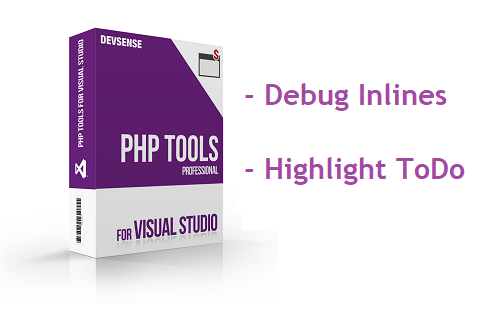
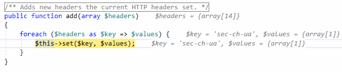
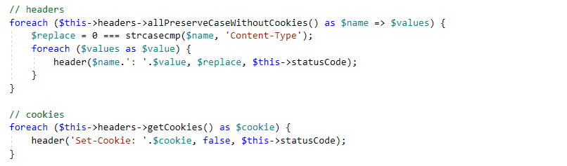
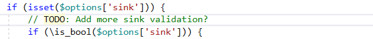

# PHP Tools for Visual Studio (May 2022)

Welcome to the May 2022 update of PHP Tools for **Visual Studio**. The release **v1.65** introduces IntelliSense improvements, enhanced **generics support**, and mostly the new **Debug Inlines** and other editor neat improvements.

<!-- more -->

---

## Debug Inlines

We're always trying to provide more insights while debugging your code. There are many features like Immediate Window, Quick Watch, Pinning Objects (aka [Object IDs](https://blog.devsense.com/2021/php-debug-objectid-mark-object)), or an efficient large array support.

With the **v1.65** we are adding one more - displaying **debug inlines**.

Debug Inlines are displayed in gray *italic* at the end of line. It shows values of variables and expressions depending on the current debugging context. Usually it is function parameters, loop variables, and expressions being read in the current statement.

To disable/enable Debug Inlines, go to `Tools` / `Options`, `Text Editor` / `PHP` / `Advanced`, and change the value of `Debug Inlines` option.

## Highlighting ToDo

One of the frequently requested feature is to **highlight TODOs** in your code. The release v1.65 provides highlighting of single line comments `//TODO:`, `#TODO`, or `@todo` within documentary comments.

To disable/enable highlighting of TODOs, go to `Tools` / `Options`, `Text Editor` / `PHP` / `Advanced`, and change the value of `Highlighting of TODO comments` option.

## Improvements

Release **v1.65** improves and fixes issues reported by our users. The following is the list of most common feature requests and fixes:

- parsing type hints from documentary comments respects more psalm and phpstan conventions
- memory use optimizations
- fixes rare cases of invalid type inferring analysis
- improves use of templated type arguments
- completion and tooltips show templated type arguments
