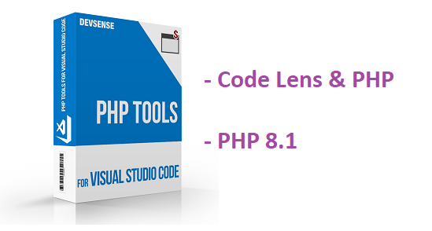
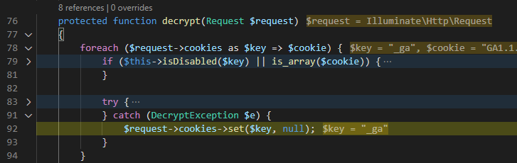
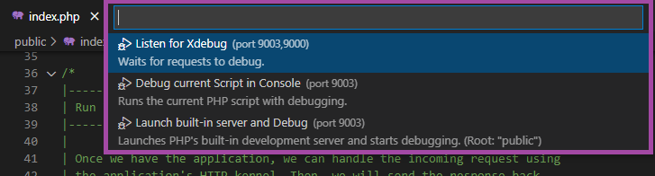
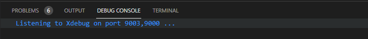
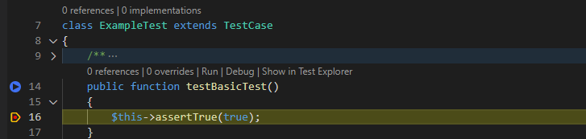

# PHP for VS Code with Debugging Adornments

The January 2022 update of [PHP Tools for VS Code](https://marketplace.visualstudio.com/items?itemName=DEVSENSE.phptools-vscode) introduces [**code lenses** and full support for **PHP 8.1**](https://blog.devsense.com/2022/php-vs-code-january-2022). Additionally we're adding other neat debugging improvements - **debugging adornments** with contextually appropriate inline values, **quick debug configurations**, and more.

<!-- more -->

## Debugging Adornments

The editor should always help with the daily routines such as the debugging. Newly PHP developers can take advantage of currently debugging statement adornments with **inline values**.

PHP debugger choses variables and expressions you might be interested in during debugging and displays their values right in the editor. This allows to quickly focus on the context of the application and see what's happening! Note, debugger won't evaluate variables on the left side of an assignment `=` operators, or more complex expressions which might have a side-effect. It shows entries of arrays the code is about to access, control variables of loops, and function parameters.

## Debug Quick Launch

Whenever you'd like to debug a PHP application without configuring the VS Code Workspace and the corresponding [`launch.json`](https://docs.devsense.com/en/vscode/debug/launch-json), it is now a much simpler. Open a `.php` file and just press `F5` - the quick picker with automatically chosen Run and Debug configurations will appear.

The options include the currently configured Xdebug port (`php.debug.port` global setting, which can be one or more ports at once), and in case of Built-In PHP Server also determined web root path.

- **Listen form Xdebug** starts listening for incoming debugging requests. Use this option when you already have a server running (local or remote) and Xdebug configured.
- **Current Console Script** runs and debugs the `.php` file currently opened in the editor using `php` chosen as your default (see [Choosing PHP](https://docs.devsense.com/en/vscode/php-version#choosing-php-version) for more details).
- **Built-In Web Server** launches and debugs PHP development server with Xdebug support enabled (in case Xdebug is enabled in your PHP installation). The home page is automatically opened in the browser.

## Listening on multiple Ports

Recently we have introduced VS Code setting `php.debug.port` which specifies the default Xdebug or DBGp Proxy port number. Now it is by default set to array of ports instead of just one number. This means PHP Tools Debugger listens for more ports at once which makes it easier to work with various setups on a single machine. The array of ports can be even used within the launch configuration `"port"`.

## ICYMI: Debug PHPUnit Test

With the introduction of Code Lenses, it is appropriate to remind the **PHPUnit tests debugging** functionality. Navigate to a test case, and click on `Debug` code lens action:

## ICYMI: Exclude Paths from Debugging

The last but not least is excluding paths from the debugger; Specifying [`"exclude"`](https://docs.devsense.com/en/vscode/debug/launch-json#ignored-paths) launch configuration setting allows to treat certain glob paths as a non-user code; This means handled exceptions and stepping through code using `F10` or `F11` won't stop in this files.
