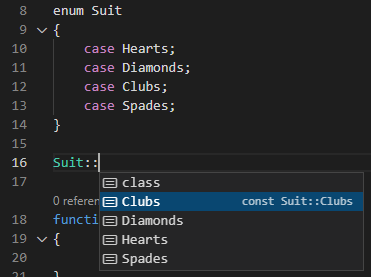
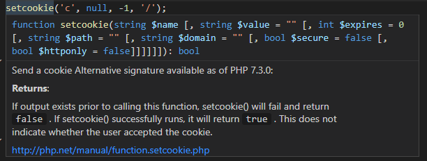

# PHP for VS Code (January 2022)

The [**PHP Tools for VS Code**](https://marketplace.visualstudio.com/items?itemName=DEVSENSE.phptools-vscode) extension received a lot of neat updates and new features! Let's take a look on the new code-lens, debug improvements, improved code analysis, new tool tips, and more!

<!-- more -->

## Code Lens

The VS Code editor provides plenty of navigation features, outline, outlining, bread crumbs, go to symbol, finding references, etc. The most recent feature - so-called [**Code Lens**](https://docs.devsense.com/en/vscode/editor/code-lens) is a neat little margin above classes/interfaces/traits, functions, properties, and constants. This informational bar provides overall counts that might come handy during your work.

The picture above shows a method code lens; it provides a quick overview of how many times is the method used, whether it is being overriden, and a quick link to the method `prototype` (the parent method implementation).

Code lenses work great in combination with PHP Unit tests as well. The picture above shows a PHP method representing a PHP Unit test case with quick actions to `Run` and `Debug` the test, right from the editor.

In case of PHP `trait`s, code lens provides a quick way of listing all the uses of the trait as well. In case of an `interface` or a `class`, the code lens shows all their subclasses implementations.

With Code Lens, PHP editor is even more useful, provides information at where you need them, when you need them. Code Lenses won't slow down the editing experience. However, in case they won't be needed, it is easy to turn them off in the VS Code Settings. Please see [the PHP Code Lens documentation](https://docs.devsense.com/en/vscode/editor/code-lens) for more information.

## Editor Improvements

We're improving the editor continuously. The new features include:

- highlight matching `case` and `switch`
- folding **HEREDOC** blocks
- improved suggestions and overall performance

## PHP version selector

To see what PHP version the editor is using, open a `.php` file, and check the Visual Studio Code status bar:

Clicking the PHP version number opens the PHP version picker:

## PHP 8.1 Support

PHP Editor has a complete support for PHP 8.0 and 8.1 syntaxes.

A useful little touch is the completely updated PHP manual, which is integrated and provided in all the major languages. The integrated manual includes useful notes, summaries of return values, and corresponding links to the online manual.

## Fixes

There are many stability and feature fixes. We're constantly looking for possible issues and our user's feedback to make the PHP extension better. Please see the complete changelog for all the listings: https://www.devsense.com/en/download/vscode .

