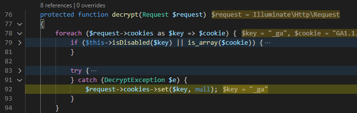
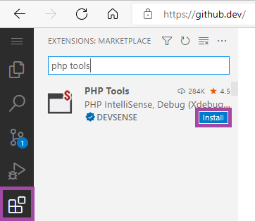
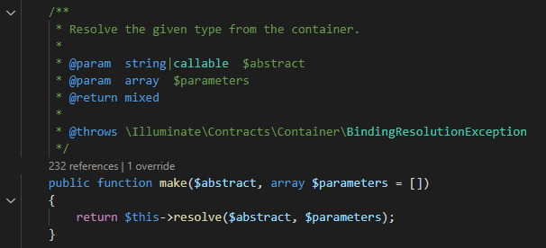

# PHP for VS Code (March 2022)

Welcome to the updates of **PHP Tools** for Visual Studio Code!

<!-- more -->

## Debug Adornments

The editor should always help with the daily routines such as the debugging. Newly PHP developers can take advantage of currently debugging statement adornments with inline values.



PHP debugger choses variables and expressions you might be interested in during debugging and displays their values right in the editor. This allows to quickly focus on the context of the application and see what's happening! Note, debugger won't evaluate variables on the left side of an assignment = operators, or more complex expressions which might have a side-effect. It shows entries of arrays the code is about to access, control variables of loops, and function parameters.

Read more at https://blog.devsense.com/2022/php-vs-code-debugging-adornments.

## VSCode on the Web

Have you heard about the **Visual Studio Code for the Web**? It's the code editor running in your browser, allowing to work with your local files, files on your GitHub repositories, or files on Azure. Anywhere.



Newly, PHP Tools can be installed on this web development environment. See [blog.devsense.com/2022/php-intellisense-web](https://blog.devsense.com/2022/php-intellisense-web) for more details!

## Editor

### Laravel Facades

Laravel framework is known for it's use features like Service Containers, use of class aliases, and Facades. This allows for seamless dependency injection and basically shorter code you have to write.

```php
// Cache is a facade to the 'cache' service ...
return Cache::get('key');
```

Newly, the editor is recognizing built-in and your custom facades, it recognizes the facade accessors service, it recognizes defined services as well. Also, the editor scans the workspace for Laravel class aliases defined in `config/app.php` file.


Here, the editor knows that the class `\Auth` is actually an alias to a class `\Illuminate\Support\Facades\Auth`, which is a facade to a service `auth`, which is an instance of the class `AuthManager` .. in the result, it is able to provide code completion and complete IntelliSense here.

> Note, the editor simultaneously supports the `@mixin` and the `@method` PHPDoc tags, in case the provided facades support is not sufficient.

### Code Completion & `@ignore`

Newly, functions annotated with `@ignore` PHPDoc comment tag are actually ignored by code completion and signature helps. This is used heavily for example in WordPress; since this release, dummy WordPress functions are not shown in code completion making the development of WordPress themes and plugins a bit better.

```php
/**
 * @ignore
 */
function add_action() { }
```
 
## Settings

### `editor.linkedEditing`

Newly the PHP editor supports linked rename of local variables. By enabling `editor.linkedEditing`, changing a variable name also renames all its occurrences:



### `php.debug.port`

New setting `php.debug.port` allows to set the default Xdebug port if it's other than `9003` or `9000`. This port or array of ports will be used during debugging and during PHPUnit tests debugging. The setting can be configured within the workspace scope or the entire user scope.

### `php.stubs`

Newly it is possible to specify which PHP books (aka PHP extensions) should be included in the IntelliSense. By default, all the default PHP extensions are included. In case, you need an additional IntelliSense, for example for `"imagick"` in addition to default extensions, you can add it there:

```json
{
  "php.stubs": ["*", "imagick"],
}
```

It is also possible to simply enable everything:
```json
{
  "php.stubs": ["all"],
}
```

## Fixes

In addition to the new features, there are numerous fixes and small improvements. We have fixed a few stability issues, improved performance of the IntelliSense engine, reduced used system resources, and made the installation package of our extension itself smaller.
