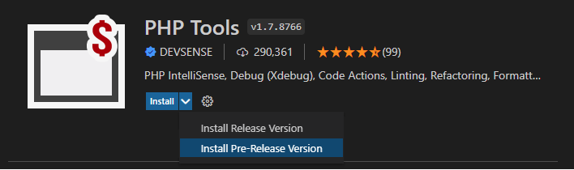
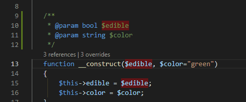

# PHP in VS Code - Pre-Release Extension

Newly, the Visual Studio Code allows to install a pre-release version of extensions (see [code.visualstudio.com - updates](https://code.visualstudio.com/updates/v1_63#_pre-release-extensions)). It's a great feature for both the extension authors and the users. In result, users can try out new things faster, and extension developers can provide their new features to users who are interested.

<!-- more -->

---

## Pre-Release Extension

Since the Visual Studio Code 1.63 and PHP Tools for VS Code 1.8, it is possible now to install the pre-release version of PHP Tools. The version will get updated more frequently, providing latest fixes and new features. User can always switch to the stable version, or pre-release version, within a click.

To switch to the pre-release version of our extension, go to VS Code's Extensions View (`Ctrl + Shift + X` or `⌘ + ⇧ + X`), and find "php tools":

You may need to reload your VSCode window, and you're ready to try out the new features!

## Latest Updates

The current pre-release version 1.8 introduces a lot of changes and internal improvements, so it is a great candidate for the first pre-release.

From the user-perspective, there are enhancements in the integrated PHP manual, fixes to parsing of HEREDOC PHP strings, faster code editing, and improved linked editing! The `editor.linkedEditing` setting was [already supported](https://marketplace.visualstudio.com/items?itemName=DEVSENSE.phptools-vscode), although now we have improved the behavior in case the whole variable name gets deleted. This is more difficult than it seams, so a lot of internal changes were necessary.

Internally, the editor's PHP Language Server is now pre-built for your actual platform - all the combinations of macOs, Linux, Windows, and CPU architectures like x64, or Arm. This makes the first run faster, without the need of downloading additional dependencies. The installation package is self-contained now.

More interestingly, the PHP Language Server is now taking advantage of incremental edit notifications - this makes the editor faster with less memory and CPU overheads.

## Conclusion

We hope you'll like our pre-releases and the new features. It's great that the new VS Code pre-release feature allows us to deliver the important updates sooner, within a single click.
