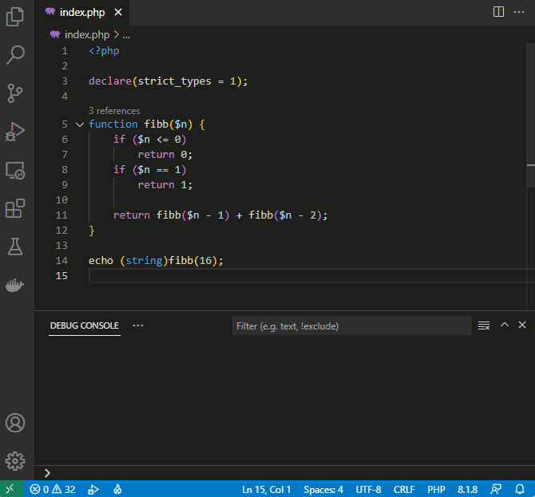

# Performance Profiling PHP with VS Code


Your PHP application or a website might be running fluently, or you might see it takes some time to load. In both cases, it is a good practice to do performance profiling. This technique lets you know how much time all the functions in the code take, and how many times they've been called. You might see interesting results and improve the live of your users, and the live of your Web Server.

<!-- more -->

> The following tutorial assumes, you have PHP and you know how to configure it.

---

<center>
    <iframe width="560" height="315" src="https://www.youtube.com/embed/VQB6pdDhGWs" title="Profiling PHP in VS Code" frameborder="0" allow="accelerometer; autoplay; clipboard-write; encrypted-media; gyroscope; picture-in-picture" allowfullscreen></iframe>	
</center>

---

## What is Profiling

There are many kinds of profiling; in any case it's collecting of real-time data about execution of your application. In this article, we'll be talking about Performance Profiling of PHP code - i.e. we'll be collecting time consumption and call graph of invoked PHP functions.


After collecting the data, we will have to **visualize** them, **inspect**, and look into so-called "**hot paths**". This will tell us, what parts of the program are "hot" i.e. they consume the most time doing something. You might also find interesting looking into the call counts. Imagine there is a small function but called a hundred thousand times per every request - it might be a good idea to do some caching, optimize this one function, or re-design the entire algorithm.

## Prepare Xdebug

In order to collect the profiling data (efficiently), you need a PHP extension that does it from the inside of the runtime - the [Xdebug](https://xdebug.org/) extension. You already have if you're debugging your code, or you're already profiling ... if you don't, follow the link and install the extension for your platform.

- Follow the steps on [xdebug.org/docs/install](https://xdebug.org/docs/install).
- Verify you have the *Xdebug* extension by running `php -v` or checking [`phpinfo()`](https://www.php.net/manual/en/function.phpinfo.php).
- Optionally, make sure you have `zlib` PHP extension enabled - this makes your profile files significantly smaller.

Then we'll need to ensure, the [`xdebug.output_dir`](https://xdebug.org/docs/all_settings#output_dir) directive is set to a writable directory. Also you should have at least a GB of free space in there. **Be sure, the directory exists, and it's writable.**

## Launch Built-In Server with Profiling

Now we're ready to do some profiling. At this point, you should have:

- [Visual Studio Code](https://code.visualstudio.com/)
- [PHP Tools for Visual Studio Code](https://marketplace.visualstudio.com/items?itemName=DEVSENSE.phptools-vscode)
- PHP with Xdebug *(as described above)*

### Open Folder

Launch _Visual Studio Code_, and _**Open Folder**_ with your PHP project. You'll see something like the following:


### launch.json

Either open or create [`.vscode/launch.json`](https://docs.devsense.com/vscode/debug/launch-json) file, and open it. We'll create the launch configuration that **Launches** Development PHP Server with **Profiling** enabled:

_.vscode/launch.json:_

```json
{
    "version": "0.2.0",
    "configurations": [
        {
            "name": "Launch Built-in server & Profile",
            "type": "php",
            "request": "launch",
            "runtimeArgs": [
                "-S", "localhost:8888", "-t", "public"
            ],
            "profile": true, // <-- enable profiling
        }
    ]
}
```

The configuration above runs development PHP server on port **`8888`** with the web root in **`./public`** - change those values as you need. The setting `"profile": true` instructs debugger to configure additional Xdebug settings for you.

After this change, you should see the following drop-down menu in your **Run and Debug** view:


### Collect Profiling Data


Now run the project using our newly created launch setting - either press `F5` or click `Start Debugging` command. You'll see the following in your *Debug Console* panel:


In your web browser, open the URL you'd like to profile. In our case it would be `http://localhost:8888/` or any other page in your application. **Be aware** that if you do more requests, the profiling file might get larger and larger. Huge files will take more time to load and process.

After opening the application in your web browser, stop "debugging" in VS Code (`Shift+F5`) and get ready for inspecting the profile file. The file will be stored in path specified by your `xdebug.output_dir` setting, and it will be named `cachegrind.out.{process id}.gz`.

## Inspecting Profile File

You have collected the profiling data and now we can proceed to the fun part. The profile file `cachegrind.out...gz` (or without `.gz` in case you don't have `zlib` PHP extension enabled) contains every single function call your application actually made during the request. It might be from a few kB to hundreds of MB big.

[Open the profile file](https://docs.devsense.com/vscode/profiling#opening-profiling-result) either by drag&dropping it directly to VS Code window, or using command `Open Profile File (Xdebug Profiling Output)`:


### Call Time View

The profile view gets opened on the first tab - **Call Time** view. Here there are all the called functions, aggregated, sorted from the most time consumed. The view can be **filtered** by name, **sorted** by clicking onto the table header, filtered to only list functions, files, or internal PHP functions.


This gives you a good idea of what's the most expensive function in your code. Personally I like checking the **Calls** column, which gives me information about functions being called excessive number of times.

**Mouse hover** a row to see the full function name as it was collected by _Xdebug_ - this contains more subtle information like if it was called by instance or statically, and the full namespaced name of the class or function.


**Double Click** to jump directly to the file.

Or click **Navigate Button** to open the next view - **Function Details**:


### Functions Detail

The next view lets you browse through the call graph. Each bubble represents a function containing how much time it consumed (including called functions), and what was the call direction.


Click on the bubbles to navigate through the call graph.

### Hot Path

The last view is actually extending the text editor itself. All the source code lines, that takes considerable percentage of overall application time, are highlighted.


This feature visualizes "**hot paths**" in your source code in various **levels of red** corresponding to the amount of time. On the right side there is percentage of the overall time it took and time in milliseconds. The percentage is configurable through `"phpprofiler.hotpath.treshold"` setting (1% by default).

## Profile Console Program

There is a shortcut to quickly profile a `.php` file as a console program. In case you have `.vscode/launch.json` file, specify the `"profile": true` setting as we did it with the built-in web server:

_launch.json_
```json
{
    "name": "Profile current script",
    "type": "php",
    "request": "launch",
    "program": "${file}",
    "cwd": "${fileDirname}",
    "profile": true,
    "externalConsole": false
}
```

But **without launch.json**, you can simply press `F5` and choose **Profile current Script**. Script file gets launched with profiling, and when it's finished the profiling result gets opened automatically:



> The script above calculates _fibonacci_ sequence, and profiles its performance.

---

## Conclusion

Even though this tutorial is longer than needed, I hope [our tools](https://www.devsense.com/) make PHP profiling simple and easy to read. Always profile your application before deploying it to production - at least you may save yourself, your server, and your users some time.

## See also

- [PHP Tools for Visual Studio and Visual Studio Code](https://www.devsense.com/download) - All-in-One PHP language integration for Visual Studio and VS Code.
- [PHP Profiler for VS Code](https://docs.devsense.com/vscode/profiling) - Inspecting cachegrind profile files in VS Code.
- [Composer All-in-One for VS Code](https://docs.devsense.com/vscode/composer) - All-in-One PHP Composer integration for Visual Studio Code.
