# Use Grunt with PHP Tools for Visual Studio


# Use Grunt with PHP Tools for Visual Studio

<!-- more -->

When you are doing client-side development you are doing many repetitive tasks such as minifying scripts or stylesheet files, combining them and similar. You can use tools such as [Grunt](http://gruntjs.com/), or Gulp to automate them. What's best is they are fully supported in Visual Studio.

You can download a sample project from [Github](https://github.com/DEVSENSE/php4vs/tree/master/samples/GruntSample).

## Preparing the project

To demonstrate you are going to create a new PHP project. Let's call it `GruntSample`.

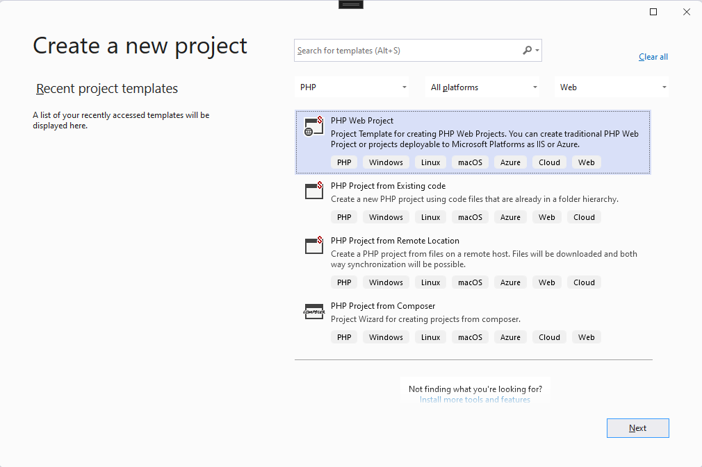

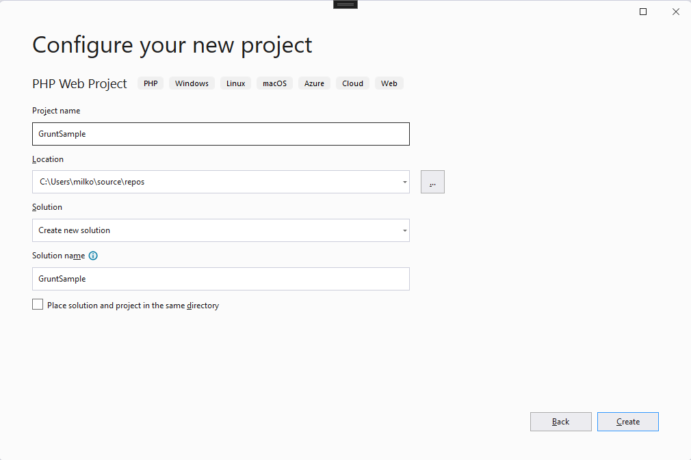

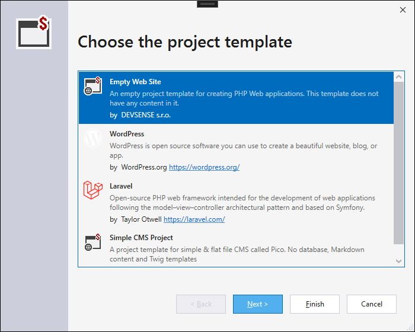

When the project is created, create a new folder called `public` and set it as web root. Right click on project node in the **Solution Explorer** and select **Properties**. In the **Application** tab, fill web root property to `public`. This will be the folder which will be served by the server as a root of this web application.

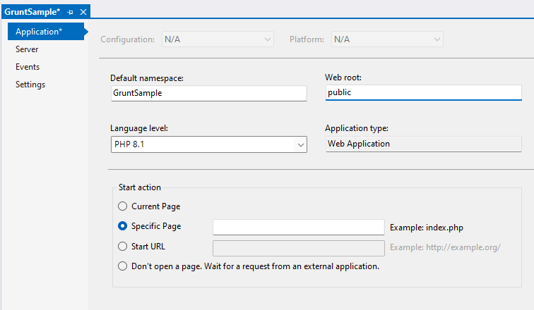

Hit <kbd>Ctrl+S</kbd> to save the project file and you should see the changed icon of the `public` folder - indicating the folder is a web root.


Move `index.php` to the web root, so the server has a default document it can serve. You can just drag and drop it in the **Solution Explorer**.

Then you are going to create a directory structure of the project. Create a folder `assets` and subdirectories `css` and `js`. They will contain unprocessed script and stylesheet files. The current directory structure should look like this.

```nohighlight
GruntSample
├───assets
│   ├───css
│   └───js
└───public
```

To `js` folder, add the following javascript file `site.js`:

```js
document.addEventListener("DOMContentLoaded", function () {
    document.getElementById("demo").innerHTML = "... and from JS."
});
```

To `css` folder, add this file `stylesheet.css`:

```css
body {
    margin: 25px;
    background-color: #ededed;
    font-family: arial, sans-serif;
    font-size: large;
}
```

Then update `index.php` in public folder, so it contains the following:

```php-template
<!DOCTYPE html>
<html xmlns="http://www.w3.org/1999/xhtml">
<head>
    <title></title>
    <script src="js/site.min.js"></script>
    <link href="css/styles.min.css" rel="stylesheet" />
</head>
<body>
    <?php

    echo 'Hello World from PHP!';

    ?>

    <div id="demo"></div>

</body>
</html>
```

You've likely noticed `js/site.min.js` and `css/styles.min.css` don't exist, but **Grunt** is going to create them for us later.

Once you are done, your **Solution Explorer** should look like this:

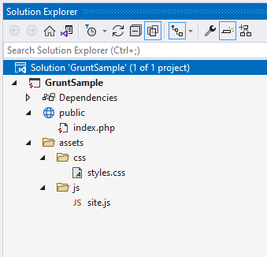


## Configuring npm

Before you are going to use **Grunt**, you will need to install it. For this you will need [node.js](https://nodejs.org/) and **npm** - it's package management tool. Make sure it's installed.

Then add `package.json` file to the project. Right click on the project node and select **Add new item**. Then select `npm Configuration File`.

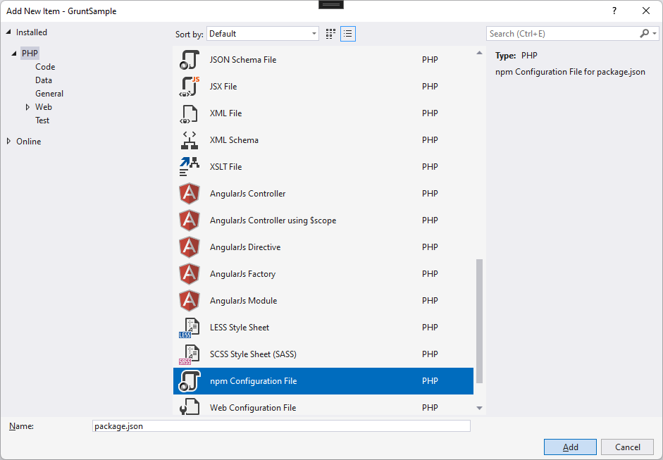

Then copy the following content:

```json
{
  "version": "1.0.0",
  "name": "php",
  "private": true,
  "devDependencies": {
    "grunt": "^1.4.1",
    "grunt-contrib-cssmin": "^4.0.0",
    "grunt-contrib-uglify": "^5.0.1",
    "grunt-contrib-watch": "^1.1.0"
  }
}
```
Btw. when you hover over the dependency nodes you will get a description about what id does.

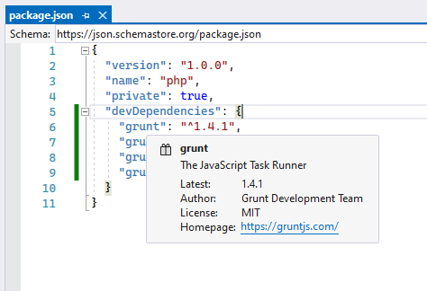

To save you from hovering, these dependencies are:
 - **grunt:** The Grunt task runner package.
 - **grunt-contrib-cssmin:**  A plugin that minifies stylesheet to reduce size.
 - **grunt-contrib-uglify:** A plugin that minifies JavaScript to reduce size.
 - **grunt-contrib-watch:** A plugin that watches file activity.

Open the **Terminal** (<kbd>Ctrl+\`</kbd>).

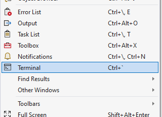

And run `npm install`, which will install all the dependencies we've defined in the `package.json`. Btw. you can run `npm install` for each of these packages separetly, but there's no need now, when we know what we want in advance.

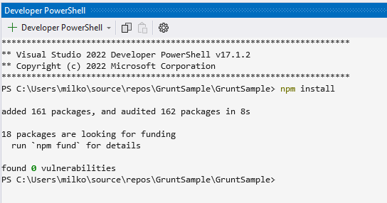

### Running npm install each time project loads

Since you might want to share this project with other team members, or you would like to open in on other machine. It's useful to make sure all these packages get installed when the project opens. You can use **Events** for that.

Go to the project properties. Right click on project node in the **Solution Explorer** and select **Properties**. Choose **Events** tab. Click `Add action..` next to the **Project Opened** event and fill the command.

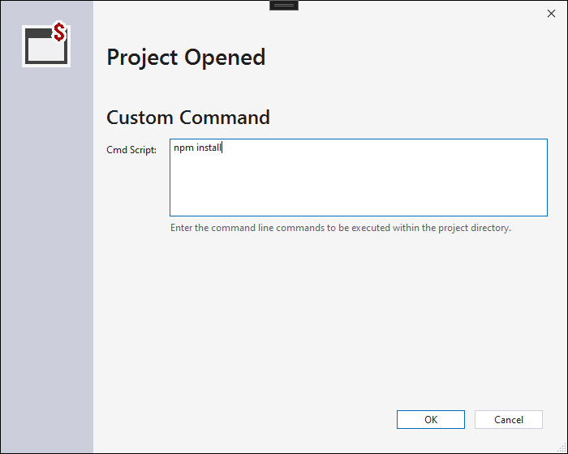

Click **Ok**. The event is set.

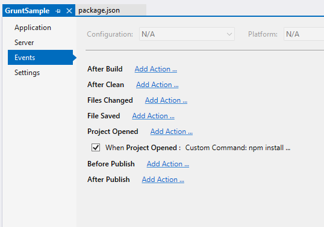

Now, when somebody opens this project `npm install` will be called - making sure all the grunt packages are installed.

## Configuring Grunt

Now, when you have **Grunt** installed we'll have to configure it, so it does something useful.

First, create a **Grunt Configuration File**.

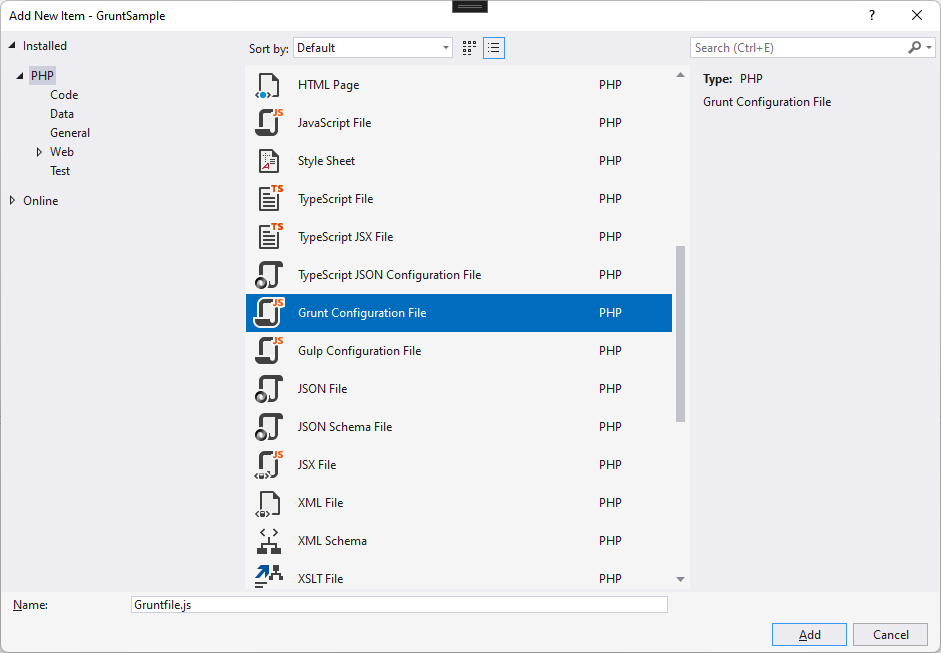

The file looks like this.

```js
/*
This file in the main entry point for defining grunt tasks and using grunt plugins.
Click here to learn more. http://go.microsoft.com/fwlink/?LinkID=513275&clcid=0x409
*/
module.exports = function (grunt) {
    grunt.initConfig({
    });
};
```

### Minifying JavaScript

Now, we would like to minify the `assets/js/site.js` file and copy it to the `public/js` folder. Update the `Gruntfile.js`.

```js
module.exports = function (grunt) {
    grunt.initConfig({

        uglify: {
            options: {
                mangle: true, //Shorten variable names, where possible
                compress: true, //Remove Unnecessary whitespaces
                banner: "/*Minified version of site.js*/\n" //Banner Property at the top of minified version
            },
            target: {
                src: "assets/js/site.js",
                dest: "public/js/site.min.js",
            }
        }
    });

    grunt.loadNpmTasks("grunt-contrib-uglify");
};
```

`grunt.loadNpmTasks` loads `grunt-contrib-uglify` task, which we've configured in the `grunt.initConfig` method. `target` defines what files are going to be minified and where the result should be placed.

### Minifying CSS

In the similar way, you will add minification of css files. 

```js
module.exports = function (grunt) {
    grunt.initConfig({

        uglify: {
            options: {
                mangle: true, //Shorten variable names, where possible
                compress: true, //Remove Unnecessary whitespaces
                banner: "/*Minified version of site.js*/\n" //Banner Property at the top of minified version
            },
            target: {
                src: "assets/js/site.js",
                dest: "public/js/site.min.js",
            }
        },

        cssmin: {
            target: {
                src: ["assets/css/styles.css"],
                dest: "public/css/styles.min.css"
            }
        },

    });

    grunt.loadNpmTasks("grunt-contrib-cssmin");
    grunt.loadNpmTasks("grunt-contrib-uglify");

};
```

`cssmin` section defines what to minify and where to place the result and `loadNpmTasks` loads the task.


### Combining it

Now we have two tasks defined, we can create one task which will call them both. Let's just call it `build`. After the `loadNpmTasks` method calls add the following line.

```js
    grunt.registerTask('build', ['uglify', 'cssmin'])
```

This is also called **Alias task** and when you call it, it will invoke both `uglify` and `cssmin`.

## Task Runner Explorer

Let's try if it works. Open the **Task Runner Explorer**. You can find it at `View | Other Windows | Task Runner Explorer` or hit <kbd>Ctrl+Al+Bkspce</kbd>.

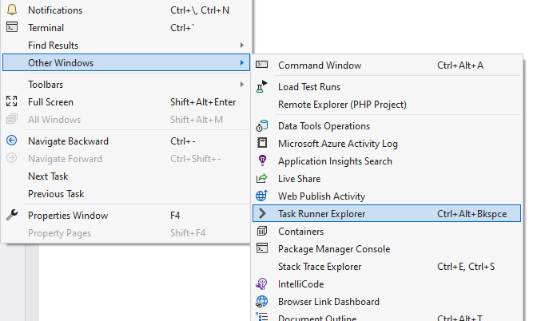

You should see two tasks we've previously defined and one alias task.

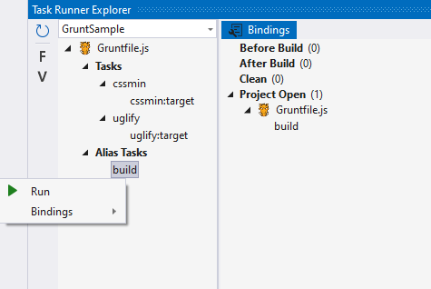

Right click on `build` task and click **Run**.

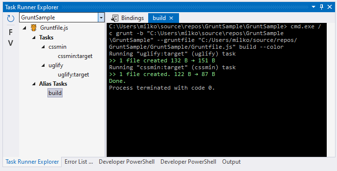

Congrats, both javascript and stylesheet files have been minified and copied to the `public` folder. You project in the **Solution Explorer** should look like this.

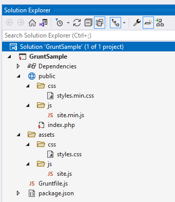

You can go ahead and run it <kbd>F5</kbd>.

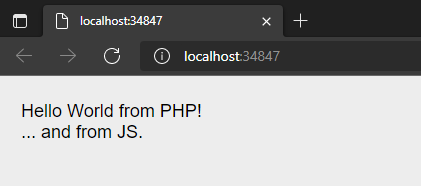

## Watching for changes

One way how we could improve the project is to use `watch` task, which will monitor `assets` folder and run the `build` task when files change. This way you will not have to call `build` each time you make a change.

This would be a resulting `gruntfile.js`.

```js
module.exports = function (grunt) {
    grunt.initConfig({

        uglify: {
            options: {
                mangle: true, //Shorten variable names, where possible
                compress: true, //Remove Unnecessary whitespaces
                banner: "/*Minified version of site.js*/\n" //Banner Property at the top of minified version
            },
            target: {
                src: "assets/js/site.js",
                dest: "public/js/site.min.js",
            }
        },

        cssmin: {
            target: {
                src: ["assets/css/styles.css"],
                dest: "public/css/styles.min.css"
            }
        },

        watch: {
            files: ["assets/**/*.*"],
            tasks: ["build"]
        }

    });

    grunt.loadNpmTasks("grunt-contrib-cssmin");
    grunt.loadNpmTasks("grunt-contrib-uglify");
    grunt.loadNpmTasks('grunt-contrib-watch');

    grunt.registerTask("default", ["watch"]);
    grunt.registerTask('build', ['uglify','cssmin'])
};
```

Other than adding `watch` task, we've also defined `default` task, which will be called when you'd be running grunt from command line and you wouldn't supply any other arguments.

If you run the `default` task from the **Task Runner Explorer** you will see that `watch` task is running and waiting for a change in asset folder.

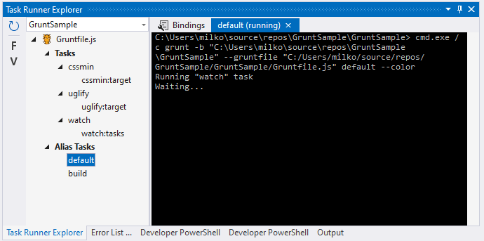

## Binding to Visual Studio events

Unless you want to run the `default` task each time you load this project, it would be useful to configure it so it starts automatically after the project load. You can either use **Events** as we did with `npm install` or you can set it up directly in the **Task Runner Explorer**.

Right click on `default` task, select **Bindings** and choose **Project Opened**.

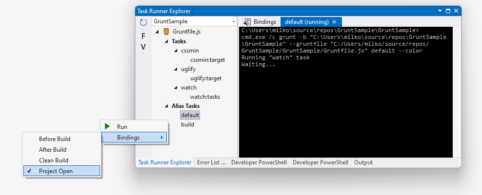

I would also recommend to set up `build` after the project opened, so when you open the project on a new machine you would still have everything ready to go.

## Summary

Client-side development requires many different tasks called again and again. Grunt is a powerful tool which allows you to automate them and Visual Studio offers convenient way how to manage, run and bind them to common Visual Studio events.
