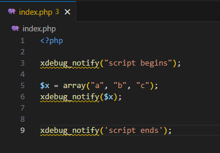
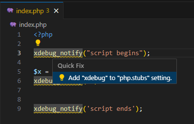
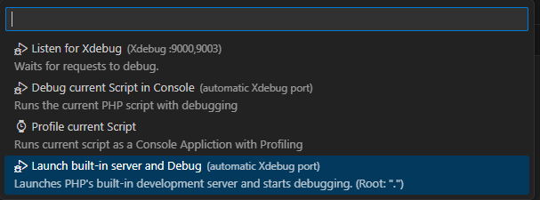
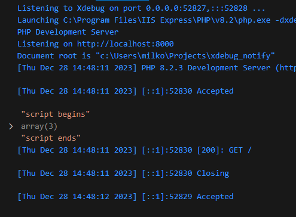
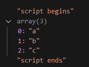

# Improving debugging workflow with xdebug_notify


There are two camps when it comes to debugging PHP applications. One one side, we have the "echo tribe" relying on `echo` and `var_dump` for debugging output, while on the other side, the "IDE-wizards" leverage IDE's with Xdebug.

<!-- more -->

Now, Xdebug 3.1. introduced a new tool in town which might appeal to both camps –  `xdebug_notify`. It allows developers to send message or variable to IDE, presenting the information in a clear manner. In case of PHP Tools for VS Code, the output is directed to the Debug Console.

## Why is xdebug_notify interesting?

In the realm of PHP debugging, developers face distinct challenges depending on their chosen debugging method. The "echo tribe," using `echo` and `var_dump`, might grapple with code clutter and limited insights, particularly if their code base expands. Conversly, "IDE-wizards", enjoying the perks of breakpoints and step-by-step debugging might find themselves bound to interruption-based methods.

### Benefits for Echo tribe:

**1. Effortless Integration:**
Easily integrate `xdebug_notify` into your existing workflow without the need for a complete shift in debugging methodology. It's a seamless addition that enhances your traditional approach.

**2. Streamlined Debugging Output:**
Bid farewell to the clutter associated with extensive `echo` and `var_dump` statements. With `xdebug_notify`, selectively output variables into VSCodes Debug Console, creating a cleaner and more focused debugging experience.

### Benefits for the IDE-Wizards:

**1. Non-Intrusive Inspection:**
Enjoy non-intrusive variable inspection without the need for explicit breakpoints. With `xdebug_notify`, selectively output variables to your IDE's console, offering a more dynamic and flexible debugging experience.

**2. Customized Variable Output:**
Tailor your debugging approach by choosing which variables to inspect and when. The power of `xdebug_notify` lies in its ability to deliver specific information based on your conditions and preferences. E.g. Be incorporating `xdebug_notify` to code you can find yourself reaching for conditional breakpoints much less.


## Let's try it

To use `xdebug_notify`, follow these steps:

1.) Install `Xdebug` at least `3.1.0`  ([Win](https://docs.devsense.com/en/vscode/debug/xdebug-win), [Mac](https://docs.devsense.com/en/vscode/debug/xdebug-mac), [Linux](https://docs.devsense.com/en/vscode/debug/xdebug-linux))
2.) Install [PHP Tools for VS Code](https://marketplace.visualstudio.com/items?itemName=DEVSENSE.phptools-vscode) if you haven't already. 

### Step 1 - Open Folder

In VSCode, open a new folder and add `index.php` file, and copy the following code:

```php
<?php

xdebug_notify("script begins");

$x = array("a", "b", "c");
xdebug_notify($x);

xdebug_notify('script ends');
```



### Step 2 - Add Xdebug Stubs

You will notice `xdebug_notify` is not recognized. This is because xdebug functions are not by default included. If you have PHP Tools PREMIUM, you can hover over the functions click `Add "xdebug" to "php.stubs" settings`. If you don't, just alter your `.vscode/settings.json` manually.



This adds xdebug stub to `.vscode/settings.json`, allowing IDE to recognize Xdebug functions
```json
{
    "php.stubs": [
        "*",
        "xdebug"
    ]
}

```

### Step 3 - Launch Debug

As `launch.json` is not configured, you will get following dialog. Choose `Launch built-in server and Debug`



### Step 4 - Debug Console

Check the Debug Console for outputs of your `xdebug_notify` calls. They will be mixed with other relevant debugging information.



If the debugging session is still alive, expand the array, by clicking on the `>`.



>**Note:** The Debug Console relies on an active debugging session to display variable information. If you encounter the message "No debugger available, can not send 'variables'" after the debugging session has ended, it is expected behavior. Ensure your debugging session is active to expand and inspect variables in the Debug Console.

## Wrap-Up

Regardless your favorite way of debugging, `xdebug_notify` can prove to be valuable tool. Give it a try and let us know if there are ways how to further enhance your PHP debugging experience.
