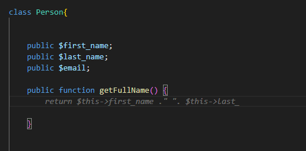

# IntelliPHP - AI-Assisted PHP Development

In the fast-evolving landscape of software development, artificial intelligence has become an indispensable tool for boosting productivity and efficiency. **Microsoft's IntelliCode**, **GitHub Copilot**, and other AI-powered solutions have already made a significant impact in the industry, offering code suggestions and completions to developers. Today, we introduce you to **IntelliPHP**, an innovative AI engine developed specifically for PHP developers, designed to revolutionize the way PHP code is written.

<!-- more -->

## What is IntelliPHP?

**IntelliPHP is an advanced AI-assisted development tool** specifically tailored for PHP programmers. Just like its counterpart IntelliCode, IntelliPHP harnesses the power of **machine learning** to understand PHP code and provide **context-aware suggestions**. Unlike GitHub Copilot, IntelliPHP operates entirely **locally**, ensuring that code remains **secure and private** within their own development environments.

**The primary aim of IntelliPHP is to save developers time spent in typing code**. It's designed to offer suggestions ranging from short and highly likely suggestions up to whole lines of code. The model has been trained in-house on vast repositories of PHP code, making it adept at providing accurate and relevant suggestions tailored to PHP development.

### Code Generation

Let's look at the concrete example how IntelliPHP can help us. As the developer starts to implement a utility function to check if a string starts with a given substring, IntelliPHP provides valuable assistance in generating the function body. For instance, when the developer begins to define the startsWith function. IntelliPHP recognizes the context and suggests relevant code completions to complete the function body. In this case, it might suggest the appropriate PHP code, such as:

The developer can swiftly accept the suggestion and move forward with their coding, **saving valuable time and effort**.

### Semantic Understanding

Semantic understanding is a critical capability of AI-assisted development tools. In this example, we witness how IntelliPHP comprehends the semantics of "fullName" within a PHP class, enabling it to generate precise code suggestions. By understanding that "fullName" represents a concatenation of "first_name" and "last_name".

The suggestion appears to be incomplete due to the token limit for suggestion length ( this is part of the optimization which allows to run this model even on laptop CPU). However, as the developer accepts the provided suggestion, IntelliPHP promptly reveals the rest of the code, completing it almost instantaneously.

### Performance and Portability: AI on Local CPU

One of the key strengths of IntelliPHP lies in its ability to run entirely **locally on a developer's CPU**. Unlike many AI-assisted coding tools that rely on cloud-based inferencing, IntelliPHP's local processing ensures data privacy and eliminates the need for external data transmission. This capability not only guarantees the security of the code and sensitive data but also significantly reduces inference latency, providing a **smoother and more responsive coding experience.**

Moreover, IntelliPHP's efficient design ensures that it can run even on older laptops or machines with limited computational resources. The model's optimized architecture allows it to deliver rapid and accurate code completions without burdening the developer's hardware. As a result, IntelliPHP can seamlessly integrate with PHP Tools in Visual Studio, running alongside the development environment, without causing any performance bottlenecks.

For developers using Visual Studio Code, IntelliPHP currently exists as a [separate extension](https://marketplace.visualstudio.com/items?itemName=DEVSENSE.intelli-php-vscode) in the Preview version. However, we have plans to bundle it together with our PHP extension for Visual Studio Code in the near future. 

## Conclussion

As AI continues to reshape the landscape of software development, **IntelliPHP emerges as a powerful and secure AI companion for PHP developers.** Its **local processing ensures data privacy and provides a seamless development experience.** By leveraging AI-driven code completions and semantic understanding, IntelliPHP empowers PHP developers to write code faster, more accurately, and with greater efficiency.

**Try IntelliPHP today and experience the power of AI-assisted PHP development firsthand.** We look forward to hearing from you. Your input is crucial in shaping the future of IntelliPHP.
