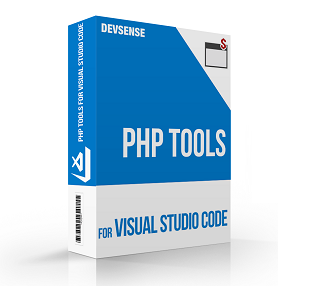

# PHP for VS Code Updates (June 2023)



PHP extension for Visual Studio Code is getting more features and updates! 

<!-- more -->

## IntelliSense

The editor is getting more fine-tuned features, minor adjustments, nice-to-have features, new code diagnostics, and fixes. Please see the following list for some of them:

- Detecting Laravel services improved.
- Completing `declare` and `declare(strict_types=1);` after `<?php` tag.
- Now it's possible to `Ctrl`+`Click` (or go to with `F12`) on `@inheritdoc` to navigate to base Doc Comment directly. [#897](https://community.devsense.com/d/897-jump-to-phpdoc-via-clicking-on-inheritdoc)
- `null` specified as Doc Comment `@param` type is reported as invalid.
- `true` pseudo-type correctly handled within union types.
- Code completion and tooltips in `trait` adaptation blocks have been implemented. ([#582](https://community.devsense.com/d/582))

### IntelliSense and `phpstorm.meta.php`

Supporting `.phpstorm.meta.php` with `expectedArgments()` and `argumentsSet()` now.


### IntelliSense &amp; `@phpstan-type` and `@psalm-type`

Since now, we have basic support for local-type aliasing.

### IntelliSense &amp; Traits with Generics

Newly, `trait` use can be annotated with `@use` doc comment to specify the trait's generic arguments ([#840](https://community.devsense.com/d/840-generics-allow-template-for-trait-usages)), i.e.:

```php
class MyClass {
    /** @use MyTrait<int, string> */
    use MyTrait;
}
```

### IntelliSense &amp; `static` Type

We have re-implemented the internals and improved type analysis for various cases involving the use of `static` and `$this` within traits, protected properties, and class inheritance in general. Moreover, generic arguments and trait members are resolved better with more inherited type information ([#931](https://community.devsense.com/d/931-inherit-and-static-array-type/)).

### Inlay Hints Improvements

We've added an option to show return type inlay hint only for named functions, not for anonymous functions and arrow functions ([#326](https://github.com/DEVSENSE/phptools-docs/issues/326)).

## Refactoring

### Sort Uses on Save aka Organize Imports

We have added support for VS Code's **"organize imports"** command and eventual `"editor.codeActionsOnSave"` setting allowing you to _organize imports_ (aka **remove unused uses**) when saving documents automatically.


The following setting works for sorting and organizing `use` statements on save:

```json
{
  "editor.codeActionsOnSave": { "source.organizeImports": true },
}
```

#### `Add Missing PHPDoc` Code Action

The `Add Missing PHPDoc` code action inserts the doc comment as a snippet ([#157(comment)](https://github.com/DEVSENSE/phptools-docs/issues/157#issuecomment-1512313864)). This replaces template variables and allows you to type into placeholders.

### More Code Actions

- PHPDoc `@see` and `@uses` is recognized during rename refactoring, find all references, and highlight occurrences.
- Unused `use` check works even if **problems** setting is turned off.
- **Namespace import** for any simple class name. We have code action suggestions to import a namespace or fully qualify the class name if there are more classes with the same name.

## PHPUnit and Test Explorer

### PHPUnit Tests &amp; Continuous Run

Newly it is possible to run tests continuously. The *watch* icon in *Testing* panel allows us to keep all the tests, test suites, or just specific test cases always up-to-date. ([#1479](https://community.devsense.com/d/1479-autorun-test-suite-on-file-save))

### Test Explorer and ParaTest

This latest update allows running [ParaTest](https://github.com/paratestphp/paratest) in the same way as PHPUnit tests. To do so:

- Install ParaTest composer package using the command `Composer: require dev package`, and search package `brianium/paratest`.
- Update your workspace settings:
  ```json
  {
    "phpunit.phpunit": "./vendor/bin/paratest"
  }
  ```
- Navigate to _Testing_ panel and run or debug your tests.

### Other Test Explorer Improvements

The _Test Explorer_ looks and watches for any _PHPUnit_ XML configuration file matching glob pattern `**/phpunit*.xml` or `**/phpunit.xml.dist` (outside the `vendor` folder) [#313](https://github.com/DEVSENSE/phptools-docs/issues/313). This allows having **multiple configuration files** in the same directory with custom names.


Additionally, we have fixed:

- Executing all tests within a configuration file.
- Executing all tests within a single test suite.
- Correct Xdebug directives so it won't cause unnecessary warnings when debugging tests.

## Composer `"composer.workingPath"` Setting

Thanks to the feedback [#909](https://community.devsense.com/d/909-setup-a-working-directory-for-composer), we've added setting `"composer.workingPath"` where users can specify the relative path for the `composer.json` and `vendor` folders.

## Other Improvements

- Tons of fixes and performance improvements.
- Several memory issues were fixed.
- Code completion of named arguments completes the `:` at the end. ([#1600](https://community.devsense.com/d/1600-improved-autocomplete))
- Code completion of hinted array keys within single quotes. ([#1600](https://community.devsense.com/d/1600-improved-autocomplete))
- Completion triggered after typing SPACE after `instanceof` keyword.
- Methods named `new()` are handled correctly in mouse hover and code completion.
- `match`, `fn`, and `interface` are not reported as syntax errors when within a qualified name (PHP 8.0+).
- PHP 8.2 standalone `true`, `false`, and `null` type names. ([#338](https://github.com/DEVSENSE/phptools-docs/issues/338))
- Fixed a few type inferring cases.
- Fixed reporting functions annotated with `@ignore` tag as unknown.
- Type inferring in the context of `is_a()` analyzed correctly.
- Less falsy warnings for non-static methods called statically in case there is `__callStatic()` magic method.
- New quick refactorings through code actions.
- Updated integrated PHP manual and localizations.
- and more! 