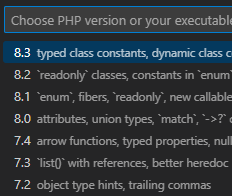

# PHP Language Level in VS Code

PHP is an old language, powering majority of the Internet. It's evolving, it's getting new features, better performance, and old features are being depreciated and sometimes even removed.

<!-- more -->

The new features introduced to the PHP language are tempting to use, like the new typed class constants, attributes, or `readonly` classes. It's now easier to write type-safe object oriented code, in PHP.

Those changes need a great support by your development environment - especially compatibility checks, debugging support, and a good IntelliSense.

[PHP extension](https://marketplace.visualstudio.com/items?itemName=DEVSENSE.phptools-vscode) for Visual Studio Code and [PHP Tools for Visual Studio](https://www.devsense.com/download) understands the whole range of PHP versions, including the newest ones. And it's super easy to check the code for compatibility issues at any language level.

## Choose PHP Language Level

VS Code with the [PHP extension](https://marketplace.visualstudio.com/items?itemName=DEVSENSE.phptools-vscode) makes it easy to choose the target PHP version.

Open a folder or a workspace with your PHP files. Navigate to any `.php` file and you'll see the PHP language version in the bottom right corner of status bar.

Click the version number to open the PHP Version Picker.

## Compatibility Checks

The PHP editor immediately highlights any issues, respecting your selected PHP version. Any depreciated or removed PHP function gets underlined, not-yet supported constructs are underlined as well, including the supported version information.

_This is the message shown after selecting PHP language level `7.4`._

## Default Language Level

The editor tries to guess your PHP, so you don't have to choose the version by yourself.

It looks on your computer for existing PHP installations - and it chooses a version from what it finds. It also uses those existing PHP's for its [Built-In WebServer](https://docs.devsense.com/en/vscode/debug/launch-json#built-in-php-server) and [Debugging](https://docs.devsense.com/en/vscode/debug). Very convenient so you don't have to setup anything usually. For more details, see VSCode's `OUTPUT` - tab `PHP`.

Then it checks `composer.json` in the root of your workspace - there might be a `"php"` requirement. It uses the version restriction here to choose the most appropriate PHP language as well.

## More Settings

Some users have more PHP binaries installed, and they might need to switch between them. See [PHP Version Documentation](https://docs.devsense.com/en/vscode/php-version) for more information.

The workspace's PHP Language Level is stored in your `settings.json`, in a `"php.version"` setting.
