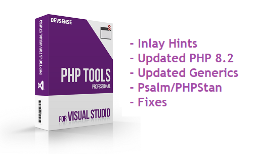

# What's New - PHP Tools for Visual Studio (March 2023)



We're happy to introduce updates to our [PHP extension for Visual Studio](https://www.devsense.com/download)! Version **1.72** introduces Inlay Hints, new Code Actions, improved code analysis, improved support for Doc Comments with extended syntax for Psalm and PHPStan type names and keywords, and more!

<!-- more -->

## Inlay Hints

Sometimes it is not clear what function arguments are used for. We are adding so-called inlay hints that annotate function parameters, inferred function return type, by-ref semantics to arguments, and expressions type.


Enable or disable Inlay Hints in `Tools`/`Options`, under `Text Editor`/`PHP`/`Inlay Hints`,

## Code Actions

Several quick refactorings through code actions have been added.


_Assignments can be simplified with `??=`, `+=`, `*=`, etc._


_Transforming expressions to the new nullable object operator `?->`._


_Assignment using `if` conditions can be simplified._


_And hard-to-read `switch` blocks can be simplified with the new `match` expression._

## Better PHP 8.2 and PHP 8.1 Support

- `enum` and `BackedEnum` and `UnitEnum` implicit interfaces
- `readonly` and `enum` parsed properly when used a part of the qualified name
- updated integrated manual with the latest symbols and translations
- support for the new `Random` extension
- support for the new PHP 8.2 core types

### IntelliSense &amp; Enums

The PHP 8.1 `enum` objects implicitly implement `UnitEnum` and `BackedEnum` interfaces. The `BackedEnum<TValue>` interface is annotated with a template type argument so it can be used in Doc Comments with the backed type for better type analysis. E.g.:

```php
/** @param \BackedEnum<string> $e */
function foo($e) {
    return $e->value // -> string
}

enum MyEnum : string {
    case A;
}

foo( MyEnum::A );
```

## Doc Comments

PHP Documentary Comments have been improved as well. In addition to more code diagnostics, the editor understands a wide range of _**Psalm**_ and _**PHPStan**_ type annotations. We've been working on recognizing commonly used type syntaxes in Doc Blocks; now supporting most of PHPStan, and other popular linting frameworks.

  

  _Image: Diagnostic showing missing variable name!_

Types, including complex array shapes, generic types, template type annotations, unions, intersections, and callables; are all not properly colorized, occurrences highlighted, and code completion works (even inside `<` and `>` when specifying generic type arguments). Refactoring recognizes nested types within Doc Blocks, and the overall functionality of types within Doc Blocks is complete now.

Additionally, the triple dot syntax `...` is now allowed within the `@param` tag, and the `@param-out` tag is recognized.

### Improved Generics and PHPStan Compatibility

- Supported the rest of `@template`, `@implements-*`, `@extends-*`, and other notations.
- Generic types support overall improvements, more supported scenarios, working with doctrine/collections, etc.
- Core PHP `Traversable` types have been annotated with generic template type-arguments.
- `foreach` works well with generic collections, `Traversable` types with generic annotations.

### PHPStan Array Shape, `callable`, `list`, and More

Since this release, the editor supports all the syntaxes for array shapes and callables. In addition, the type analysis handles specified PHPStan types accordingly.

PHPStan and Psalm  **array shapes** specified in PHP Doc Comments are allowed, parsed, colorized, and used in code completion and type analysis.

Additionally, `list` and `non-empty-list` types are handled as well. Including their generic counterparts with `<` and `>` types specified.

All the **callable** syntaxes in PHP Doc Comments are supported now as well.

### Array Shape Types Supported

- doc comments allow using single-line structured array types in form of `array{ key: type, }`

## More Generic Annotations

This update brings the standard types annotated with generic template types; this is especially helpful in Laravel and Symfony frameworks, where it provides type inferring for all the collections, iterables, `Generator`, `DOMNodeList`, etc.

This improves value inferred within `foreach` for all kinds of iterables.

## New Diagnostics

- Checks for use of `readonly` properties.
- Assignment to non-existing properties is checked.
- Check for use of an unknown attribute class.
- Check that class used within the `throw` expression is throwable.
- Fixes many false-positive warnings!
- Newly, we report `interface` containing properties, which is not allowed in PHP.
- Type analysis handles array type inferring, avoiding lots of falsy warnings.
- Newly, we report invalid types in `echo` and concatenation expressions.
- Type analysis for `array_map()` is more precise, if the "map" functions can be determined.

  

- It is now possible to use PHPDoc right above the constructor property promotion, with just `@var` annotation.

  
  
- Improved analysis of `define()` with `object`.

## Other Editor &amp; IntelliSense Improvements

- Facades from traits are recognized.
- More precise type inference for some built-in functions.
- More precise analysis of `match` arms.
- Completion of properties after `?->`.
- Updated integrated PHP manual.
- Go To Def prefers declaration in the same file. It avoids showing the unnecessary list of all functions.
- Comment/uncomment block (`/* ... */`) instead of line comment (`//`).
- Lots of minor UI fixes and code analysis improvements.
- Tooltips show resolved generic types.
- Stub-only Phar packages (`.phar` with only the main stub, no file entries) are supported.
- Blade files do not report falsy warnings.
- Generated doc comments (`/**`) respect `Generator` functions.
- Memory use optimizations.
- Overall type inferring improvements and fixes.
- PHPStan doc comment type syntaxes supported and improved.
- Avoids several falsy warnings.
- `integer`, `boolean`, `list` types are handled properly in Doc Block.
- Unused `use` analysis is fixed, so it handles type names specified in Doc Blocks.
- Diagnostic and parameter completion for `session_set_cookie_params()` works for both possible definitions.
- Missing `Imagick` constants added.
- Improves type inferring for generic types and various edge cases.
