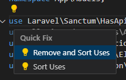
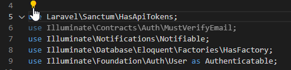
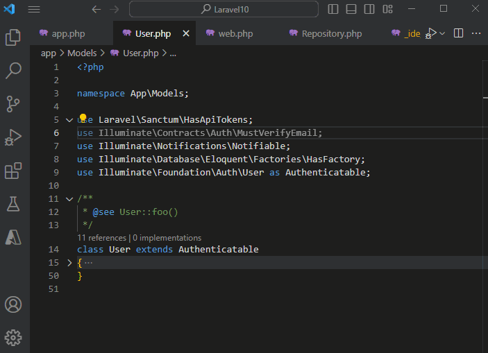

# Sort Uses and Remove Unused Uses on PHP File Save (Organize Uses on Save)



[PHP extension for Visual Studio Code](https://marketplace.visualstudio.com/items?itemName=DEVSENSE.phptools-vscode) comes with tons of code actions and code diagnostics! One of them sorts and removes unused uses:

<!-- more -->



It's a handy automation making your code tidy, light, and clean. It takes into account doctrine documentary comments, attributes, trait adaptations, and all the other PHP code aspects.

## Automatically Organize Uses on Save

It would be even better to remove unnecessary uses whenever saving the `.php` file. Luckily, you don't need any other extension, it's all already supported by PHP extension and VS Code.

Just add the following to your VS Code `settings.json`:

```json
"editor.codeActionsOnSave": {
    "source.organizeImports": true
}
```

You can even scope it just for `[.php]` files, configure it globally in the global `settings.json`, or just for the current workspace (read more at [VSCode Documentation - Settings](https://code.visualstudio.com/docs/getstarted/settings).



## See Also

For more code actions please see [PHP extension Documentation](https://docs.devsense.com/en/vscode/editor/code-actions#remove-and-sort-uses-on-save).
