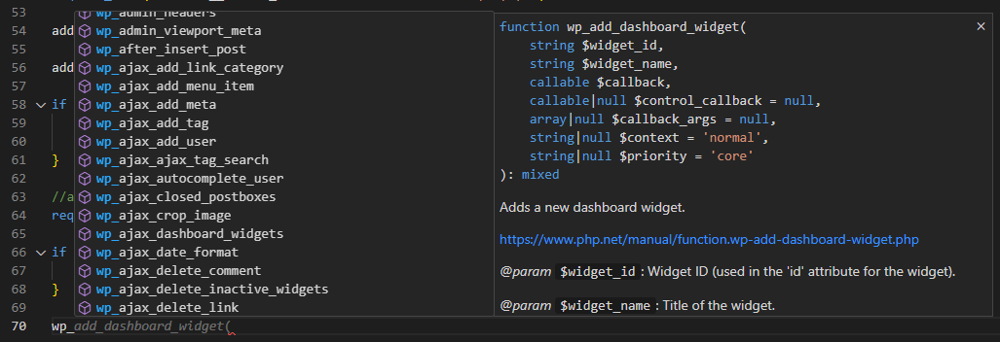

# WordPress IntelliSense and Linting


Version `1.42` of the [PHP extension for VS Code](https://marketplace.visualstudio.com/items?itemName=DEVSENSE.phptools-vscode) includes **WordPress Stub**. What does it mean? The editor will recognize all the standard WordPress functions, constants, and classes. It provides code analysis, IntelliSense, AI inline code suggestions, and type analysis.

<!-- more -->

All of it without the need of opening WordPress source code in the editor. So you can open a standalone plugin/theme folder in VS Code, or just open a WordPress plugin remotely.

Without the WordPress stub, you may see something like the following:


## Add WordPress Stub with UI

Add WordPress Stub (or another known PHP stub) using Visual Studio Code Command Palette (`F1`):


Search for `Workspace Stubs`, and hit `Enter`:


Check `wordpress`, and confirm with `OK`. Wait a second, and the editor should recognize all the WordPress functions, class, and constants. They will appear in IntelliSense and the underlined problems will disappear.

## Add WordPress Stub to Settings.json

To setup stubs manually, using VS Code's `settings.json`, add the following:

```json
    "php.stubs": [
        "wordpress",
        "*"
    ]
```

- `"*"` represents all the default PHP extensions. It is a shortcut for the list of extensions so it keeps your `settings.json` file small.
- `"wordpress"` represents the stubs for WordPress (obviously). It contains all the declarations from the entire WordPress, all the functions, classes, and constants. The source code of WordPress is actually not there, so if you eventually navigate to a WordPress function using _go to definition_, the editor will show you a generated pseudo-code instead.

## Add WordPress Stub with Quick Fix

There is a convenient quick code action (quick fix) for undefined functions. Open quick fix and choose `Add "wordpress" to "php.stubs"`.


Wait a second, or re-open the workspace. It adds `wordpress` stub into your settings for you.

---



Unless you have opened the entire source code of WordPress in VS Code, add the "wordpress" stub. You'll have full IntelliSense for WordPress symbols, including AI code suggestions, problems analysis, and more.
