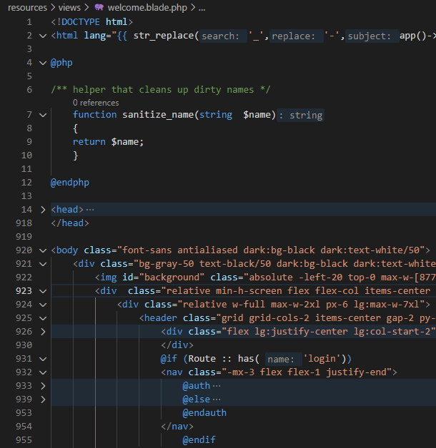

# Blade Language Support in VS Code (Part 1)

Blade template language is an important part of Laravel development. It combines  XML/HTML, Blade Statements, and PHP language! This blog post is not about Blade development itself, but rather what we (as the authors of [PHP extension for VS Code](https://marketplace.visualstudio.com/items?itemName=DEVSENSE.phptools-vscode)) can provide you to make the development easier.

<!-- more -->

Let's dive deep into some of the features we are already providing!

## Syntax Highlighting

As simple as it looks, blade is a complex language with its own quirks. There are many languages in a single file, sometimes overlapped by each other, so a correct syntax highlighting is very much needed. Imagine a case where a blade directive is commented using an HTML comment, or a blade directive contains a fragment of PHP code.

We have "extended" standard PHP language grammar which is extended already with HTML/JS/CSS languages. The additional grammar rules are very minimalistic, and they're kept up-to-date with built-in grammars of other languages in Visual Studio Code. The result is neat.

## Formatting

Code formatting helps to keep your code nicely well-arranged. Again, there are several languages in a single file. All of them need to be formatted using their own rules, while a code block in one language affects code in another language below it or those nested inside it.

As an example, imagine a blade directives `@for ()` or `@if ()` - the PHP code in parentheses need to be pretty printed, the nested code between `@if`/`@endif` or `@for`/`@endfor` indented correctly, and the nested JavaScript or CSS code formatted as well - all of it after the whole HTML document gets formatted using their specific formatting rules.

## IntelliSense - Hover and Completion

Blade templates consist of fragments of PHP code projected into a generated PHP script file. IntelliSense features need to treat it this way.

Internally our PHP editor understands blade directives and respects those projections as much as possible. In the result, you have regular PHP code completions and hovers (and other features) right in the blade file:

## Folding

Blade directives add more folding to the editor. Block directives are collapsible in addition to PHP blocks, HTML blocks, and JavaScript/CSS blocks:

## `@use` Directive

There are special quirks in Blade, such as the recently introduced `@use` directive. It allows to import types into your PHP code in Blade files. Of course it all needs to play nicely with code diagnostics, code completion, and syntax highlighting.

Inside `@use()` directive, there is code completion for available PHP types. In other parts of Blade file, the imported type is recognized by IntelliSense for completions, hovers, diagnostics, and navigation.

## Inlay Hints &amp; Code Lenses

You may be used to [Inlay Hints](https://docs.devsense.com/vscode/editor/inlay-hints) from PHP editor - it's a neat feature adding additional information to the code. Name of parameters, inferred function return type, or  `&` for arguments passed by reference.

Notice it also works for PHP code in Blade files and for arguments of Blade directives, such as `@json`.

Internally the editor projects fragments of PHP code into approximated generated PHP script to see the full context. Then it resolves all the inlay hints and other inline data, and projects it back to the blade file. The result is seamless and fully-featured.

Try it yourself. Enable `"editor.inlayHints.enabled"` setting in VS Code.

## Find all References &amp; Refactoring

Similarly to other IntelliSense features, the PHP code in Blade files can be refactored using the yellow bulb, used for navigation, and everything else you would expect from the PHP editor - except for the PHP code does not have the usual `<?php` openings.

## More?

Those were the basic features for Blade that we have introduced as a part of [PHP extension for VS Code](https://marketplace.visualstudio.com/items?itemName=DEVSENSE.phptools-vscode). But Blade has more - namely components, additional HTML Blade tags, component properties, or livewire support. Stay tuned.

## See Also

- [Laravel Support](https://docs.devsense.com/vscode/frameworks/laravel/) - Visual Studio Code Laravel Support