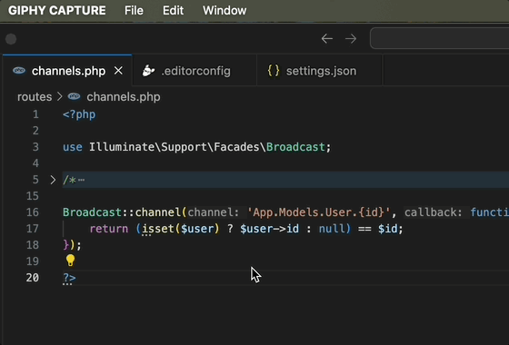

# Automate Code Fixes through Visual Studio Code Auto-Fix Feature 

The PHP editor with [PHP Tools extension](https://marketplace.visualstudio.com/items?itemName=DEVSENSE.phptools-vscode) provides vast array of useful code actions - either code fixes or inline code refactorings. What if you always prefer the fix or the specific refactor (like simplifying `?:` operator or removing unnecessary `?>` tag whenever possible).

<!-- more -->

---

Automatically applying the specific code refactoring will also keep your code-base in sync and clean.



## Available Refactorings

See the list of currently available actions at [Documentation - Code Actions - List](https://docs.devsense.com/vscode/code%20actions/list/#list).

Each of the action represent a specific refactoring that popup in the editor whenever it's applicable, in the form of light bulb and underlined as an editor hint with triple dots.

## Set Code Action as Auto-Fix

Set the code action convention to `autofix` in the `.editorconfig` file, as shown on example below:

```ini
[*.php]
php_remove_redundant_closing_tag=autofix
```

This applies the code action as automatic (preferred) fix. Such actions can be applied using `Auto Fix ...` command, and marked with a blue light bulb (by default).


## Auto-Fix on File Save

Code actions marked as _autofix_ can be applied automatically on file save using the following setting:

```json
"editor.codeActionsOnSave": {
    "source.fixAll": "explicit" 
}
```

## Auto-Fix and Code Style

Setting a code style (setting `"php.format.codeStyle"`) may enable auto-fix on code actions that are required by the selected code style. For example setting `PER` code style implicitly enables _"Remove Redundant Closing Tag `?>`"_ code action.


In future update, code style may also change the [severity](https://docs.devsense.com/vscode/code%20actions/severity) of code code action, so it will appear as error.

## See More

- [Documentation - Code Actions - List](https://docs.devsense.com/vscode/code%20actions/list/#list)
- [Documentation - Code Actions - AutoFix](https://docs.devsense.com/vscode/code%20actions/autofix/)
- [Increase code action hint severity](https://docs.devsense.com/vscode/code%20actions/severity/)