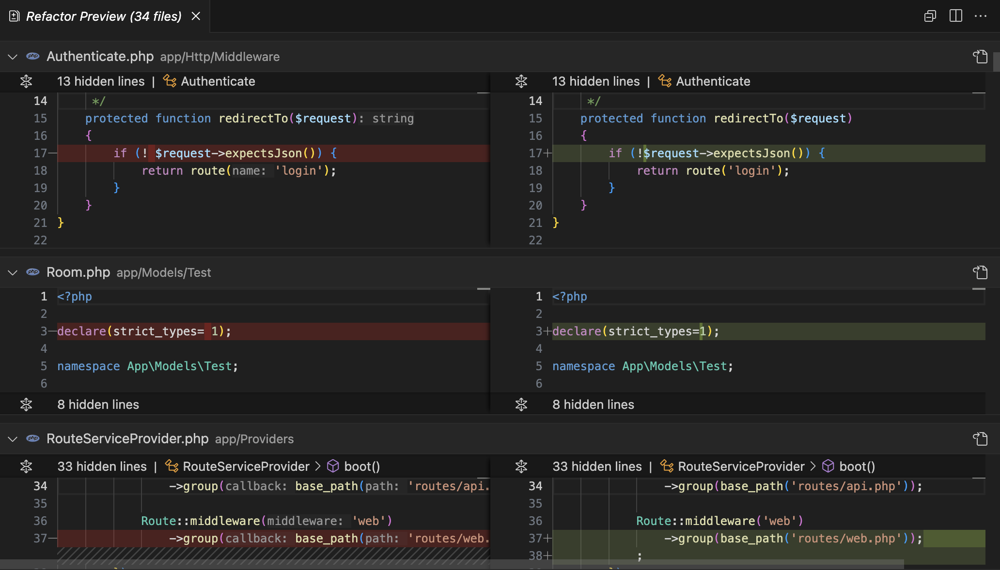

# Format Multiple PHP Files with Preview

The [PHP extension for Visual Studio Code](https://marketplace.visualstudio.com/items?itemName=DEVSENSE.phptools-vscode) comes with an exhaustive code formatting built-in ([see docs](https://docs.devsense.com/en/vscode/editor/formatting)). There is a vast array of parameters to configure your [custom code style](https://docs.devsense.com/en/vscode/editor/customize-formatting), predefined code styles for [common standards](https://docs.devsense.com/en/vscode/editor/code-styles), and all of this with ability to only format selection, format-on-type, format-on-save, and newly - **format multiple PHP files at once**, with preview.

<!-- more -->

---

## How To Format Multiple PHP Files

This feature is available through Command Palette (`F1`) in Visual Studio Code. Pick the command `"PHP > Format Multiple Files"`:

The command asks for a glob pattern. Specify what `.php` files you want to format and confirm. 

**Confirm** and watch the progress in Visual Studio Code's notification area. The formatting runs on background, it does not open the documents in your document area, and **does not modify any files** yet.

Once the formatting is done, a preview window with all the suggested changes is opened.

## Preview Changes

The list of suggested changes is listed in a preview window at the bottom of Visual Studio Code:

Click on an item in the list to see the diff window of checked changes:

Click `Apply` to confirm and do the changes to selected files.

## Configuration

The formatting respects the settings for code formatting rules.

**`php.format.codeStyle`**: Choose from one of many standards such as `psr-12`, `laravel`, `K&R`, `wordpress`, `drupal` etc.  (**free**)

**`php.format.rules. ...`**: Many custom formatting rules to adjust. See [customize formatting](https://docs.devsense.com/en/vscode/editor/customize-formatting) for the details. This feature comes as a **premium** for our customers.

**`php.format.exclude`**: Glob patterns of files excluded from formatting.

## See Also

- [code standards](https://docs.devsense.com/en/vscode/editor/code-styles) - predefined code styles to format with.
- [formatting](https://docs.devsense.com/en/vscode/editor/formatting) - code formatting documentation.
- [custom rules](https://docs.devsense.com/en/vscode/editor/customize-formatting) - customize formatting rules.
