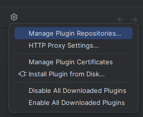
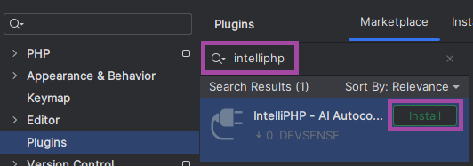

# IntelliPHP for IntelliJ - EAP


**UPDATE (March 2024)**: **IntelliPhp for IntelliJ** is publicly available at [plugins.jetbrains.com](https://plugins.jetbrains.com/plugin/23859-intelliphp--ai-autocomplete-for-php).

<!-- more -->

---

Today, we're releasing a preview version of full-line AI completions for IntelliJ (and PhpStorm). Try **IntelliPHP for IntelliJ**.


It's a neat plugin for IntelliJ (and PHPStorm) with machine learned code suggestions, working fully locally, providing suggestions instantly, not requiring Internet connection!

## Installing EAP

In order to install the plugin from **Early Access Program**, follow the steps on [plugins.jetbrains.com/docs/marketplace/custom-release-channels.html](https://plugins.jetbrains.com/docs/marketplace/custom-release-channels.html#configure-a-custom-channel)

- Go to **Setting** / **Plugins**, and add **Custom Plugin Repository**:
  ```
	https://plugins.jetbrains.com/plugins/eap/list
	```

  

- Search for `intelliPHP` plugin
- Install

	

## How it Works

As you type, IntelliPHP generates a most probable line completion and offers it as an in-line suggestion. Confirm it with `TAB` key, and the suggestion gets inserted. The plugin does it all locally, within milliseconds, on your machine, without any Internet data transfer.


## Conclusion

We're happy about this new achievement. **IntelliPHP for IntelliJ** enhances productivity, works instantly, does not interfere with your regular work flow, and once you get used to it, it greatly helps building your code.

### See Also

If you like PHP AI code suggestions - it is already available for [Visual Studio Code](https://marketplace.visualstudio.com/items?itemName=DEVSENSE.intelli-php-vscode) and [Visual Studio 2019, and 2022](https://www.devsense.com/en/download) _(installed together with PHP Tools)_.
