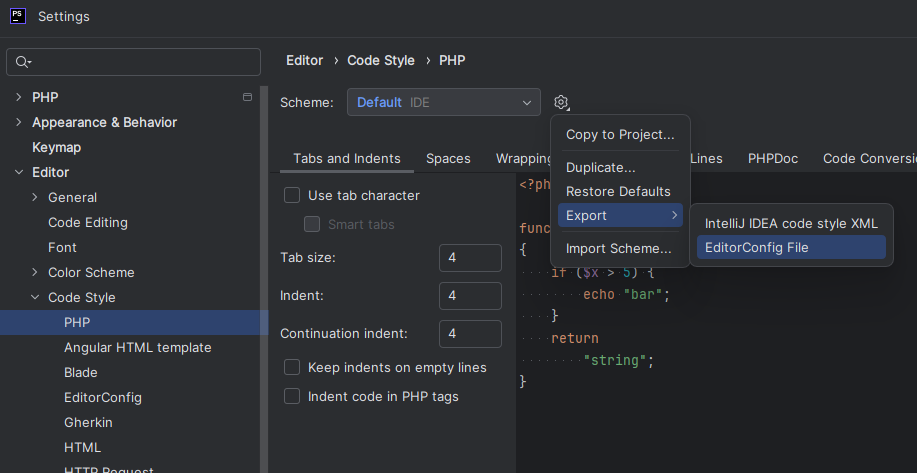
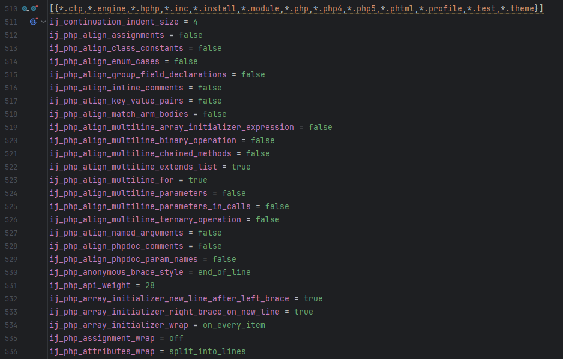

# Leveraging .editorconfig for Consistent Code Style Across Different IDEs

Maintaining a consistent code style is essential for any development team—not just for aesthetics but for readability and maintainability. Developers often use various IDEs, making it challenging to ensure that code adheres to the same standards. Thankfully, `.editorconfig` provides a unified way to enforce coding conventions across different development environments, including Visual Studio, Visual Studio Code and PhpStorm. In this post, we’ll explore how teams can utilize `.editorconfig` to keep their PHP code consistent and how to bridge the gap between different IDEs with ease.

<!-- more -->

## Why Use .editorconfig?

`.editorconfig` files are a powerful tool for maintaining consistent coding standards. From defining basic rules for things like indentation style, character sets, and final newline handling to specific PHP formatting rules, teams can enforce a uniform code style across projects, regardless of the IDE used by individual developers.

## Benefits of Using .editorconfig:

 - **Cross-IDE Support**: `.editorconfig` is supported by most modern code editors, making it a versatile solution.
 - **Enforcement at the Project Level**: The rules defined in `.editorconfig` apply project-wide, ensuring consistency even as team members switch between tools.
 - **Easily Shareable**: It’s easy to include a `.editorconfig` file in version control to share code style configurations with your team.

## Exporting Code Style from PhpStorm to .editorconfig

PhpStorm has built-in code style management, but when working in mixed-IDE teams, it’s beneficial to export these settings to an `.editorconfig` file that other tools like VS Code can read.

### Step-by-Step Guide:

- Configure Code Style in PhpStorm:
  - Open PhpStorm and navigate to Preferences/Settings > Editor > Code Style.
  - Click on the `PHP` tab to ensure you are setting rules specifically for PHP code.

- Export Settings to `.editorconfig`:
   - Click the **Show Scheme Actions** button (the gear icon or the three dots at the top-right of the code style panel).
   - Select **Export** and then choose **EditorConfig File**.
   - PhpStorm will create a `.editorconfig` file in the project’s root directory with rules that align with your current PHP code style settings.

   

   - The PHP section exported in the .editorconfig file will look like this:
	 
	 

## How the PHP Extension in VS Code Uses `.editorconfig`

The PHP extension for Visual Studio Code fully supports `.editorconfig`, making it easier for teams to standardize code formatting and other development practices, such as diagnostics, across different IDEs. When a developer opens or edits a PHP file in VS Code, the extension reads the `.editorconfig` file and automatically applies the specified formatting rules. For more details, visit our [documentation page](https://docs.devsense.com/en/vscode/editor/editorconfig).

### Basic `.editorconfig` Settings

Most modern IDEs, including Visual Studio Code, PhpStorm, and others, recognize a set of basic `.editorconfig` settings. These include fundamental code style configurations such as:

- **Indentation Style** (`indent_style`): Specifies whether to use spaces or tabs for indentation.
- **Indentation Size** (`indent_size`): Defines the number of spaces (or tabs) for each indentation level.
- **End of Line** (`end_of_line`): Determines the line ending type (e.g., `lf`, `crlf`).
- **Charset** (`charset`): Specifies the character set for files (e.g., `utf-8`).
- **Trim Trailing Whitespace** (`trim_trailing_whitespace`): Ensures that trailing spaces are removed at the end of each line.
- **Insert Final Newline** (`insert_final_newline`): Ensures a newline is added at the end of files.

These basic settings help achieve a baseline of consistency across different editors, making it easier for teams to collaborate.

### PhpStorm Settings the PHP Extension Reads:

In addition to the basic `.editorconfig` settings, the PHP extension for VS Code supports specific properties from PhpStorm’s `ij_php_*` settings. These allow for even finer control over PHP code style configurations. Some of these properties include:

- **Alignments** (e.g., `ij_php_align_assignments`, `ij_php_align_enum_cases`)
- **Braces** (e.g., `ij_php_class_brace_style`, `ij_php_block_brace_style`)
- **Wrapping** (e.g., `ij_php_method_call_chain_wrap`, `ij_php_array_initializer_wrap`)
- **Spaces** (e.g., `ij_php_spaces_within_brackets`)
- **Blank Lines** (e.g. `ij_php_blank_lines_around_method`)

The full list of supported options will be documented shortly.

### Customizing `.editorconfig` for PHP in VS Code:

PHP extension for VS Code is not limited to importing formatting rules from PhpStorm. It comes with its own robust set of PHP-specific formatting rules. If a particular setting from PhpStorm isn't supported, developers can still customize their `.editorconfig` to use properties provided by our extension, ensuring complete control over code style.

For a complete list of supported PHP formatter rules and how to customize them, visit our [full documentation on PHP formatting](https://docs.devsense.com/en/vscode/editor/customize-formatting).

## Advantages for Teams:

- **Seamless Collaboration**: Developers using different IDEs can still write code with the same style.
- **Reduced Review Friction**: By standardizing style rules, teams can focus code reviews on logic and functionality rather than formatting issues.
- **Easy Adaptation**: New team members can quickly adapt to the team's coding standards by simply opening the project in their IDE.

### Best Practices for Managing `.editorconfig`:

- **Version Control**: Include `.editorconfig` in your version control system to ensure all team members use the same configuration.
- **Communication**: Update the team when changes are made to the `.editorconfig` file to avoid unexpected formatting discrepancies.

## Conclusion

Using `.editorconfig` files helps teams maintain consistent code styles across different IDEs, simplifying collaboration and reducing formatting discrepancies. With features in PhpStorm to export code style settings and the robust support in the PHP extension for VS Code, achieving seamless formatting compliance is easier than ever.
