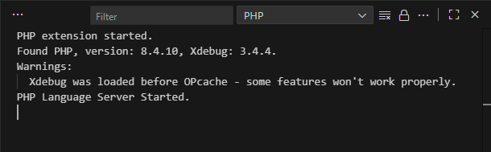
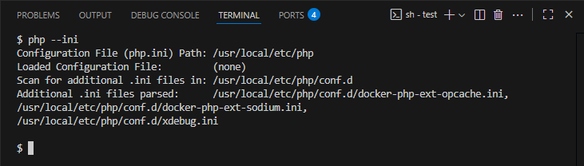
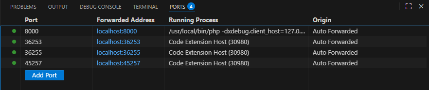

# 12 Most Common PHP Debugging Issues (and How to Fix Them)

Debugging PHP can sometimes feel like chasing ghosts. Even experienced developers often encounter the same recurring issues, especially when using Xdebug or IDE-integrated debuggers. Here’s a practical guide to the most common pitfalls—and how to solve them.  

<!-- more -->

## 1. Xdebug Isn’t Installed or Enabled

A lot of developers assume Xdebug is ready, but sometimes it’s not even installed.

**How to check:**  
```bash
php -v
```

Look for `with Xdebug`.

**Fix:** Install and enable Xdebug in your `php.ini`:

```
zend_extension=xdebug.so  ; Linux/macOS
zend_extension=php_xdebug.dll  ; Windows
```

## 2. Xdebug Version Mismatch with PHP

Xdebug must be compatible with your specific PHP version. Each PHP release (`8.2`, `8.3`, `8.4`, etc.) has its own internal API, and an Xdebug build compiled for a different PHP version may **fail to load entirely**.

**How to check and fix:**
1. Verify your PHP version:
```bash
php -v
```
2. Use the [Xdebug’s download wizard](https://xdebug.org/wizard) by pasting the output of `php -i` to get the correct version for your setup.
3. Download and install the matching Xdebug build for your PHP version and OS.

## 3. Running the Wrong PHP Binary

If multiple PHP versions are installed, your IDE might launch one that doesn’t have Xdebug.

**Fix:** Verify your `PATH` and IDE configuration point to the correct PHP executable.

## 4. Misconfigured `xdebug.mode`

From Xdebug 3 onward, you must set the mode explicitly:

```
xdebug.mode=debug
```
Old settings like `xdebug.remote_enable=1` no longer work.

## 5. Port Mismatch

The default Xdebug port changed from `9000` to `9003` in Xdebug 3.

```
xdebug.client_port=9003
```

Make sure your IDE is listening on the same port.

## 6. Wrong `xdebug.client_host`

In containers or VMs, localhost points inside the environment, not to your host IDE. This is only true if your are not running vs code server directly in the container!

**Use:**
```
xdebug.client_host=host.docker.internal  ; Windows/Mac
```

## 7. Xdebug Loads Before Opcache

This one can be tricky. Even if debugging seems to work, it might behave very strangely. We’ve even added a check for it—if this happens, a warning appears in the Output pane:



What happens is that if Xdebug is loaded **after** Opcache, you might encounter unpredictable behavior because the bytecode is already cached.

**Fix:** Make sure Xdebug is loaded **after Opcache**, either as the last extension in `php.ini` or, if multiple `.ini` files are used, in a file that is read after the Opcache configuration.

```
zend_extension=opcache.so
zend_extension=xdebug.so
```

**Tip:** Run the following command to see the order of all loaded `.ini` files:

```
php --ini
```



You can change the order by renaming `.ini` file, for example `20-xdebug.ini`

## 8. CLI vs Web Server Configuration Mismatch

Xdebug settings can differ between the PHP CLI and the web server (Apache/nginx/FPM). Which means debugging may work when running scripts from the command line but fail for web requests.

**Fix:** Ensure that Xdebug and related settings match across all relevant `php.ini` files used by CLI and the web server.

## 9. `xdebug.start_with_request` Not Enabled

Xdebug won’t start automatically unless this setting is enabled:

```ini
xdebug.start_with_request=yes
```

Without it, you must trigger a debug session manually using a GET/POST parameter or cookie, for example: `XDEBUG_SESSION_START=1`.

## 10. Firewalls or VPNs Blocking Connections

Xdebug communicates with your IDE over a network port, which can be blocked by firewalls, VPNs, or other network restrictions.  

**Fix:** First, verify debugging works locally. If it does, check firewall rules, VPN settings, or other network configurations that might prevent Xdebug from reaching your IDE.

## 11. PHP Built-in Server Listening on `localhost` in Docker

This one is personal. I once spent half an hour wondering why my PHP server wouldn’t load.

When you run the PHP built-in server inside Docker:

```
php -S localhost:8080 -t .
```

will only listen **inside the container**, so you cannot access it from your host machine. You’d just end up staring at a loading animation in your browser indefinitely.

**Fix:** Listen on all interfaces using `0.0.0.0`:

```
php -S 0.0.0.0:8080 -t .
```

and map the port to the host:

```
docker run -p 8080:8080 my-php-app
```

Or if you are using VS Code with Remote Containers, you can also use the port mapping UI to forward container ports to your host.

**Tip:** In some setups (e.g., VS Code Remote Containers or Docker Compose), the container port may be automatically forwarded to the host, so manual port mapping may not be necessary.



## 12. Breakpoints Never Hit

Even if Xdebug connects, breakpoints may not work if:

- The file running is not the same as the one open in the IDE.
- Opcache or other caching changes the source mapping.

**Fix:** Clear caches and ensure correct file paths.

## Conclusion

Most PHP debugging issues come down to configuration mismatches—whether in Xdebug, PHP versions, ports, file paths, or the order of extension loading. Understanding these common pitfalls saves time and frustration, letting you focus on solving real bugs in your code.