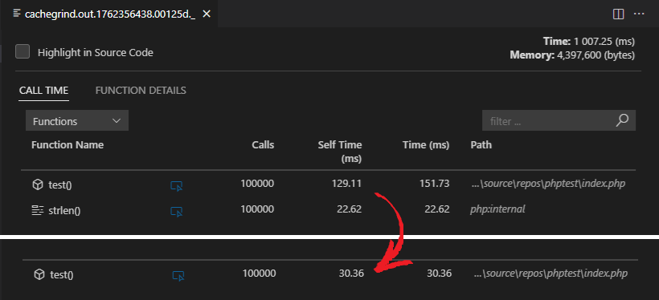
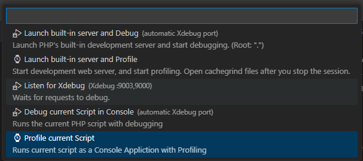
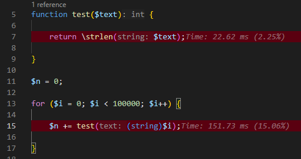
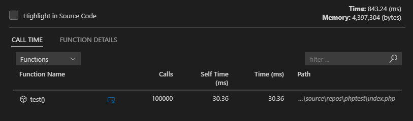
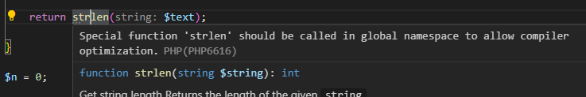
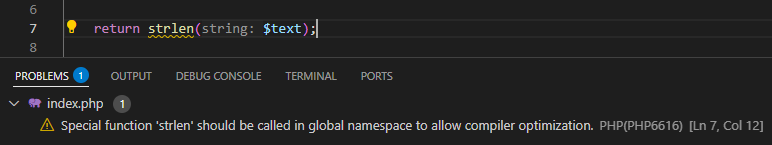
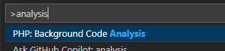
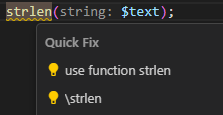
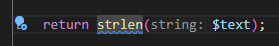

# Optimize Native Function Invocation

PHP has come a long way from being an interpreted scripting language for home web pages to a pretty fast object-oriented compiled language running the most powerful websites on the Internet. As part of its performance boost are various compiler optimizations. In this blog post, we'll focus on a subtle feature that makes applications automatically faster (although just slightly): optimizing native function invocation.



<!-- more -->

There are about 36 special functions recognized by the PHP compiler, including `strlen()` and `count()`, that PHP can run significantly faster. The thing is, if you use them in a namespace (e.g., `FOO`), the compiler cannot be sure whether you mean `\strlen()` or `\FOO\strlen()`. Thus, the function call is not optimized.

**Example:**

```php
<?php
namespace FOO;
use function count;

strlen($text);     // not optimized, ambiguous name
\strlen($text);    // optimized
count([]);         // optimized
```

## Performance Profile

If we actually measure the optimized and unoptimized cases, it becomes clear why there is a difference.

> Using Visual Studio Code with [PHP extension](https://marketplace.visualstudio.com/items?itemName=DEVSENSE.phptools-vscode) and [PHP Profiler extension](https://marketplace.visualstudio.com/items?itemName=DEVSENSE.profiler-php-vscode), and local installation of PHP 8.4.12 with Xdebug: 3.4.5.

### Unoptimized Test

```php
<?php
namespace Foo;

function test($text) {
    return strlen($text);
}

for ($i = 0; $i < 100_000; $i++) {
    test((string)$i);
}
```

In Visual Studio Code, you can configure a [launch.json for profiling mode](https://docs.devsense.com/vscode/debug/launch-json/#profiling-mode) or just hit `F5` and select to profile the current script:


When the profiling session ends, you'll see profiling results like the one below. The result shows what you may expect: 100,000 calls to the `test()` function and the `strlen()` function.


**Hot Paths:**



### Optimized Test

```php
<?php
namespace Foo;
use function strlen;

function test($text) {
    return strlen($text);
}

for ($i = 0; $i < 100000; $i++) {
    test((string)$i);
}
```

With a slight change, let's profile the code again. The only difference is that `strlen()` is now effectively changed to `\strlen()`.



The results show **two major differences**:

- The overall time is much smaller. 100,000 calls take **30ms** instead of **151ms**.
- The `strlen` function is not even listed—it was entirely optimized out. The compiler replaced the function call with specialized OP code.

That's **80%** performance improvement.

## Built-In Code Diagnostic

The [PHP](https://marketplace.visualstudio.com/items?itemName=DEVSENSE.phptools-vscode) extension (since version `1.62.18067`) has this diagnostic built in. By default, it shows you a _hint_ that is not listed in VS Code's `Problems` window.



### Show as Warning

If you care about this kind of performance optimization, make this problem more prominent by marking it as a **warning** instead of a **hint**. Add or edit the `.editorconfig` file in your workspace root with the following:

```ini
[*.php]
php_diagnostic_php6616=warning
```



### Analyze Entire Workspace

Use the setting `"php.problems.scope": "all"` or the VS Code command from the Command Palette (`F1`): `PHP: Background Code Analysis`, and choose **all**:




All PHP files in your workspace will be checked for problems, including the _"unoptimized native function invocation (PHP6616)"_ diagnostic.

### Quick Fix

The editor provides quick fixes for this problem right away. Click the light bulb, press the corresponding shortcut, or click the `Quick Fix...` menu to see the options:



### Automatic Fix on File Save

Wouldn't it be nice to fix this issue automatically?

Open `.editorconfig` again, and change the value to `autofix`:

```ini
[*.php]
php_diagnostic_php6616=autofix
```

The light bulb changes to blue with more features!



Now you can call the command from the Command Palette (`F1`): `Auto Fix...`, and the issue will be fixed.

Alternatively, you can configure Visual Studio Code to fix the issue every time you save the file. Add the following setting to your `settings.json`:

```json
    "editor.codeActionsOnSave": {
        "source.fixAll": "explicit"
    }
```

## Conclusion

And there you have it—automatic performance improvement of your PHP application taking advantage of this neat compiler optimization. Of course, it won't make your app several times faster, but it depends on your use case. 

Do your measurements and optimize when you can. It's easy and painless.