# Run and Debug Pest and PHPUnit Tests in VS Code

Test Explorer in Visual Studio Code opens the door to all your PHPUnit and Pest PHP tests. You can browse and filter test suites, test classes, test cases, and data sets. Run, debug, profile, or navigate to any test. You can enable automatic testing on changes, browse test history, and see detailed diffs of actual and expected results. Let me show you how.

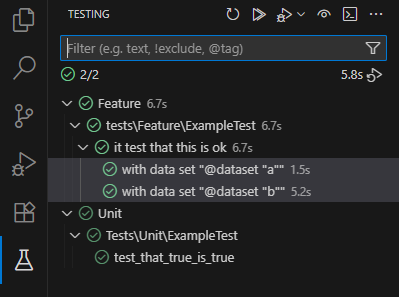

<!-- more -->

## Basic Setup

If you already have a project with tests, or a project based on Laravel or similar framework, you can skip this step. To add tests to your project, you need the **following file structure**:

- `tests/`
  - `Feature/`
    - `ExampleTest.php`
- `phpunit.xml`

With the default configuration, test files need to be suffixed with `Test.php`.

The content of the `phpunit.xml` will look like this (minimal setup):

```xml
<?xml version="1.0" encoding="UTF-8"?>
<phpunit>
    <testsuites>
        <testsuite name="Feature">
            <directory>tests/Feature</directory>
        </testsuite>
    </testsuites>
</phpunit>
```

> For the full list of configuration options, please see [docs.phpunit.de/configuration](https://docs.phpunit.de/en/10.5/configuration.html).

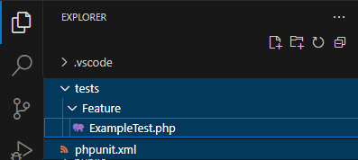

### PHP Installation

Make sure you have `php` installed. The following php extensions are recommended: `json`, `mbstring`, `process`, `xml`, `libxml`, `xdebug`.

Check that VSCode detects your PHP in the _OUTPUT_ / _PHP_ window:

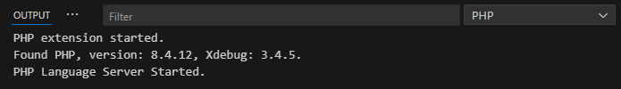

> No other configuration is needed, since the VSCode PHP extension will handle it for you.

> Select your PHP installation as described in [docs.devsense.com/vscode/php-version/](https://docs.devsense.com/vscode/php-version/#choosing-php-version).

### PHPUnit

Add **PHPUnit** Composer package itself. Open Command Palette (`F1`), and type `require dev package`:
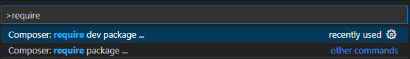

Search for `phpunit/phpunit` and confirm:
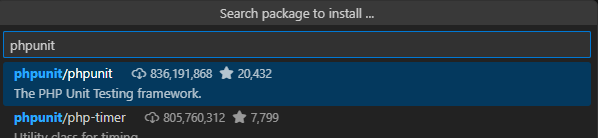

Create a minimal test case. Open the file `tests/Feature/ExampleTest.php`, and add the following content:

```php
namespace Tests\Feature;

use PHPUnit\Framework\TestCase;

class ExampleTest extends TestCase {
    function test_true_is_true() {
        $this->assertTrue(true);
    }
}
```

> Note, that the class name must follow PSR notation, i.e. the class name must match the file name. Additionally, the test method must be prefixed with `test` or it needs to have a `#[Test]` attribute.

### Pest

**Removing `phpunit/phpunit`**

To use **Pest** instead of PHPUnit, **don't install `phpunit/phpunit` package**. If you already have it, remove it; use command (`F1`) "Composer: Remove package ...", then search for `phpunit/phpunit`, tick, and confirm:
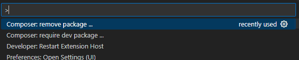

**Installing `pestphp/pest`**

Add **pestphp/pest** Composer package itself. Open Command Palette (`F1`), and type `require dev package`:


Search for `pestphp/pest` and confirm:
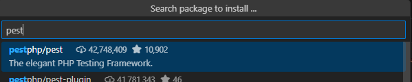

**Minimal Test Case**

Create a minimal test case. Open the file `tests/Feature/ExampleTest.php`, and add the following content:

```php
<?php

test('that true is true', function () {
    $this->assertTrue(true);
});
```

As you can see, Pest tests have a smaller boilerplate, and can basically force you to be more descriptive.

## Explore Tests

Switch to the Test Explorer view, and you can browse the discovered test cases. From here, you can run, debug, and navigate to your test cases.

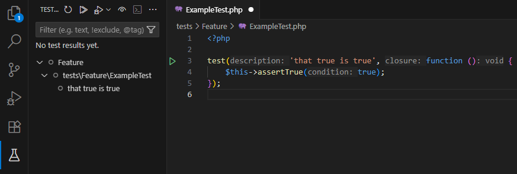

## Run Tests

There are several ways of running your tests. Right from the editor, or from the Test Explorer view.

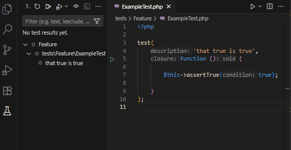

### Inspect Output

Under the hood, **PHP extension** runs your `phpunit` (or `paratest` or `pest`) with several command line arguments. Let's see what it is doing;

Open _OUTPUT_ panel, and switch to _PHP (Test Explorer)_:

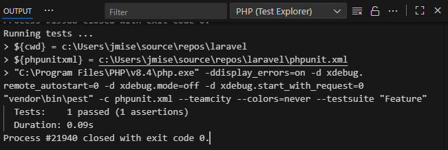

> The parameters used in the command above can be configured using settings `phpunit.phpunit` and `phpunit.command`.

### Inspect Failures and History

Tests also fail. But luckily all the failures are recorded and can be inspected later:

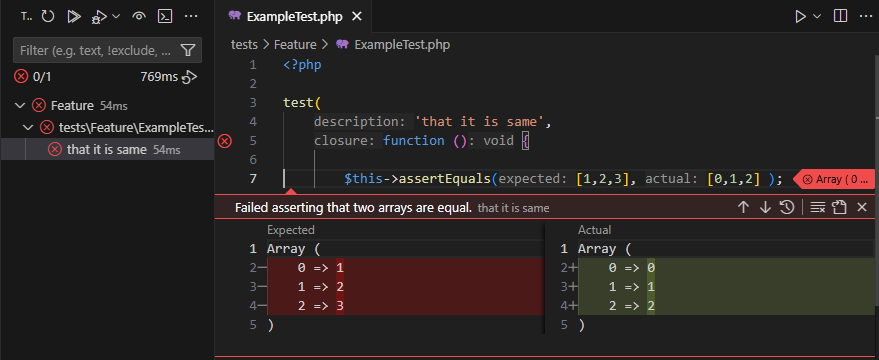

### Using Data Providers

**Support for Data Providers is a new feature in PHP extension version `1.61` (or newer)!** 

**Data providers** allow to run the same test with different input. It is a must-use feature; making it easy to scale your tests and cover more code paths.

Test Explorer will show and update your data sets once you run the test. Let's see how to add a data set, investigate it, and re-run it first:

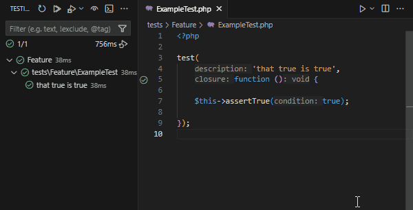

> There are several ways of specifying a data providers depending on your version of PHPUnit, or whether you run Pest.

#### PHPUnit 10+ `#[DataProvider]`

```php
use PHPUnit\Framework\Attributes\DataProvider;
use PHPUnit\Framework\TestCase;

class ExampleTest extends TestCase {
    static function my_provider() {
        return [[1], [0], [-1]];
    }

    #[DataProvider('my_provider')]
    public function test_that_it_is_greater_than_0($n): void {
        $this->assertTrue($n > 0);
    }
}

```

#### PHPUnit &lt; 10 `@dataProvider`

```php
use PHPUnit\Framework\TestCase;

class ExampleTest extends TestCase {
    function my_provider() {
        return [[1], [0], [-1]];
    }

    /** @dataProvider my_provider */
    public function test_that_it_is_greater_than_0($n): void {
        $this->assertTrue($n > 0);
    }
}
```

#### Pest `->with()` Data

```php
test('that it is greater than 0', function ($number) {
    $this->assertTrue($number > 0);
})->with([
    'a' => [1],
    'b' => [0],
    'c' => [-1],
]);
```

### Enable Live Testing

A neat feature is _live (aka continuous) testing_. When enabled, test files are watched for changes. When a change is detected, the affected tests are re-run.

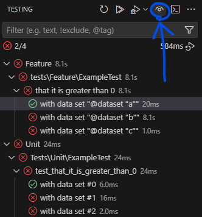

## Debug Test

Whenever a test fails, you can simply debug it. Debugging tests is a fundamental part of application development. It's also simpler and quicker, since you are running your separate unit test and fixing only the corresponding components.

**Prerequisite: Xdebug**

Make sure, your `php` installation is configured with `xdebug` zend_extension. Check your configuration is correct in _OUTPUT_ / _PHP_ view:


**Start Debug**

Initiate debugging either from Test Explorer, or directly from the editor. Right click on the icon next to the test declaration, and choose `Debug`.

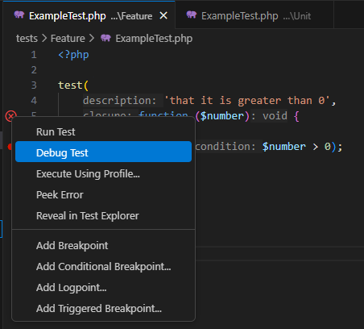

## Related Links

- [PHP extension for VS Code](https://marketplace.visualstudio.com/items?itemName=DEVSENSE.phptools-vscode)
- [Choosing PHP Version](https://docs.devsense.com/vscode/php-version/).
- [Debugging Overview](https://docs.devsense.com/vscode/debug/).
- [Test Explorer Documentation](https://docs.devsense.com/vscode/test-explorer/).
- [Pest Documentation](https://pestphp.com/docs/installation).
- [PHPUnit Documentation](https://phpunit.de/documentation.html)
