# Profile Laravel in Visual Studio Code


Performance always matters. Your Laravel application might be beautifully designed and written, but there's always the possibility of hidden bottlenecks. Is it unnecessarily slow? Can it be optimized further? Sometimes, a single function can consume most of your CPU time. In this tutorial, you'll learn how to profile your **Laravel** application in **Visual Studio Code** to uncover and address these issues.

<!-- more -->

If you're looking for general PHP profiling guidance, check out these resources:

- [PHP code profiling for Visual Studio Code](https://docs.devsense.com/vscode/profiling/)
- [PHP Profiler for Microsoft Visual Studio](https://docs.devsense.com/vs/profiling/overview/)

---

<center>
    <iframe width="560" height="315" src="https://www.youtube.com/embed/eos-bgyl-6k" title="Profiling Laravel in Visual Studio Code" frameborder="0" allow="accelerometer; autoplay; clipboard-write; encrypted-media; gyroscope; picture-in-picture" allowfullscreen></iframe>	
</center>

## What is Profiling?

Simply put, profiling tracks all function calls in your application, recording their start and end times. This information allows you to:

- Identify which functions consume the most time.
- See how many times a specific function is called.
- Understand the call tree of all functions across the entire application.

With this data, you can pinpoint performance bottlenecks and optimize your application effectively.

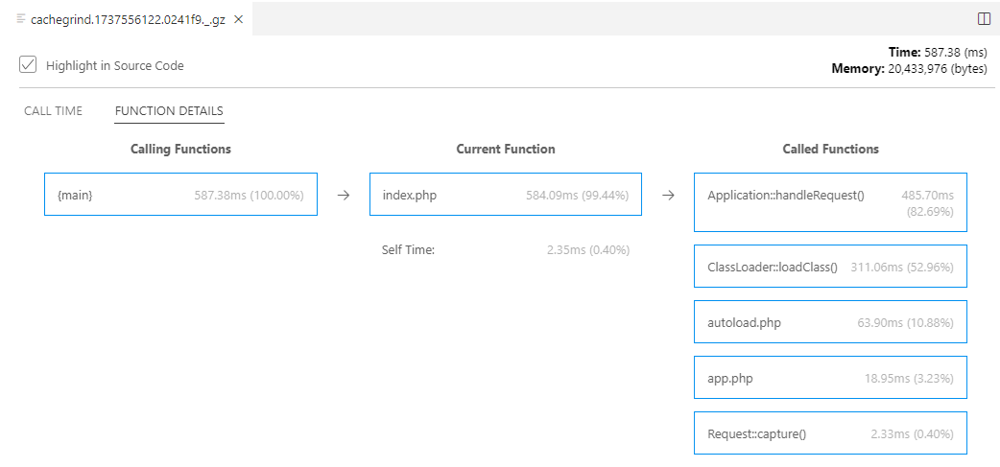

---

## Requirements

Before starting, ensure you have the following:

- **PHP** installed.
- The PHP [`Xdebug`](https://xdebug.org/docs/install) extension installed.
- The PHP `zlib` extension enabled (recommended).
- The [PHP Tools](https://marketplace.visualstudio.com/items?itemName=DEVSENSE.phptools-vscode) extension for Visual Studio Code.
- The [PHP Profiler](https://marketplace.visualstudio.com/items?itemName=DEVSENSE.profiler-php-vscode) extension (installed automatically with PHP Tools).

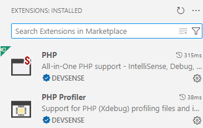

To confirm PHP and Xdebug are correctly configured, open any PHP file in Visual Studio Code and check the _OUTPUT_ panel for a confirmation message:

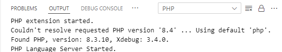

---

## Setting Up Your Laravel Workspace

1. **Open Laravel Application**

   Open folder with the Laravel application. You should see the directory structure like this:

   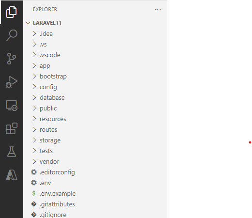

2. **Create a `launch.json` Profile**

   If you don’t already have a `launch.json` file, follow these steps:
	 
   - Open the `Run and Debug` panel.
   - Click on `create a launch.json file` and choose the `PHP (Xdebug)` option.

   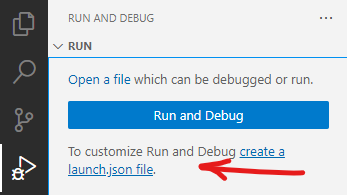

3. **Add the Profiling Configuration**

   Ensure your `launch.json` file includes the following profile:

   ```json
	 "configurations": [
   {
       "name": "Launch built-in server and Profile",
       "type": "php",
       "request": "launch",
       "noDebug": true,
       "runtimeArgs": [
           "-S",
           "localhost:8000",
           "-t",
           ".",
           "../vendor/laravel/framework/src/Illuminate/Foundation/resources/server.php"
       ],
       "cwd": "${workspaceRoot}/public",
       "serverReadyAction": {
           "action": "openExternally"
       },
       "envFile": "../.env",
       "profile": true,
       "openProfile": true
   }
	 ]
   ```

---

## Running the Profiler

1. **Select the Profiling Configuration**

   In the `Run and Debug` panel, choose the **"Launch built-in server and Profile"** option:

   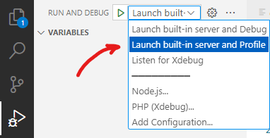

2. **Start Debugging**

  Press **F5** to start the profiling session. This will:
  - Launch the built-in PHP server.
  - Open your Laravel application in a browser.
	
  You should see a smilar output in VS Code's `DEBUG CONSOLE`:
	
  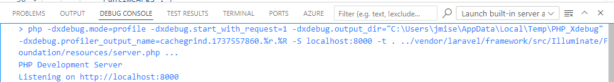

3. **Make Web Requests**

Navigate through the pages you wish to profile. Each request generates a separate profiling file, which will open automatically when the profiling ends.

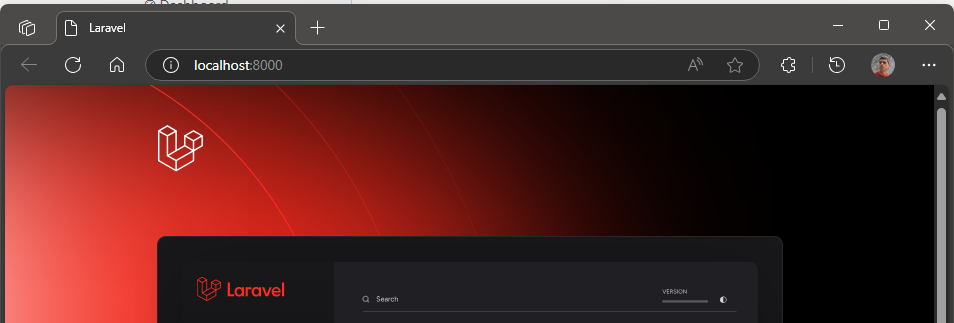
	
4. **Stop the Profiling Session**

   Return to Visual Studio Code and click the **Stop** button to end the session. Note, it may take a few seconds.

   

5. **View Profiling Results**

   The profiling output will appear in new document tabs:

   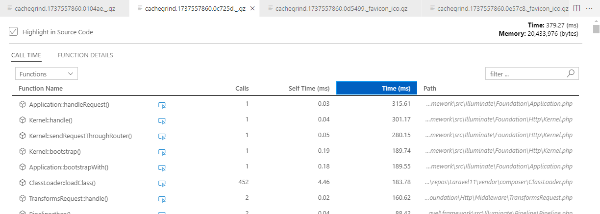

---

## Analyzing Profiling Data

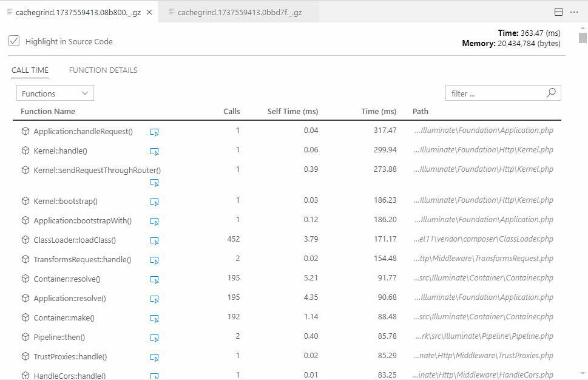

Each profiling file corresponds to a single request. Here's how to interpret the results:

**Aggregated Time**

   Sort by _Time (ms)_ to identify the "heaviest" functions.

**Call Counts**

   Sort by _Calls_ to find the most frequently called functions.

**Highlight Hot Paths**

   Use the **Highlight in Source Code** option to visualize performance hotspots directly in your code:

   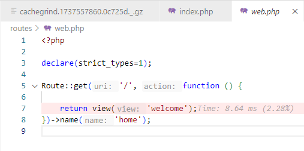

---

## Additional Resources

- [PHP code profiling for Visual Studio Code](https://docs.devsense.com/vscode/profiling/)
- [PHP Profiler for Microsoft Visual Studio](https://docs.devsense.com/vs/profiling/overview/)
- [Laravel support in Visual Studio Code](https://docs.devsense.com/vscode/frameworks/laravel/)
