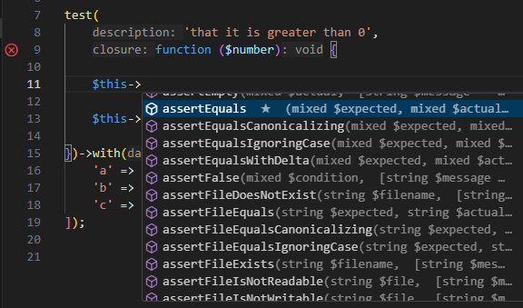

# PHP Tools for VS Code – Version 1.61

## Pest Tests & Data Providers

September update (_1.61_) introduces support for Pest tests. This means, your tests defined using `it()` and `test()` methods are seamlessly listed in the VSCode's Test Explorer, tests can be inspected, run, debugged, or profiled. Additionally, the editor inside your test anonymous function provides full IntelliSense for `$this` variable and its members. Let's see how it works.

**Test Explorer** & **Data Providers**

Test Explorer inspects your tests allowing you to browse them, run them, and discover data sets. Data sets can be then run separately.

**Editor**

Code editor recognizes anonymous functions defining the Pest test, or more precisely the annotation `@param-closure-this`, and provides IntelliSense for `$this` variable. Note, that the current _Pre-Release_ version even works with the inherited `TestCase` class.

**Profiling**

Configure PHP with Xdebug and you can easily profile your tests right in VSCode UI. Navigate to your test, right-click, choose `Execute Using Profile`, and select `Profile`.

The test will be executed in profiling mode, and collected profiling data will be opened right in VS Code.

> For more information about profiling, see our [profiling documentation](https://docs.devsense.com/vscode/profiling/).

## PHP 8.5

If you're keen about the new PHP 8.5 syntactic sugar - the pipe operator - try the latest _Pre-Release_ or the future version _1.62_.

The [PHP version selector](https://docs.devsense.com/vscode/php-version/) now contains `8.5` option:

The editor recognizes the new pipe operator (`|>`), provides type inference, code formatting, and type checking.

The pipe operator allows to chain function calls, passing a value from the left operand as an argument for the callback in the right operand. It's really just a syntactic sugar making ugly calls chained instead of being nested. 

## IntelliSense & Diagnostics

There are several new code diagnostics and code completion improvements. 

- Added diagnostic for unreachable match arm.
- Added checks for PHP configuration; warnings including improperly configured Xdebug are listed in _OUTPUT_ / _PHP_ log.
- Added code action to simplify chained `&&` conditions.
- Highlights methods called through magic methods, since they may be potentially undefined.
- Magic methods are listed at the end of code completion.

## Related Links

- [Changelog](https://www.devsense.com/en/download/vscode) - full product changelog.
- [Download](https://www.devsense.com/en/download) - install PHP Tools for VS Code and Visual Studio.