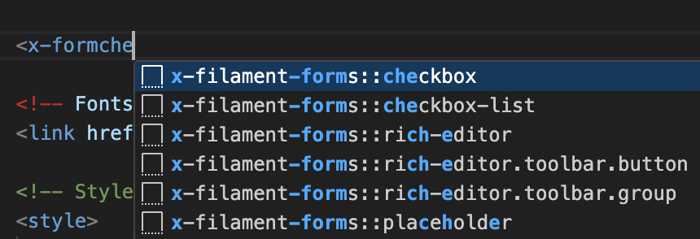
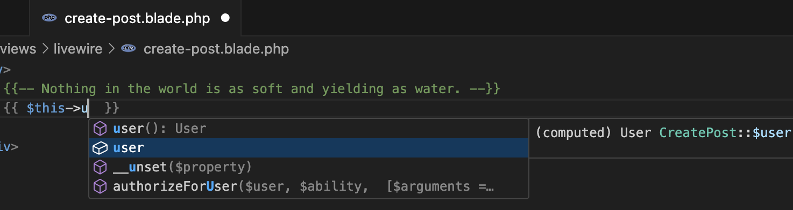
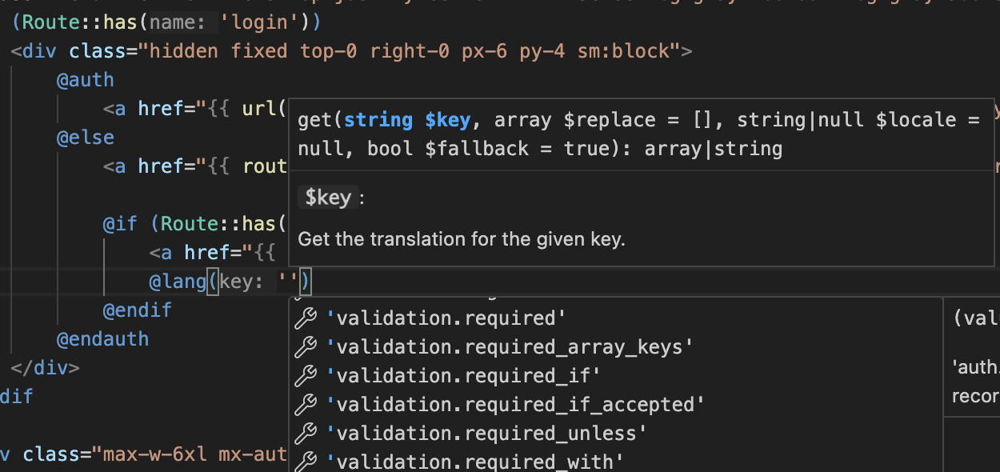
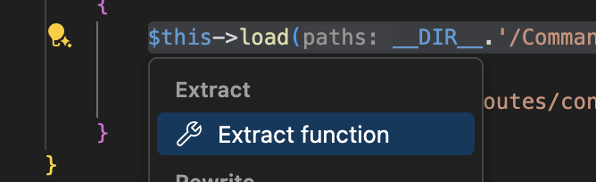
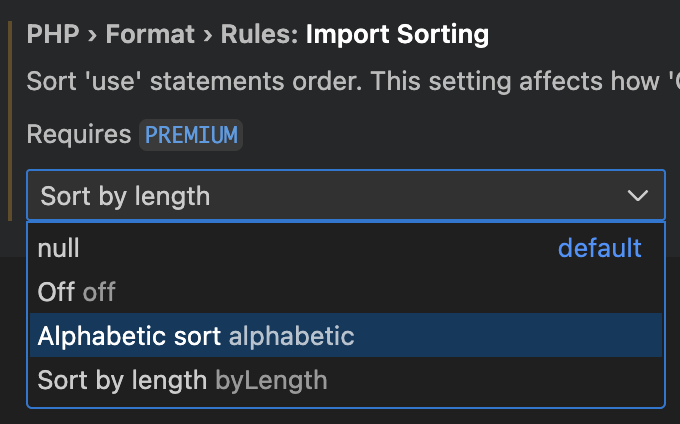
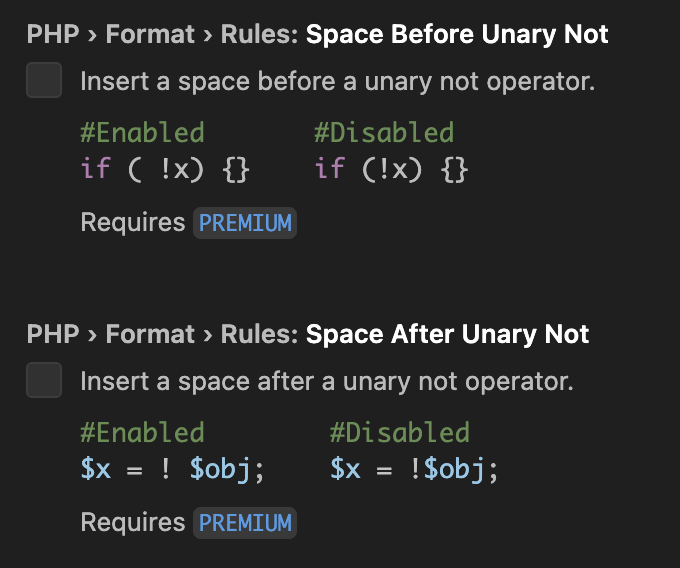
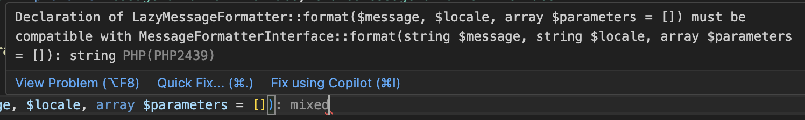
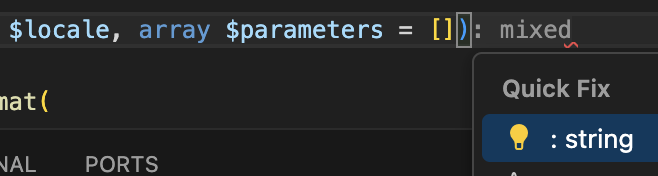
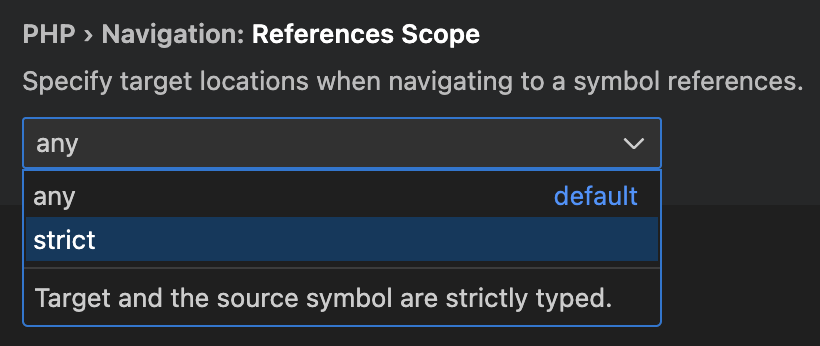

# PHP Tools for Visual Studio Code – Version 1.59

We’re excited to announce the release of **PHP Tools for Visual Studio Code** version **1.59**! This update delivers a wide range of improvements and new features — from enhanced Laravel support, powerful code actions, and improved IntelliSense, to diagnostics and formatting refinements.

Let’s take a look at what’s new:

<!-- more -->

## 🧠 Smarter Laravel IntelliSense

Laravel developers are in for a treat! The IDE now provides deeper insight into common Laravel patterns:

- **Livewire computed properties** are now recognized.
- **Eloquent relationships** support generic return types (e.g., `HasOne<T>`), so the IDE can infer types of dynamic properties.
- **Blade templates** get better `$this` type completion when tied to a component class.
- Completion of attributes from `casts()` and `$casts` is more accurate.
- `.php` language translation files are processed – functions like `trans()` or Blade’s `@lang` can now navigate and complete translation keys.
- Fixes for Blade directives such as `@error` and duplicated `@` symbols in completions.

- Translation IDs completion is improved and provides texts across the packages. 

---

## 🧠 IntelliSense Enhancements

Your coding flow just got even better with several key upgrades:

- **Extract Method / Extract Constant** code actions are now available to refactor code with a click.
- Support for **Composer IntelliSense** out-of-the-box, even when `composer.phar` is not part of the workspace.
- Improved navigation through constructs like `new self`, `new static`, and `new parent`.
- Accurate recognition of callable-strings and PHPDoc annotations, including `.phpstorm.meta.php`.
- Seamless handling of trait method usage and complex type inference.

---

## 🛠️ New: Organize Imports

Keep your code tidy with the new **Organize Use Statements** feature. You can now sort your `use` statements:

- **Alphabetically**, or
- **By length**

This can be configured via your `settings.json` or `.editorconfig` file (`ij_php_import_sorting`). Sorting can be triggered manually, on save, or automatically via code actions. [Read more here →](https://docs.devsense.com/vscode/code%20actions/organize-uses/)

---

## 🔧 Formatting Tweaks

Formatting has been fine-tuned for readability and consistency:

- Prevented `foreach` from collapsing into a single line.
- Fixed new line placement for single-line property hooks.
- Resolved issues with block comments mixing tabs and spaces.
- Added setting to configure spacing before unary `!` ([#874](https://github.com/DEVSENSE/phptools-docs/issues/874)).
- Fixed formatting for intersection types ([#2309](https://community.devsense.com/d/2309)).

---

## 🧪 Diagnostics Improvements

We've made diagnostics smarter and quieter — reducing false warnings and improving analysis:

- More accurate reporting for unimplemented abstract methods and properties ([#870](https://github.com/DEVSENSE/phptools-docs/issues/870)).
- Better type inference for numeric operations and class references.
- Blade and global `$this` usage are no longer flagged when appropriately annotated.

---

## ⚙️ New Settings

Take control with new customization options:

- `php.files.exclude`: exclude files from language indexing, while keeping them in Explorer.
- `php.navigation.referencesScope`: configure strictness of "Find References".
- `phpTools.parallelismLimit`: limit background threads for indexing and parsing.

---

## 🚨 Breaking Change Notice

HTML auto-update tags behavior has changed: it now respects VS Code’s `"editor.linkedEditing"` setting. Be sure to adjust your preferences if needed. [Learn more](https://code.visualstudio.com/docs/languages/html#_auto-update-tags).

---

## 🐛 Fixes and Stability

- Language server stability improvements (e.g., polyfill packages crash fix [#873](https://github.com/DEVSENSE/phptools-docs/issues/873)).
- Performance optimizations across the board.
- Fix for trait members with changed visibility ([#854](https://github.com/DEVSENSE/phptools-docs/issues/854)).
- Parsing and Blade template improvements.

---

Thank you for using **PHP Tools for Visual Studio Code**! Your feedback helps us continue making the best possible experience for PHP development in VS Code. 🚀

Happy coding!  
— The DEVSENSE Team
