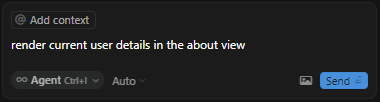
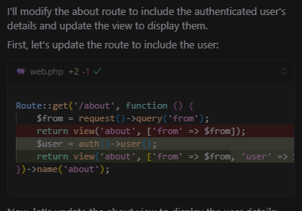
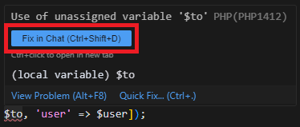

# Vibe Coding getting smarter with PHP diagnostics

[PHP Extension](https://marketplace.visualstudio.com/items?itemName=DEVSENSE.phptools-vscode) works seamlessly with [Cursor](https://www.cursor.com/)—the popular AI-powered code editor. With the *PHP extension*, you get a full suite of features, including code completion, intelligent code actions, an integrated debugger, advanced syntax highlighting, and effortless navigation. But that’s not all! It also offers workspace-wide code analysis and detailed diagnostics. Plus, these features are fully compatible with the AI chat agent, creating a powerful coding experience.

<!-- more -->

## Vibe Coding: The Future of Development

One of the biggest trends in coding today is **vibe coding**. This approach allows developers—and even non-developers—to ask AI for coding suggestions, modifications, and improvements. From our perspective, it feels like magic! With *vibe coding*, even those with little to no programming experience can create fully functional applications by simply interacting with AI.

## The Catch: AI Still Makes Mistakes

Despite its power, AI is not infallible. It occasionally introduces subtle mistakes—issues that may not be immediately obvious but can cause code to break. Fortunately, this is where [PHP Tools](https://marketplace.visualstudio.com/items?itemName=DEVSENSE.phptools-vscode) shines. By continuously analyzing the code, the extension identifies errors and provides clear diagnostics. This means the AI chat agent can automatically detect and fix these issues, creating a beautifully symbiotic workflow.

## From Problem to Solution

The [PHP Extension](https://marketplace.visualstudio.com/items?itemName=DEVSENSE.phptools-vscode) continuously monitors your code, leveraging a wide range of heuristics and rules. With full awareness of your workspace and project dependencies, it usually can:

- Detect undefined symbols
- Highlight type mismatches
- Identify syntax errors based on your PHP version
- Warn about deprecated functions
- Point out potential problems and suggest refactorings
- And much more!

Each issue comes with a human-readable description, which is invaluable for the AI chat agent. By feeding this information directly into its prompts, AI can generate more accurate fixes, significantly improving the development experience.

With PHP Tools and AI working together, debugging and refining your code has never been easier!

